# 115：数组（第一部分）📚

在本节课中，我们将要学习OCaml中的数组。数组是一种可变的数据结构，与你在其他编程语言中遇到的数组非常相似。我们将学习如何创建、访问和修改数组元素，并探索一些用于处理数组的便捷函数。

---

## 数组基础

OCaml拥有数组，它们与其他语言中的数组非常相似。语法略有不同，看起来像是OCaml列表语法和可变字段语法的混合体。

我们可以通过编写一个看起来几乎像列表的表达式来创建数组。

以下是创建一个包含数字1的列表的语法：
```ocaml
[1]
```
但我们在两边加上了一组额外的竖线：
```ocaml
[|1|]
```
现在，这就变成了一个包含数字1的整数数组。

我们同样使用分号来分隔其中的值。这是一个包含1到3的数组：
```ocaml
[|1; 2; 3|]
```

要访问数组的元素，我们使用点语法。我们可以将数组绑定到一个名称 `a`，然后使用 `a.(0)` 来访问它的第一个元素。这将得到 `1`。

因此，与大多数其他语言一样，OCaml中的数组也是**从0开始索引**的。

如果你尝试索引超出数组的末尾，将会得到一个越界异常。

要修改数组的元素，你可以使用左箭头语法，就像修改字段一样：
```ocaml
a.(0) <- 5
```
现在 `a.(0)` 是5，而不是1。

---

## 使用数组建模向量

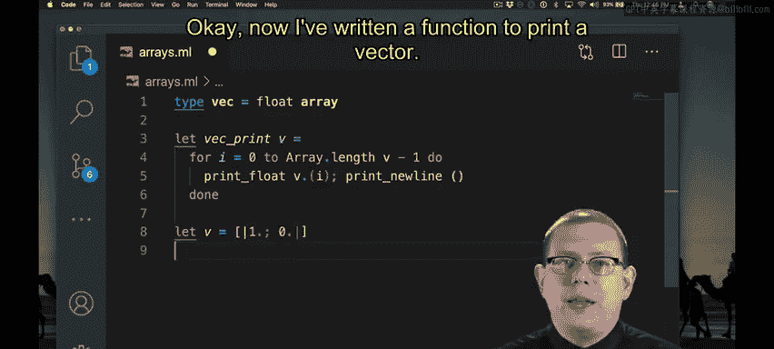

上一节我们介绍了数组的基本操作，本节中我们来看看如何用数组编写更复杂的代码。让我们来模拟物理学或线性代数中的向量。

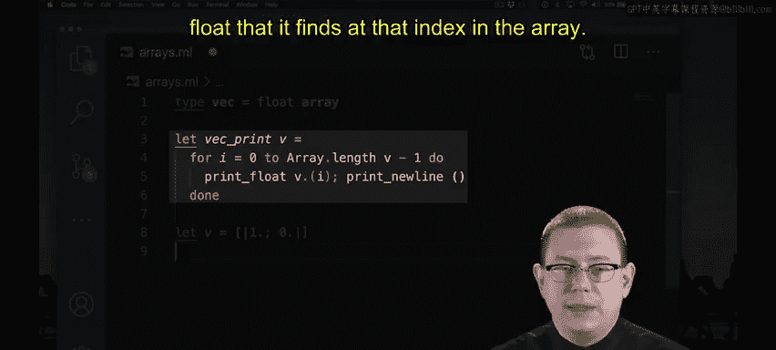

我们可以为向量定义一个类型，例如，一个浮点数数组：
```ocaml
type vector = float array
```

我们首先从打印一个向量开始。如果你习惯于在命令式语言中做这件事，你首先想到的可能是编写一个循环来遍历数组的所有元素并打印每一个。

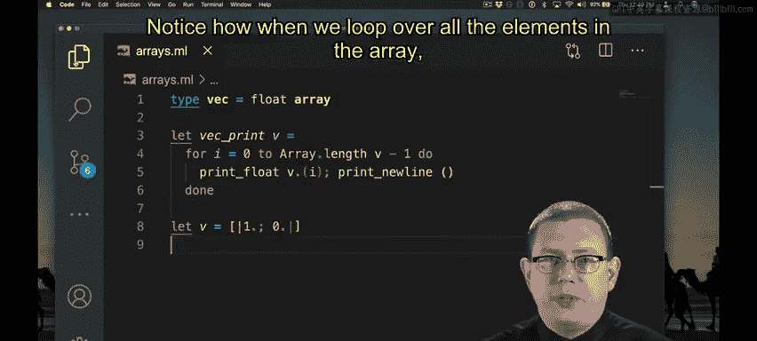

我们可以在OCaml中做到这一点。现在，我写了一个函数来打印向量。它循环遍历该数组中的每个索引，并打印出在该索引处找到的浮点数。

```ocaml
let print_vector v =
  for i = 0 to Array.length v - 1 do
    print_float v.(i);
    print_newline ()
  done
```

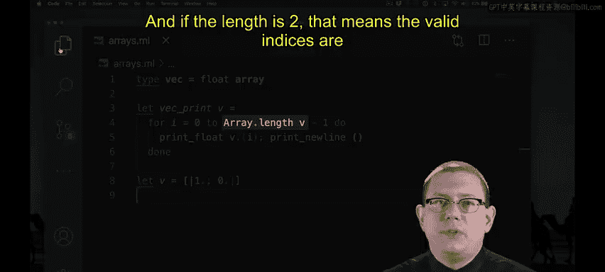

假设我们有向量 `v`，其第一个分量为1.0，第二个分量为0.0。我们打印它，每个分量会单独显示在一行。

请注意，当我们循环遍历数组中的所有元素时，可以使用 `Array.length` 来获取数组的长度。如果长度是2，那么有效的索引是0和1。因此，通常我们需要从长度中减去1来循环遍历每个索引。

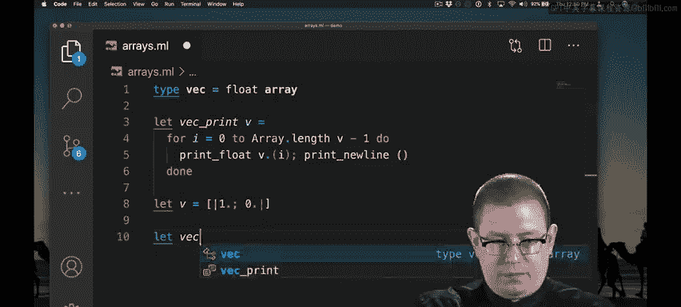

---

## 使用高阶函数迭代数组

不过，还有更巧妙的方法来实现我们的向量打印函数，利用函数式编程和高阶编程的思想。让我们来看看它们。

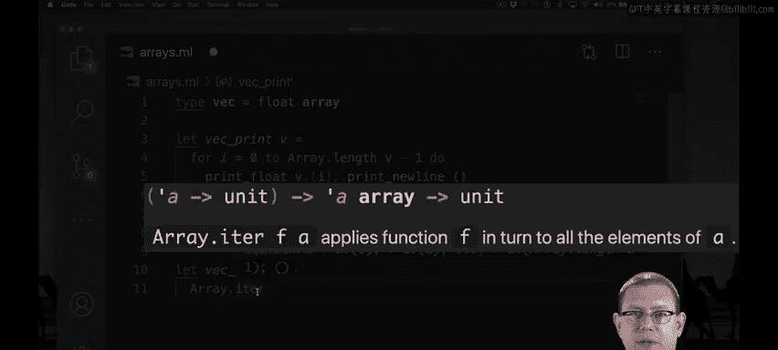

标准库的数组模块中有一个名为 `iter` 的函数。该函数接收一个类型为 `'a -> unit` 的函数和一个 `'a array` 数组。它将这个函数应用到数组的每个元素上，类似于依次执行 `f a.(0); f a.(1); ...` 直到数组末尾。

通过使用 `iter`，我们可以避免编写循环。这也意味着我们不会在循环索引上犯错，比如很容易忘记那里的 `-1`，那样会导致索引越界异常。

使用 `Array.iter`，我们甚至不需要编写循环。我们只需传入一个打印数组每个元素的函数。

```ocaml
let print_vector_iter v =
  let print_element x = print_float x; print_newline () in
  Array.iter print_element v
```

这里我们看到了很好的关注点分离：我们有一个单独的函数 `print_element` 来处理数组中每个元素应该发生的事情；而 `Array.iter` 则处理遍历数组元素的所有迭代工作，这样我们就不必编写循环，也就不会在循环中出错。

这两个函数打印出的内容相同。

---

## 使用 `Printf` 模块进一步简化代码

为了进一步缩短这段代码，我们能否编写一个函数来打印数组元素，但只用一行代码完成呢？标准库中的 `Printf` 模块为我们提供了一种方法。

如果你熟悉C语言或其他命令式语言中的 `printf` 函数，这会让你感到非常熟悉。它的用法很简单。

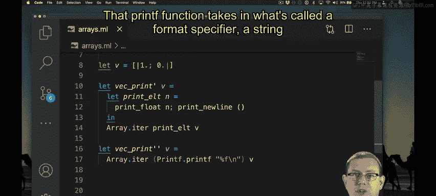

`printf` 函数接收一个所谓的**格式说明符**，这是一个说明如何打印参数的字符串。

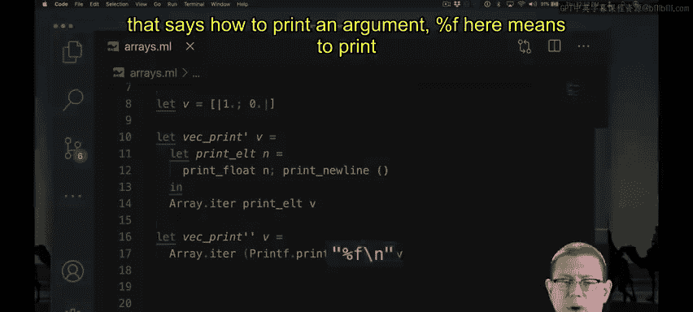

```ocaml
let print_vector_printf v =
  Array.iter (Printf.printf "%f\n") v
```
这里的 `%f` 表示打印一个浮点数，`\n` 表示打印一个换行符。

我们得到的输出与之前略有不同，你会看到打印出了所有额外的小数位。这是因为标准的 `%f` 以那种风格打印浮点数。如果你想以标准的OCaml风格打印它们（省略所有多余的零），你也可以做到。

```ocaml
let print_vector_printf_short v =
  Array.iter (Printf.printf "%F\n") v
```
注意我们使用了大写的 `F`。现在我们得到了与之前相同的输出。

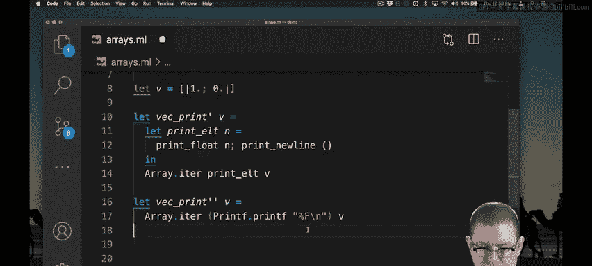

但我们是用一个非常简短的函数实现的。这不需要我们实现大量代码，从而避免了在代码中可能犯的许多错误。

---

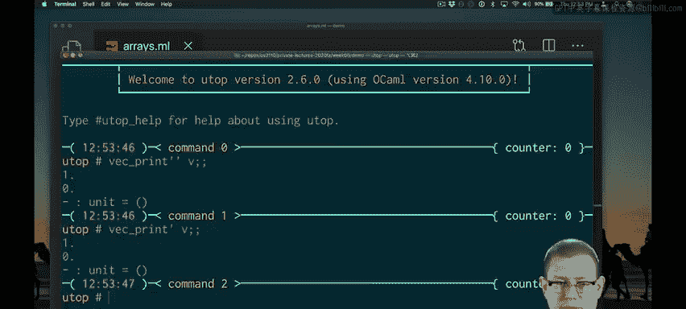

## 总结

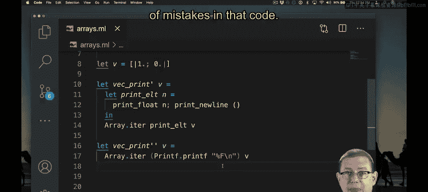

本节课中我们一起学习了OCaml数组的基础知识。我们了解了如何创建数组、访问和修改其元素。我们还探索了使用 `Array.iter` 高阶函数来遍历数组，这比手动编写循环更安全、更简洁。最后，我们使用了 `Printf.printf` 函数来格式化输出，进一步简化了代码。数组是OCaml中处理可变序列数据的重要工具。