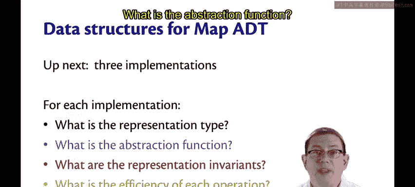
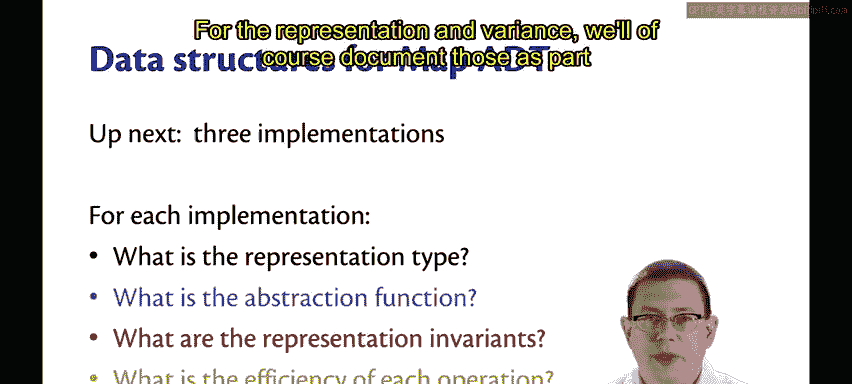
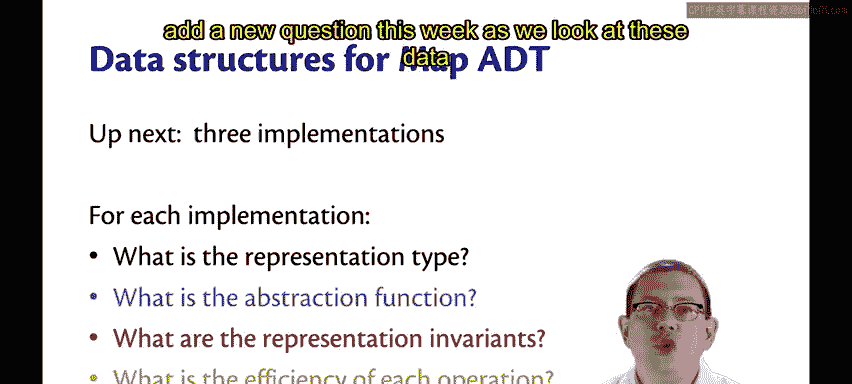
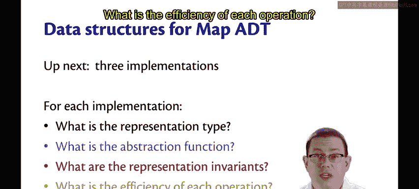

# 118：Map ADT 绑定与列表

在本节课中，我们将学习如何构造映射（Map）抽象数据类型（ADT），并探讨其核心操作。我们将重点关注如何从空映射和关联列表创建映射，以及如何将映射转换回关联列表。此外，我们还将讨论实现细节和效率考量。

---

## 构造映射的方法

我们需要提供构造映射的方法。以下是两种简单的构造方式。

### 空映射

首先，一个空映射。值 `empty` 就是一个空的映射。

### 从关联列表创建映射

另一种创建映射的便捷方式是从关联列表（association list）生成。我们最初学习列表时见过关联列表，它们就是包含键值对的列表。每个对中的第一个元素是键，第二个元素是值。

函数 `ofList` 将接收一个包含适当键值类型的关联列表，然后返回一个包含相同绑定的映射。

现在的问题是，如果该列表包含重复的键绑定，应该如何处理？例如，假设列表包含一个从 `31` 到 `"fun"` 的绑定，以及另一个从 `31` 到 `"FP"` 的绑定。这就是键 `31` 的重复绑定。`ofList` 函数必须对此做出决定。

在这里，我设定一个前置条件来排除这种情况，这样 `ofList` 的实现就不必担心重复键的问题。这对ADT的使用者来说可能不那么友好，但对ADT的实现者来说更友好。

---

## 映射的表示函数

最后，提供一个便利函数来获取映射的表示形式会很有用。无论底层类型 `T` 是什么，都可以将其转换为关联列表。在某种程度上，你可以将其视为抽象函数的一种实现。通过将底层表示 `T` 转换为关联列表，我们可以获得对映射中绑定的另一种抽象理解。

因此，函数 `bindings` 接收一个映射 `m`，返回一个包含与 `m` 相同绑定的关联列表。我保证 `bindings` 返回的关联列表中没有重复的键。

---

## 语法细节说明

你可能注意到我刚刚完成时有一个小的语法错误，值得一看。我最初在 `K` 和 `V` 之间加了一个逗号。当我们为一个类型构造器编写两个类型变量参数时，它们位于类型构造器的左侧，并且中间有一个逗号，就好像那里有一个“对”一样。但是，当我们有一个参数化类型的列表时，我们需要实际给出一个类型，而两个带逗号的类型变量本身不是一个类型。

然而，元组类型——其中第一个分量的类型是 `K`，第二个分量的类型是 `V`——是一个有效的类型。因此，这两种用法在语法上存在差异。这种差异存在的主要原因是这两个类型构造器的定义不同：类型构造器 `T` 由两个类型变量参数化（如 `type ('k, 'v) t`），而类型构造器 `list` 只由一个类型变量参数化（如 `type 'a list`）。

---

## 总结与展望

这完成了我们关于映射ADT的讨论。当然，我们还可以向其中添加许多其他函数，但目前这些足以让我们研究如何实现这个ADT。

接下来，我们将探讨三种不同的数据结构来实现映射ADT。对于每种实现，我们将重点关注以下四个问题：
1.  表示类型是什么？
2.  抽象函数是什么？
3.  表示不变式是什么？（我们将作为表示类型 `T` 注释的一部分来记录这些。）
4.  每个操作的效率如何？（这是我们本周新增的问题。）

本节课中，我们一起学习了映射ADT的构造方法、从关联列表创建映射、将映射转换回关联列表的便利函数，以及相关的语法细节。我们还为后续研究不同数据结构的实现设定了框架和核心问题。