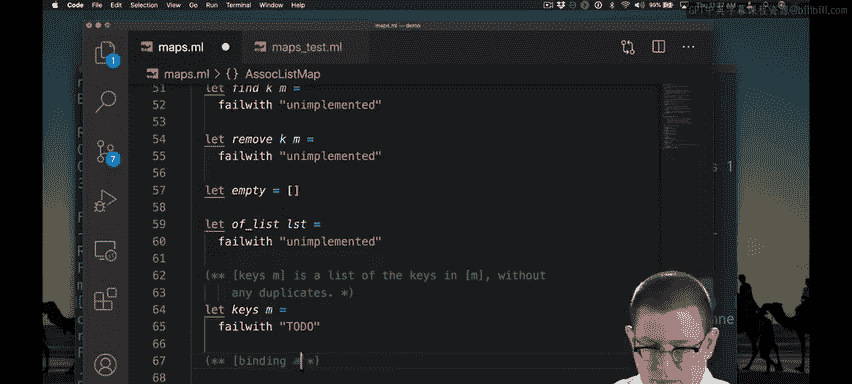

# 120：关联列表与绑定 🗺️

在本节课中，我们将学习如何为关联列表数据结构实现一个名为 `bindings` 的操作。我们将遵循测试驱动开发的方法，从编写一个失败的测试用例开始，然后逐步实现功能，最终通过测试。

## 概述

我们将实现一个函数，用于从关联列表中提取所有唯一的键值对（绑定）。关联列表本质上是一个 `(key * value)` 对的列表。`bindings` 函数的目标是返回一个列表，其中每个键只出现一次，并与其对应的值配对。

## 从测试开始

上一节我们介绍了测试驱动开发的基本概念。本节中，我们来看看如何为一个具体的操作编写测试。

测试驱动开发的第一步是选择一个涉及某个操作的测试用例，并为其实现一个会失败的测试。我们已经有了一个空列表的值。这是一个简单的起点。我们知道空关联列表的绑定结果应该为空。

以下是我们的第一个测试用例：

```ocaml
let test_empty_bindings () =
  assert (bindings empty = [])
```

我们实现了第一个测试用例，断言空关联列表映射的 `bindings` 结果就是空列表。运行测试以确认它失败。确实，测试失败了。这意味着我们现在有需要修复的问题。当然，问题在于我们尚未实现 `bindings` 函数。

## 初步实现

现在，我们如何获取一个列表的绑定呢？一个非常简单的做法是直接返回列表本身。

```ocaml
let bindings m = m
```



我不确定这是否完全符合规范，但它可以编译，并且通过了测试。这就是测试驱动开发：我们不一定要第一次就做对，但我们不断取得进展，持续编译并添加测试。

## 深入思考规范

现在，如果我思考 `bindings` 函数应该做什么的规范，我知道会有一个问题。`bindings` 要求列表中没有重复的键。但我们没有在关联列表的实际表示类型中定义任何机制来防止重复键。这意味着我们需要在 `bindings` 函数中做一些工作来消除任何重复项。

我们的算法思路是：
1.  获取所有键的列表。
2.  从该键列表中去除任何重复项。
3.  将那个无重复的键列表转换为其对应的绑定。

我已经取得了一些进展。我实现了那个算法思路：获取映射中的所有键，并生成一个无重复的键列表（这将是 `keys` 函数要做的），然后我将每个键转换为代表该键绑定的键值对（这就是对函数 `binding m` 应用 `List.map` 会做的事情）。

```ocaml
let bindings m =
  let keys_list = keys m in
  List.map (binding m) keys_list
```

在这里，我将 `binding` 部分应用到了映射 `m` 上。这意味着从输入列表传入的每个键，现在将被映射到该键的绑定上。

此时，我可以再次运行测试以确保它仍然失败，并且重要的是仍然能够编译。它仍然失败，但出现了不同的错误：现在我需要实现这些我尚未完成的函数，而不是“未实现”的错误。

## 实现辅助函数

让我们先实现 `keys` 函数。我在这里用到了老朋友 `List.sort_unique` 来去除任何重复项。具体做法是：获取关联列表中的所有键值对，通过 `fst` 函数映射它们（该函数只从每个对中提取出键部分），然后通过 `List.sort_unique` 使所有这些键变得唯一。

```ocaml
let keys m =
  m |> List.map fst |> List.sort_unique
```

让我们暂停一下，思考这个函数的效率。使用 `fst` 函数映射一个列表需要线性时间，所以这部分是 **O(n)**，其中 n 是列表中的元素数量。但是，正如你从库文档中会记得的，`List.sort_unique` 需要 **O(n log n)** 的时间。因此，`keys` 函数的效率是 **O(n log n)**。

那么 `binding` 函数呢？我如何从列表中获取一个绑定？这实际上很容易，我甚至可以用一个标准库函数来实现，该函数已经存在，用于查找关联列表中某个键最左侧的绑定。

```ocaml
let binding m k = List.assoc k m
```

就这样完成了。现在让我们尝试运行我们的测试套件。太好了，成功了！我们能够正确确定空映射中的绑定是什么。

## 总结


本节课中，我们一起学习了如何为关联列表实现 `bindings` 操作。我们遵循了测试驱动开发的流程：首先为一个简单情况（空列表）编写并运行一个失败的测试，然后实现了一个初步的、能通过测试但可能不完全符合最终规范的版本。接着，我们深入分析了规范，设计了一个能处理重复键的算法，并逐步实现了 `keys` 和 `binding` 这两个辅助函数，最终完成了 `bindings` 函数并通过了测试。我们还简要分析了 `keys` 函数的算法效率。