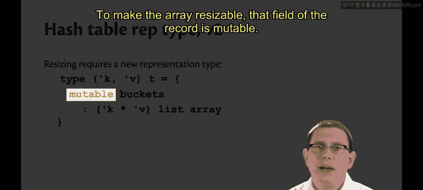
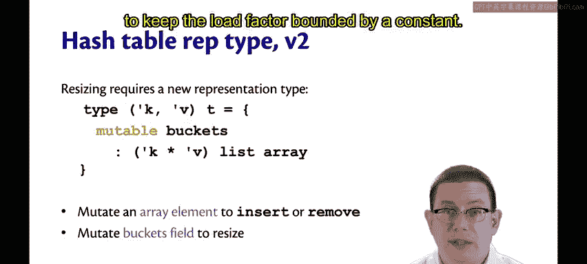

# 129：哈希表表示类型 v2 🧮

在本节中，我们将学习哈希表核心操作的算法，并探讨如何通过控制负载因子来保证操作的效率。我们将看到，一个设计良好的哈希表可以实现常数时间的插入、查找和删除操作。

---

## 核心操作算法

以下是哈希表主要操作的算法。

### 插入操作

要插入一个键值对到哈希表中，我们首先对键进行哈希，以确定它应该进入哪个桶。接着，我们需要在该桶中搜索，以删除键 `K` 的任何先前绑定。这是为了维护我们的表示不变量：任何键都不能被绑定超过一次。最后，我们将改变该桶，添加 `K` 到 `V` 的绑定。

### 查找操作

查找操作与插入类似。我们对键 `K` 进行哈希，以确定它应该在哪个桶中。然后，我们线性搜索该桶，以找到该键的绑定。

### 删除操作

删除操作与其他两个操作类似：对键进行哈希以找到桶，然后搜索该桶以删除该键的任何绑定。当然，一旦我们找到一个绑定，我们就完成了，因为根据我们的表示不变量，不可能有第二个绑定。

---

## 效率分析与负载因子

上一节我们介绍了哈希表的基本操作，本节中我们来看看这些操作的效率如何保证。

您可能立刻注意到，上述每一个操作都需要我们搜索一个桶。这有点令人担忧。我们选择这种表示类型是为了获得常数时间的操作。但现在，我们突然需要在桶中进行搜索。如果我们不小心，这可能会变成线性时间操作，而不是常数时间。

因此，我们的效率将取决于桶的长度。如果桶的长度最终与添加到哈希表中的绑定数量成函数关系，我们就有麻烦了。但如果桶的长度能保持为一个常数，那么我们就没问题，因为当我们需要搜索每个桶时，只需要做常数量的工作。

桶的长度将取决于哈希函数。例如，这里有一个糟糕的哈希函数：假设键 `K` 的哈希值，无论键是什么，都只是 `42`。这是一个常数函数。这意味着所有键都会发生冲突，并被存储到同一个桶中。本质上，我们有一个巨大的数组，除了那个桶之外，其余部分都是空的。而在那个桶里，它只是一个关联列表。因此，这退化成了我们之前用关联列表实现的映射。在这种情况下，插入、查找和删除都将是线性时间操作。

所以，让我们假设哈希函数的一个属性：假设它能将键随机地分布到各个桶中。这里的“随机”是指键均匀地分布在各个桶上，它们以相等的概率可能出现在任何桶中。这种随机均匀分布意味着所有桶的长度大致相同，因为平均而言，每个桶最终会有大约相同数量的键。

让我们称期望的桶长度为 `L`。在这种情况下，插入、查找和删除的期望运行时间都是 `O(L)`。如果期望的桶长度是 `5`，那么它们都有期望运行时间 `5`，这只是一个常数。`O(5)` 就是 `O(1)`。所以，这意味着我们得到了常数运行时间。这正是我们需要的。

如果我们的哈希函数能提供这个属性，我们就能用任意键类型实现常数时间的插入、查找和删除操作。

从表中绑定数量与整个数组中桶数量的关系来思考这个问题。如果哈希函数将键均匀地分布到所有桶中，那么检查的桶长度将是绑定数量除以桶数量。

因此，如果你有 `10` 个绑定和 `10` 个桶，那么平均而言，任何桶的期望长度将只是 `1`。你不需要搜索超过一个元素，这很好，是常数时间。如果有 `20` 个绑定在 `10` 个桶中，那么期望长度将是 `2`，这仍然没问题，仍然是常数。或者，如果绑定数量是 `5`，桶数量是 `10`，期望长度将是 `0.5`，这甚至更好，一半的时间我们甚至不需要搜索任何元素。

无论哈希函数将键分布到桶中的情况如何，还有另一个重要的量，称为**负载因子**。这正是我们上一张幻灯片所探讨的。

负载因子是绑定数量除以桶数量。负载因子有效地告诉你哈希函数在随机分布键方面做得有多好。因为这是哈希表性能的一个如此重要的特征，现实世界的标准库实现都提供了查询负载因子的功能。例如，OCaml 的哈希表和 Java 的 HashMap 实际上都提供了功能，让你可以询问哈希表其当前的负载因子，以查看你是否面临任何性能问题，或者你的哈希函数表现是好是坏。

关于负载因子的关键点是，虽然绑定数量不在实现者的控制之下，但桶的数量是。是客户端将绑定放入哈希表，我们可能不应该编写限制可添加绑定数量的哈希表。这实际上是我们直接地址表实现的一个缺点，因为你必须提前声明容量，并且它是固定的。但是桶的数量，这是数组中元素的数量。如果需要，我们可以分配新数组，并增加或减少哈希表中的桶数量。

所以，这里有一个关键思想：当负载因子变得太大时（即超过某个常数，重要的是它是一个常数），哈希表需要将数组变大。在大多数数组实现中，数组大小不可调整，这意味着需要分配一个新数组并将一些元素复制过去。当数组变大时，桶的数量增加，因此负载因子下降。这样做需要额外的工作，我们必须将这些键重新分布到更大的数组中，但通过这样做，我们将负载因子限制在一个常数范围内。

---

## 新的表示类型

以下是我们的新表示类型。此时我把它放在一个记录中，因为我想让数组可变。我也可以使用 `ref`，差别不大，但稍后使用记录会更方便。

```ocaml
type ('k, 'v) t = {
  mutable buckets : ('k * 'v) list array;
  mutable size : int; (* 当前绑定数量 *)
}
```


记录中的 `buckets` 字段是可变的。这意味着我可以在需要增加数组大小时改变该字段。所以请注意这里有两层可变性：数组本身的元素是可变的，而记录有一个 `buckets` 字段也是可变的。我们改变数组元素以执行插入或删除操作。当我们需要调整数组大小以将负载因子限制在常数范围内时，我们改变 `buckets` 字段。



---

## 总结



本节课中我们一起学习了哈希表核心操作的算法，并深入理解了保证其效率的关键——负载因子。我们了解到，通过设计良好的哈希函数将键均匀分布，并动态调整数组大小以控制负载因子在一个常数范围内，哈希表可以实现期望的常数时间插入、查找和删除操作。我们还介绍了新的可变记录表示类型，它支持数组的动态扩容。