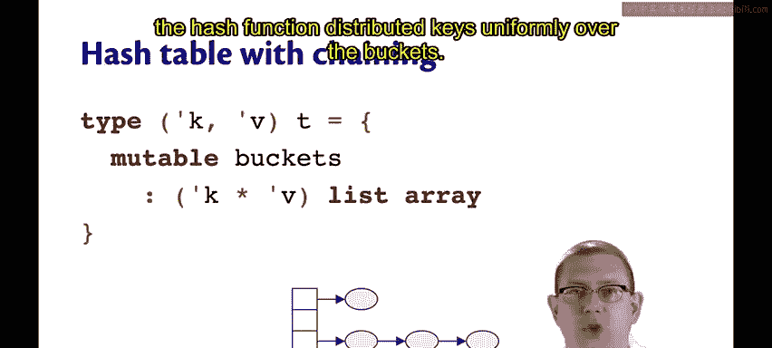
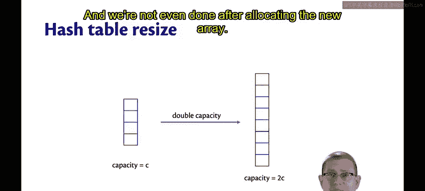
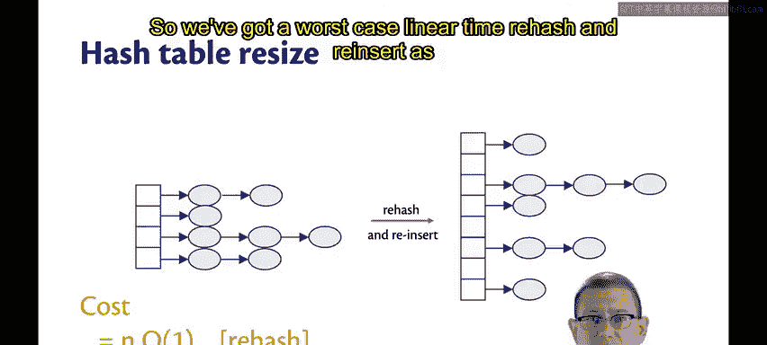
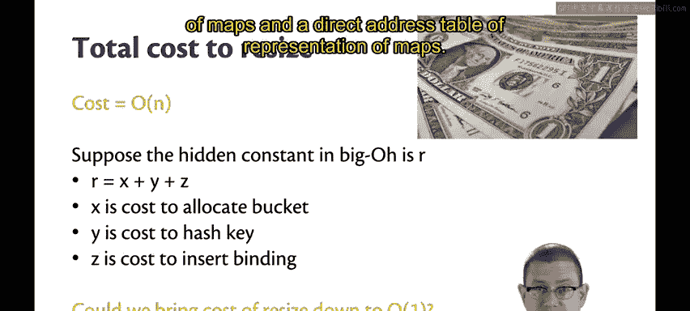
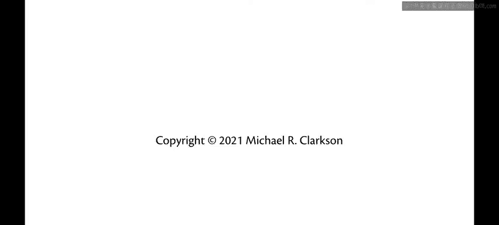

# 137：哈希表扩容效率分析 🧮

在本节课中，我们将分析哈希表在扩容（Rehashing）操作时的效率。我们将看到，虽然单次扩容操作在最坏情况下是线性时间，但通过均摊分析，我们仍然可以实现平均的常数时间性能。

## 哈希表链式实现回顾

上一节我们介绍了使用链式法实现的哈希表。其表示类型包含一个桶数组，每个桶中存储一个关联列表。

每个桶中关联列表的长度可能各不相同。但我们假设哈希函数能将键均匀地分布到各个桶中，从而将关联列表的期望长度保持为一个常数。

因此，查找操作是高效的。但插入操作偶尔需要进行扩容，以将平均桶长度限制在一个常数范围内。

## 扩容操作的成本分析

在哈希表扩容时，假设其容量为 `C`，即数组中有 `C` 个桶。我们约定，会将桶数组的容量加倍，创建一个容量为 `2C` 的新数组。OCaml 的标准库实现也采用了同样的策略。

以下是扩容操作的主要步骤及其成本：

1.  **重新分配数组**：仅分配新数组的成本就是 `O(C)`，因为新数组的长度为 `2C`。
2.  **重新哈希和重新插入**：在分配新数组后，我们还需要将原始数组中的每个元素重新哈希并插入到新数组中。这是因为哈希函数现在需要根据新的数组长度（`2C`）重新计算每个键应归属的桶。这不仅仅是简单的复制。

假设在扩容时，绑定（键值对）的数量 `n = 2C`（因为我们在绑定数量是桶数量的两倍时触发扩容）。那么：

*   重新哈希 `n` 个键（假设哈希函数是常数时间）的成本是 `O(n)`。
*   将 `n` 个绑定插入新桶数组的成本也是 `O(n)`。即使所有键都冲突到同一个桶（最坏情况），我们仍然需要进行 `n` 次插入。

因此，重新哈希和重新插入的总成本在最坏情况下也是线性时间，即 `O(n)`。

这意味着**单次扩容操作的总成本在最坏情况下是线性时间，即 `O(n)`**。

## 深入思考常数因子

根据大 O 记法的定义，它隐藏了一个常数因子。当我们说某个操作是 `O(n)` 时间，意味着它被某个常数乘以 `n` 所限定。这个常数可能是 1、2 或 5000。

为了帮助我们思考，让我们暂时考虑这个隐藏的常数。假设扩容成本 `O(n)` 中隐藏的常数是 `R`。我们可以进一步将 `R` 分解为几个部分，每个部分对应扩容中每个绑定（键值对）的平均成本：

*   令 `X` 为分配一个桶的成本（我们需要分配 `n` 个新桶）。
*   令 `Y` 为哈希一个键的成本（我们需要哈希 `n` 个键）。
*   令 `Z` 为插入一个绑定的成本（我们需要插入 `n` 个绑定）。

那么，`R` 可以表示为 `X + Y + Z`，它代表了执行重新分配、重新哈希和重新插入时，**每个绑定所花费的平均成本**。

我们实现哈希表的初衷是为了获得常数时间的性能，但单次扩容的线性成本似乎破坏了这个目标。

## 核心问题与目标

这就引出了核心问题：**我们能否将所有这些扩容的成本降低到 `O(1)`？我们能否以某种方式将其降低到常数成本？**

如果我们能做到这一点，那么我们就实现了最初的目标：在映射的关联列表表示和直接寻址表表示之间取得最佳平衡，同时拥有高效的查找和平均高效的插入操作。

## 总结

本节课中，我们一起学习了哈希表扩容操作的效率分析。我们发现，虽然单次 `insert` 操作在最坏情况下（触发扩容时）是 `O(n)` 的，但通过下一节将要介绍的**均摊分析**，我们可以证明，在一系列操作中，每个操作的平均成本仍然是 `O(1)`。这使我们能够实现哈希表所承诺的高效性能。