# 140：双列表队列的摊还分析 📊

在本节课中，我们将运用摊还分析的方法，再次审视双列表队列的效率。我们将看到，尽管出队操作在最坏情况下是线性的，但通过巧妙的“记账”方式，我们可以证明其**摊还时间复杂度**是常数级的。

## 双列表队列回顾

上一节我们介绍了双列表队列的数据结构。让我们快速回顾一下其核心概念。

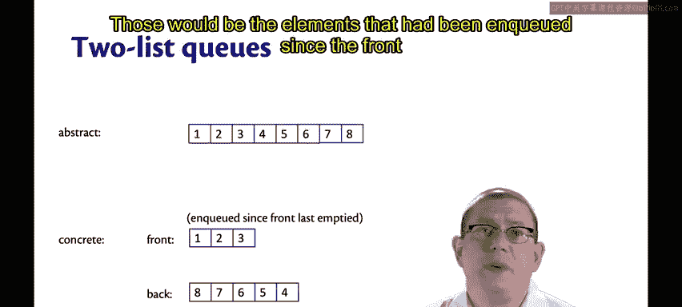

双列表队列在抽象上是一个有序的元素序列。但在具体实现中，它被分解为两个列表：一个**前列表**和一个**后列表**。

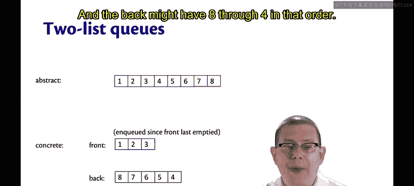

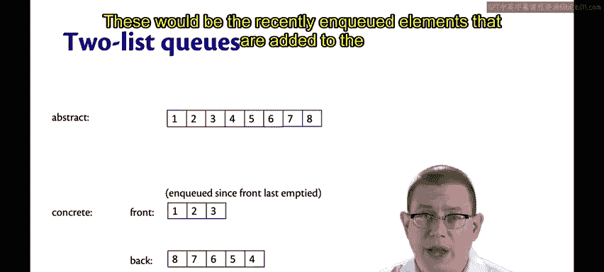

*   **前列表**：按队列顺序存储元素。
*   **后列表**：按**逆序**存储新入队的元素。

例如，一个包含元素 `1, 2, 3, 4, 5, 6, 7, 8` 的队列，其具体表示可能如下：
*   前列表：`[1; 2; 3]`
*   后列表：`[8; 7; 6; 5; 4]`

我们定义了一个**表示不变式**来保证正确性：**如果前列表为空，则后列表也必须为空**。这确保了空队列表示的唯一性，并指明了出队操作的位置——我们总是从前列表出队。当前列表变空时，我们将后列表反转，并将其作为新的前列表。

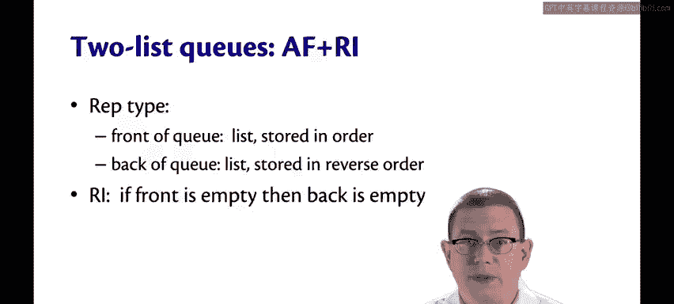

## 操作效率分析

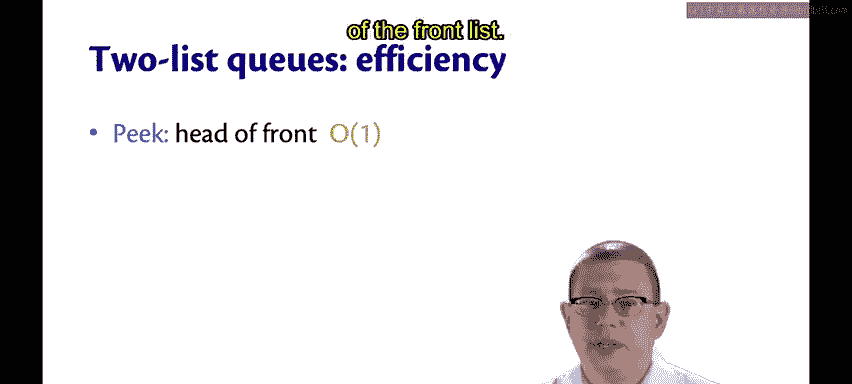

现在，我们来分析双列表队列中各个操作的效率。

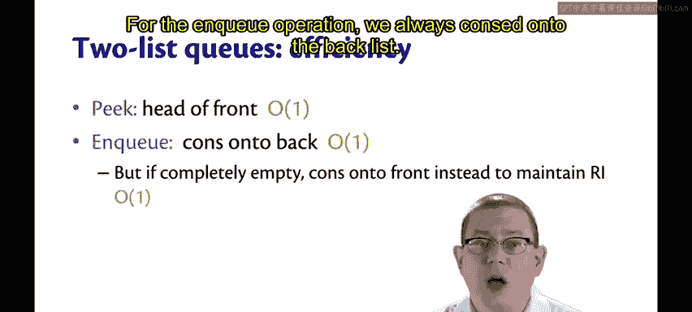

### 常数时间操作

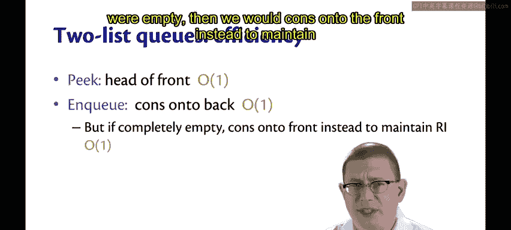

以下是时间复杂度为常数 **O(1)** 的操作：

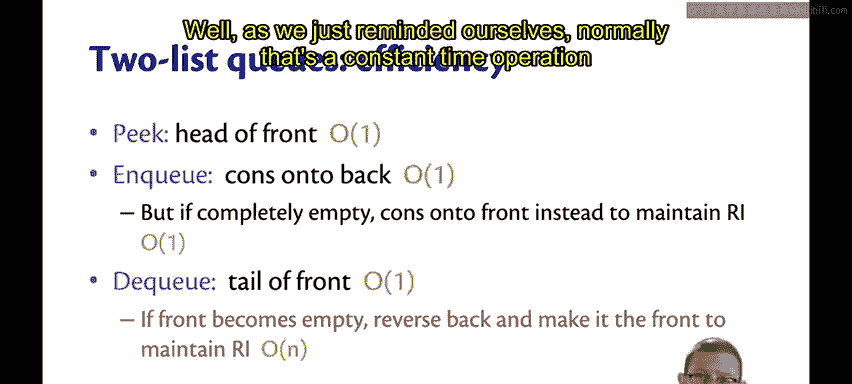

*   **`peek`（查看队首）**：只需查看前列表的头部元素。
    ```ocaml
    let peek = function
      | {front = hd::_; _} -> Some hd
      | _ -> None
    ```
*   **`enqueue`（入队）**：通常通过 `cons` 操作将新元素添加到后列表的头部。
    ```ocaml
    let enqueue x {front; back} = {front; back = x::back}
    ```
    *（注：当队列为空时，有一个特殊情况需要将元素加入前列表以维持不变式，但这仍然是常数时间。）*

### 出队操作的复杂性

出队操作 `dequeue` 的效率则有些复杂。

*   **通常情况**：从前列表的尾部取出元素，这是常数时间操作。
    ```ocaml
    (* 常规出队 *)
    let dequeue {front = _::tl; back} = {front = tl; back}
    ```
*   **特殊情况**：当前列表变为空时，我们必须执行一个昂贵的操作——将整个后列表反转并设为新的前列表。如果此时队列中有 `n` 个元素，这个反转操作的成本就是 **O(n)**。

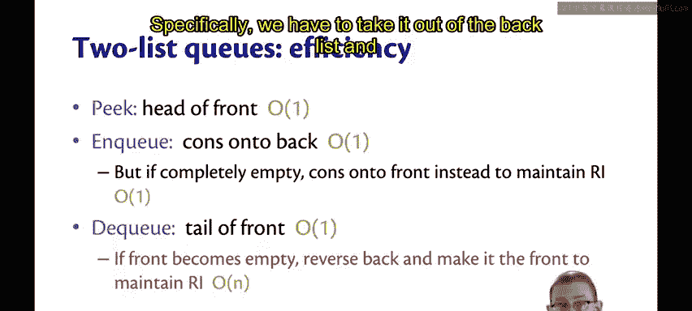

因此，`dequeue` 的**最坏情况时间复杂度是线性的**。

## 摊还分析：平摊成本

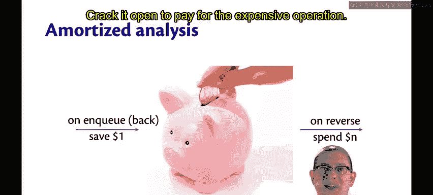

虽然 `dequeue` 有时很昂贵，但我们可以通过**摊还分析**来证明，如果将成本平摊到一系列操作中，每个操作的平均成本仍然是常数。

想象一个“存钱罐”模型：
1.  每次执行一次廉价的 `enqueue` 操作（向后列表添加元素）时，我们就在存钱罐里存入 **1 美元**。
2.  当遇到那个昂贵的 `dequeue` 操作（需要反转后列表）时，我们就打开存钱罐，用里面存的钱来支付这个 **n 美元**的成本。

以下是一个具体示例：

| 操作序列 | 队列状态 (前列表, 后列表) | 存钱罐余额 | 说明 |
| :--- | :--- | :--- | :--- |
| 初始 | `([], [])` | $0 | 空队列。 |
| `enqueue 1` | `([1], [])` | $0 | 因前列表空，元素加在前列表，不存钱。 |
| `enqueue 2..10` | `([1], [10;9;...;2])` | **$9** | 执行9次 `enqueue`，每次存$1。 |
| `dequeue` | `([10;9;...;2], [])` | **$0** | 前列表空，需反转后列表（成本$9），正好用光存款。 |
| `dequeue x 9` | `([], [])` | $0 | 连续9次出队都从前列表取，成本低，不涉及存钱罐。 |

通过这种记账方式，昂贵操作的成本被之前多次廉价操作“预付”了。因此，虽然单次 `dequeue` 的最坏情况是 **O(n)**，但其**摊还时间复杂度是 O(1)**。

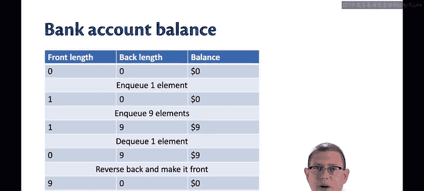

## 总结

本节课我们一起学习了如何对双列表队列进行摊还分析。

*   我们回顾了双列表队列的结构和表示不变式。
*   我们分析了 `peek` 和 `enqueue` 是严格的常数时间操作，而 `dequeue` 的最坏情况是线性时间。
*   通过引入“存钱罐”的比喻和摊还分析，我们证明了 `dequeue` 操作的**摊还成本是常数**。这意味着在一系列操作中，每个操作的平均时间开销很小且恒定。

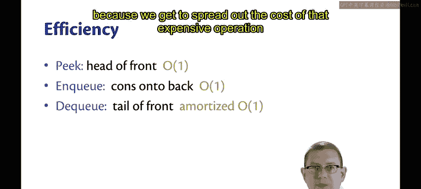

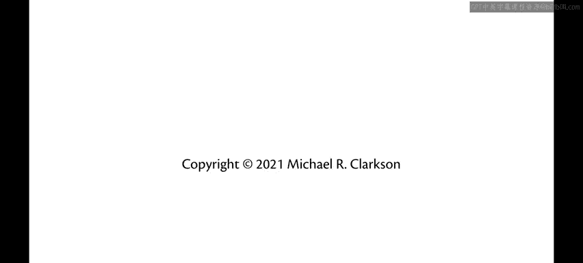

这种分析揭示了数据结构和算法设计中的一个重要思想：即使单个操作可能很昂贵，只要它能被足够多的廉价操作“摊销”，整体性能仍然可以非常高效。