# 149：冈崎插入算法 🧮

在本节课中，我们将要学习如何为红黑树实现插入操作。我们将从一个简单的二叉搜索树插入代码开始，然后探讨如何为新增节点选择颜色，并最终介绍冈崎提出的一种优雅算法，该算法通过临时违反局部不变量，再通过旋转操作进行修复，从而高效地完成插入。

## 从二叉搜索树插入开始

上一节我们介绍了红黑树的基本概念和不变性。本节中我们来看看如何实现插入操作。我们可以复用二叉搜索树的插入代码作为起点。

如果从一棵空树（即一个叶子节点）开始，并希望插入一个元素 `X`，我们将创建一个新节点来存储 `X`，并为其分配空的子树。

```ocaml
type color = Red | Black
type 'a tree = Leaf | Node of color * 'a * 'a tree * 'a tree

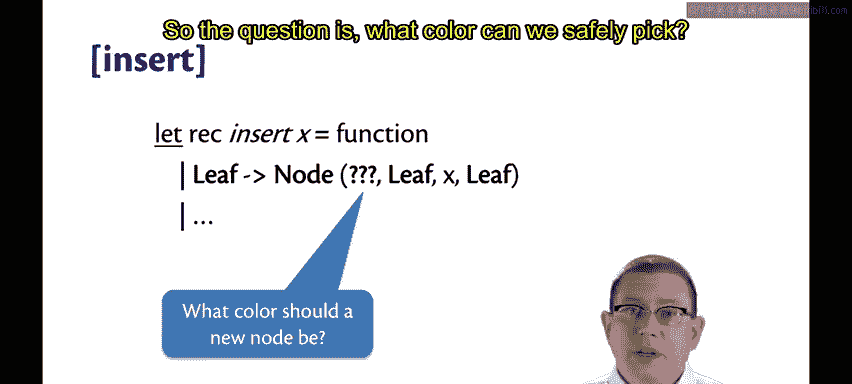

let insert_bst x t = ... (* 标准BST插入逻辑 *)
```

但由于这是红黑树，我们现在必须为这个新节点选择一个颜色。

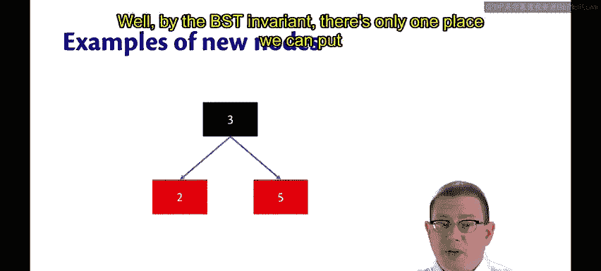

## 新节点的颜色选择难题

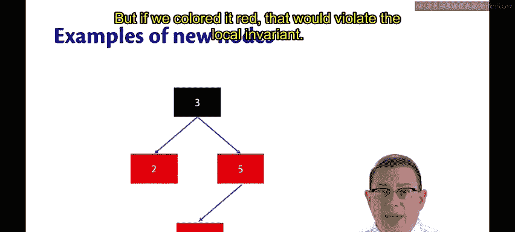

那么，我们可以安全地选择什么颜色呢？让我们通过一个例子来思考。

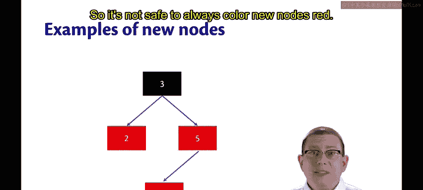

假设我们有一棵红黑树，并希望插入元素 `4`。根据二叉搜索树的不变性，它只能被放在节点 `5` 的左侧。


如果我们将其着为**红色**。

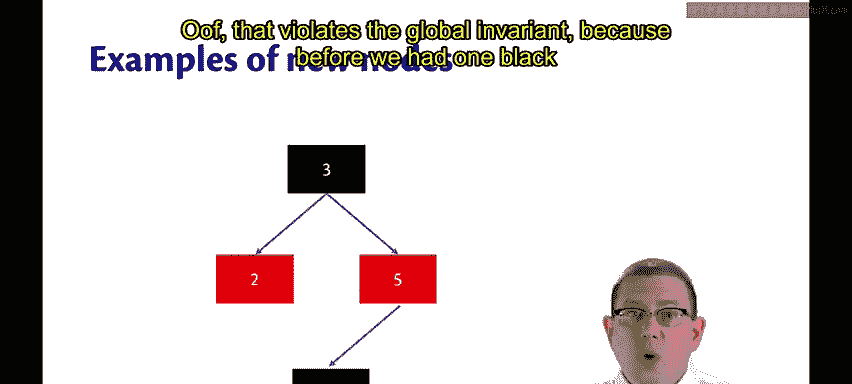


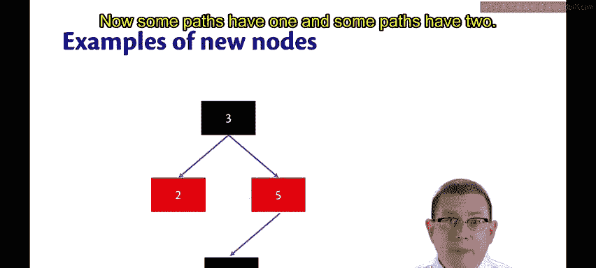

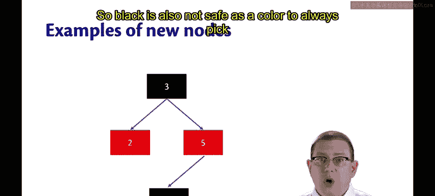

这将违反**局部不变量**（红节点的子节点必须是黑的）。因此，总是将新节点着为红色并不安全。


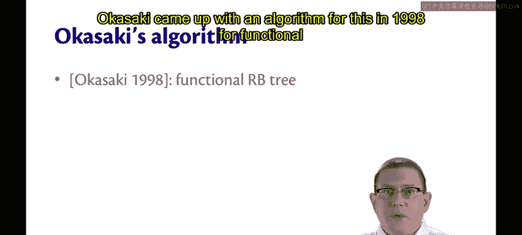

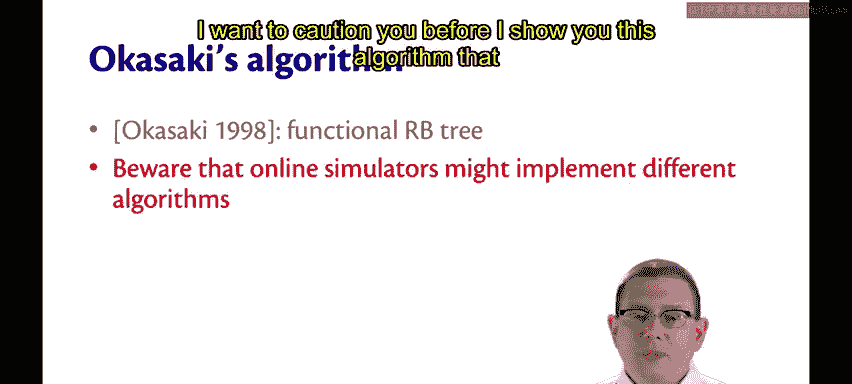

如果我们将其着为**黑色**呢？这违反了**全局不变量**（从根到每个叶子的路径必须包含相同数量的黑节点）。因为在此之前，每条路径有一个黑节点，现在有些路径有一个，有些路径有两个。所以，总是将新节点着为黑色也不安全。


## 冈崎算法的核心思想

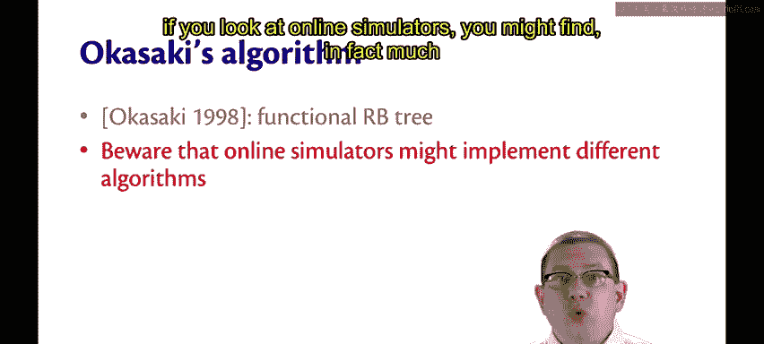

那么该如何解决这个问题呢？冈崎在1998年为函数式红黑树提出了一种特别优雅的算法。

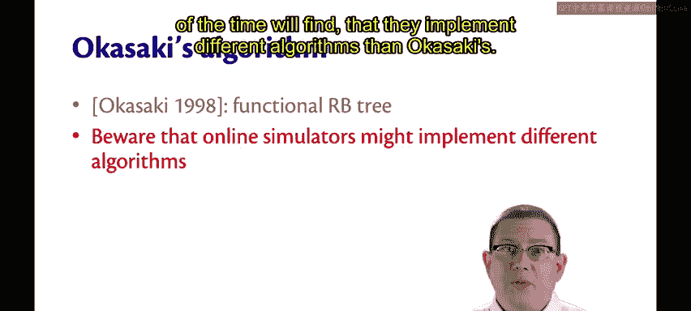

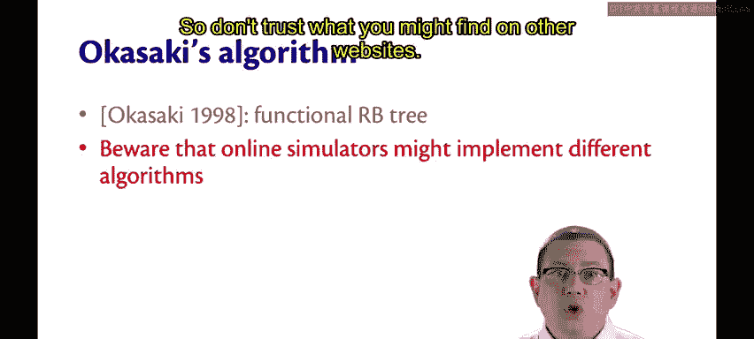

在展示这个算法之前，我需要提醒你：如果你查看在线的红黑树模拟器，你很可能会发现它们实现的算法与冈崎算法不同。因此，不要完全相信你在其他网站上找到的内容。😡

冈崎算法的核心原则基于以下几点：

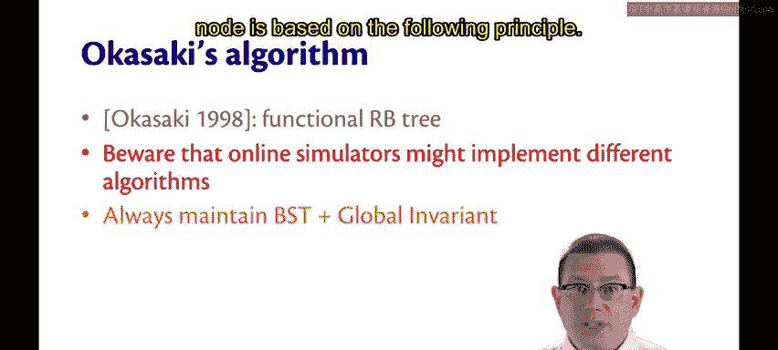

1.  我们将始终维护**二叉搜索树不变性**和**全局不变量**。
2.  但我们愿意**暂时牺牲局部不变量**。

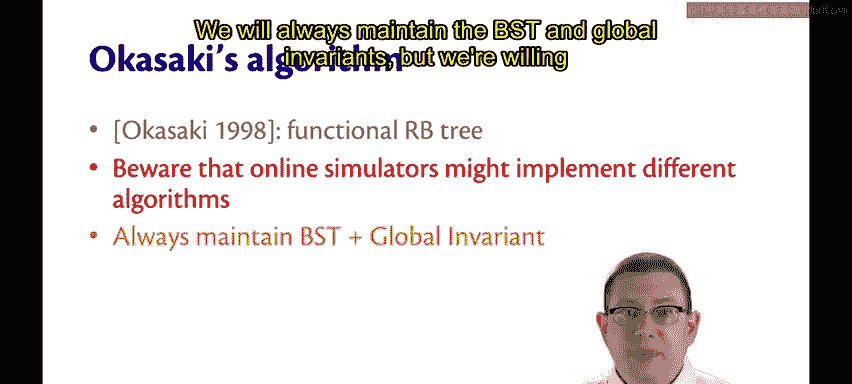

具体操作步骤如下：

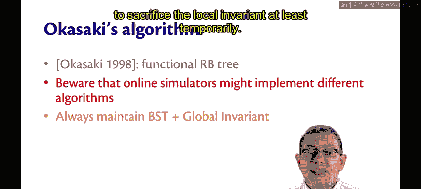

*   **插入并着色**：我们总是将新节点着为**红色**，即使这可能导致局部不变量被违反。
*   **递归修复**：在插入这个红色新节点后，我们递归地向上回溯。
*   **检测与旋转**：在回溯过程中，我们持续检查当前节点下方的两个直接子节点。😡 如果我们检测到连续出现两个红色节点的违规情况，我们就对节点进行旋转操作。
*   **恢复与平衡**：旋转的目的是使局部不变量再次成立，同时在这个过程中平衡树的结构，使其形状更好。

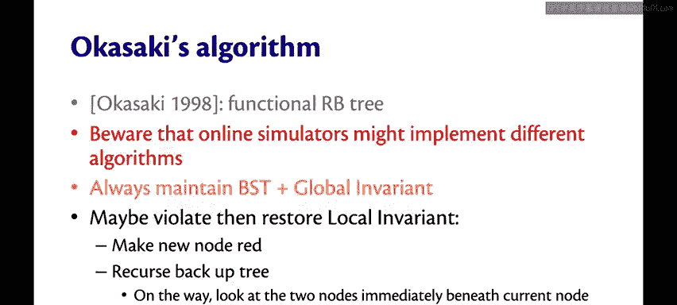

## 算法步骤概述

以下是该算法关键阶段的一个简要总结：

*   **阶段一：红色插入**：始终以红色插入新节点，接受可能产生的临时“红-红”冲突。
*   **阶段二：向上回溯**：从插入点开始，沿路径向根节点回溯。
*   **阶段三：模式匹配与旋转**：在回溯的每个节点处，检查其子节点和孙节点的颜色模式。当匹配到特定的“红-红”违规模式时，应用预定义的旋转和重新着色操作来消除冲突，并将“红色”向上推送。
*   **阶段四：根节点处理**：最终，回溯到根节点。如果根节点被染成了红色（这是旋转过程中红色上推可能导致的），我们将其重新着为黑色。这会使所有路径的黑高增加1，但全局不变量（所有路径黑高相等）依然保持。

## 总结


本节课中我们一起学习了冈崎的红黑树插入算法。我们从简单的BST插入出发，发现了直接为新节点选择颜色的困难。冈崎算法通过一个巧妙的策略解决了这个问题：**总是插入红色节点，允许暂时的局部违规，然后在递归回溯的过程中，通过旋转和重新着色来修复这些违规**。这种方法在保持二叉搜索树性质和全局黑高不变量的前提下，高效地维护了红黑树的结构。理解这个“先破坏，后修复”的范式，是掌握函数式红黑树操作的关键。