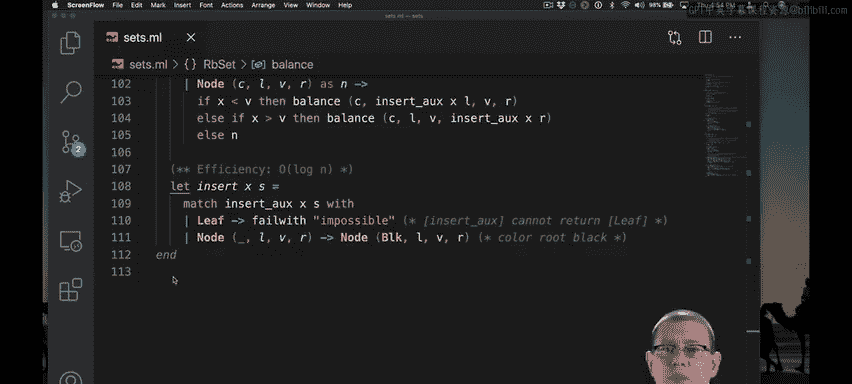
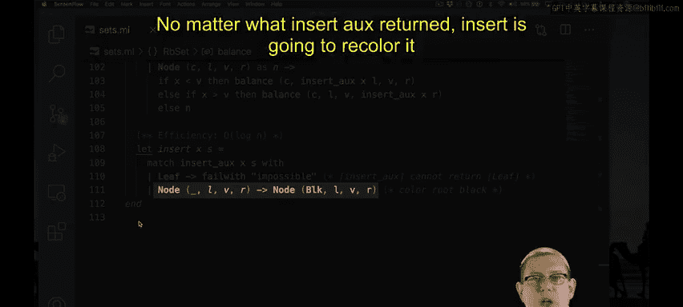

# 151：红黑树插入实现 🧮

在本节中，我们将学习红黑树插入操作的具体代码实现。我们将分析平衡操作和插入函数的逻辑，理解它们如何协同工作以维护红黑树的性质。

## 概述

红黑树是一种自平衡的二叉搜索树。它通过一组颜色规则和旋转操作来确保树的高度大致平衡，从而保证插入、删除和查找等操作的时间复杂度为 O(log n)。本节我们将深入探讨其插入操作的实现细节。

## 平衡操作

首先，我们来看平衡操作的代码。这个函数负责在插入后检查和修复可能违反的红黑树性质。

```ocaml
let balance = function
  | Black, z, Node (Red, y, Node (Red, x, a, b), c), d
  | Black, z, Node (Red, x, a, Node (Red, y, b, c)), d
  | Black, x, a, Node (Red, z, Node (Red, y, b, c), d)
  | Black, x, a, Node (Red, y, b, Node (Red, z, c, d)) ->
      Node (Red, y, Node (Black, x, a, b), Node (Black, z, c, d))
  | color, value, left, right -> Node (color, value, left, right)
```

这个函数是常数时间复杂度的，它不进行递归。它的核心工作是模式匹配树的前两层结构，检查是否存在连续的红色节点。如果发现违反规则的情况（即出现“红-红”冲突），它就执行相应的旋转操作并构造一棵新的树。否则，它直接返回原树。

## 辅助插入函数

接下来，我们分析辅助插入函数 `insert_aux`。这个函数是插入操作的核心，其逻辑与普通二叉搜索树的插入非常相似。

```ocaml
let rec insert_aux x = function
  | Leaf -> Node (Red, x, Leaf, Leaf)
  | Node (color, v, left, right) as node ->
      if x < v then
        balance (color, v, insert_aux x left, right)
      else if x > v then
        balance (color, v, left, insert_aux x right)
      else
        node
```

以下是 `insert_aux` 函数的关键步骤：

1.  **插入到叶子节点**：如果当前节点是 `Leaf`，则创建一个新的节点。新节点的值为 `x`，左右子树均为 `Leaf`，并且**始终将这个新节点着色为红色**。这正是 Okasaki 算法的要求：新插入的节点总是红色，即使这可能暂时违反局部的不变性规则。
2.  **递归插入**：如果当前不是叶子节点，函数会比较待插入值 `x` 与当前节点值 `v` 的大小。
    *   如果 `x < v`，则递归地在左子树中插入 `x`。
    *   如果 `x > v`，则递归地在右子树中插入 `x`。
    *   如果 `x = v`，说明值已存在，直接返回原节点。
3.  **调用平衡**：与普通BST插入的主要区别在于，在每次递归调用返回后，`insert_aux` 会立即将结果（新的左子树或右子树）与当前节点的其他部分一起传递给 `balance` 函数。这样，在递归回溯的过程中，每一层都会尝试修复可能因插入红色节点而破坏的平衡性。

## 主插入函数

最后，我们来看主插入函数 `insert`。它是对外提供的接口，内部使用 `insert_aux` 完成大部分工作。

```ocaml
let insert x t =
  match insert_aux x t with
  | Leaf -> failwith "insert: impossible"
  | Node (_, v, left, right) -> Node (Black, v, left, right)
```



`insert` 函数的工作流程如下：

1.  它首先调用 `insert_aux x t` 在树 `t` 中插入值 `x`。
2.  然后对 `insert_aux` 的返回结果进行模式匹配。
    *   第一个分支 `Leaf -> ...` 理论上永远不会发生，因为向非空树插入元素不会返回空树。这里包含它只是为了实现详尽模式匹配，并通过 `failwith` 处理意外情况。
    *   第二个分支是主要逻辑。无论 `insert_aux` 返回的根节点是什么颜色，`insert` 函数都会**将其重新着色为黑色**。这是完成插入操作的最终步骤，确保了红黑树的根节点始终是黑色这一全局性质。

## 时间复杂度



`insert` 函数的时间复杂度是对数级的 O(log n)。因为它调用的 `insert_aux` 函数沿着树向下递归一次（O(log n)），然后在回溯的每一层调用常数时间的 `balance` 函数。这个对数复杂度的保证，源于我们之前讨论过的关于红黑树大小和路径长度的引理和定理。

## 总结

本节课我们一起学习了红黑树插入操作的完整实现。我们首先分析了常数时间的 `balance` 函数，它通过模式匹配和旋转来修复局部冲突。然后，我们深入探讨了递归的 `insert_aux` 函数，它像普通BST一样插入节点（但总是着红色），并在回溯时调用 `balance` 维持平衡。最后，主 `insert` 函数确保根节点为黑色，完成了整个插入过程。整个算法精巧地保证了树在插入后仍能维持红黑树的所有性质，从而确保操作的高效性。