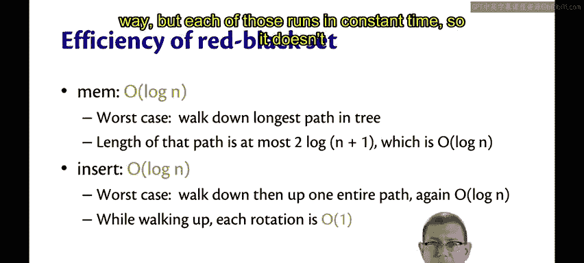
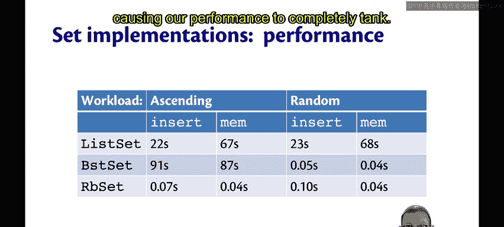

OCaml编程：8.36：红黑树集合性能分析 🎯

在本节中，我们将回顾红黑树操作的效率，并分析其性能表现。

上一节我们介绍了红黑树的操作实现，本节中我们来看看这些操作的性能如何。

红黑树操作的效率分析如下：

以下是`mem`操作的效率分析：
*   `mem`操作在**对数时间**内运行。
*   其最坏情况是必须遍历树中最长的路径。
*   由于红黑不变式的保证，该路径的长度至多为 **O(log n)**。

以下是`insert`操作的效率分析：
*   对于`insert`操作，最坏情况是沿着最长路径向下遍历，然后在递归返回时再向上回溯。
*   这同样需要 **O(log n)** 的时间。
*   在向上回溯路径的过程中，我们会进行旋转操作，但每次旋转仅需常数时间，因此不会增加渐近复杂度。

通过使用这些更高效的红黑树操作，我们获得了期望的性能表现，无论是在升序工作负载还是随机工作负载下。

因此，这个红黑树集合实现的`insert`和`mem`性能，与二叉搜索树集合在随机工作负载下的性能完全可比。

😊 无论是对于红黑树集合执行升序工作负载还是随机工作负载，其性能大致相同。我们在此看到的数据存在微小差异，这只是测量中的实验误差。为了获得更精确的信息，本应进行大量重复实验并计算置信区间，但希望当前的演示足以证明，通过使用平衡二叉树的实现，我们能够获得非常理想的性能，而不会因某些插入顺序导致性能急剧下降的极端情况。

本节课中我们一起学习了红黑树`mem`和`insert`操作的时间复杂度均为**O(log n)**，并通过性能对比图表验证了其在升序和随机插入序列下都能保持稳定高效的性能，成功避免了普通二叉搜索树可能出现的性能退化问题。