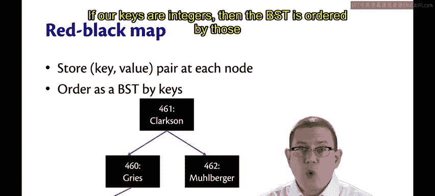
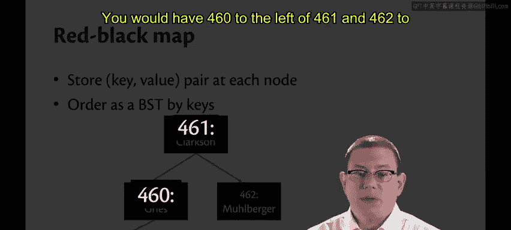
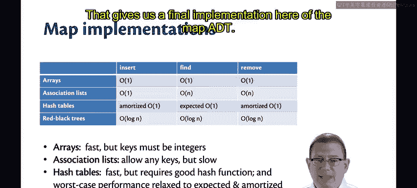
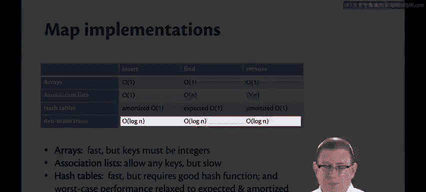

# 153：用红黑树实现映射表 🗺️

在本节课中，我们将学习如何利用红黑树来实现映射表（Map）这一抽象数据类型。我们将看到，只需对之前用于实现集合（Set）的红黑树进行简单的修改，就能得到一个高效、持久化的映射表实现。

## 从集合到映射表





上一节我们介绍了如何用红黑树实现集合。本节中，我们来看看如何将其扩展为映射表。映射表与集合的主要区别在于，每个节点不仅存储一个键（Key），还存储一个与该键关联的值（Value）。

为了实现映射表，我们只需在每个节点存储一个键值对。这个键用于维持二叉搜索树的排序不变式。例如，如果键是整数，那么树将按照这些整数进行排序。值本身不影响树的排序结构，它只是作为附加信息存储在节点中。

当我们在树中查找一个绑定时，可以通过键在**对数时间**内找到它，而它绑定的值就存储在同一个节点中。



以下是映射表抽象数据类型（ADT）的最终实现核心思想：



```ocaml
type ('k, 'v) tree =
  | Leaf
  | Node of color * ('k * 'v) * ('k, 'v) tree * ('k, 'v) tree
```

## 红黑树映射表的性能

红黑树的所有操作——插入（`insert`）、查找（`find`）和删除（`remove`）——其时间复杂度都是**O(log n)**。这意味着在最坏情况下，它们也是对数时间复杂度的。

这种渐近效率介于哈希表和关联列表之间。但**对数时间远优于线性时间**。因此，随着输入规模变得非常大，红黑树的性能将更接近哈希表，而不是关联列表。

我们通过这种函数式的红黑树，得到了一个几乎和哈希表一样快的数据结构，但它还具有**持久化**的特性。这意味着如果你需要，可以保留数据结构的历史版本。这是哈希表无法直接提供的（至少在不显式创建副本的情况下）。

持久化数据结构通常比同等的非持久化（临时性）数据结构需要付出对数级的额外时间复杂度，这是我们为持久化特性所付出的微小性能代价。

## 不同实现的性能权衡

顺便提一下，我完成了我们的集合实现性能对比表。通过OCaml的`Hashable`模块创建哈希集合（Hash Set），在升序和随机工作负载下，哈希集合的性能确实非常快，实际上比红黑树集合快大约一个数量级。

因此，如果你追求最佳性能，可变性（Mutability）实际上是必不可少的。我经常开玩笑说可变性是万恶之源，但它确实能带来好处——它为我们提供了我们所看的四种实现中最快的映射表实现。

## 关于优化的思考

大家应该都记得托尼·霍尔爵士（Sir Tony Hoare），他因对编程语言定义和设计的基础性贡献而获得了1980年的图灵奖。他曾说过：“我们应该忘记那些小的效率问题，大约97%的时间都是如此。**过早优化是万恶之源**。”

作为程序员，我们很容易过早地开始思考如何优化某段代码。我认为托尼爵士想说的是，在大多数时候，我们应该放下这种想法。不要在编写每一行代码时都试图完全优化它，那样你走不远。

另一方面，**优化**和**过早优化**是有区别的。你在本课程和其他课程中学到的渐近复杂度理论，其目的是作为一个指南，让你提前知道哪些操作会非常昂贵，哪些则很廉价。

如果你知道需要一个非常高效的映射表数据结构，那么现在你就知道应该使用哈希表或红黑树，很可能不应该使用普通的二叉搜索树，绝对不应该使用关联列表。

另一方面，如果你知道自己不需要一个超级高效的映射表实现，只需要一个快速且易于实现的东西，那么关联列表就是你的选择。如果你只有非常小的映射表，关联列表就足够了，因为线性遍历的操作量不会太大。

因此，思考数据结构操作的渐近效率是很重要的。然后，再担心数据结构内部或你使用它们的代码中，具体每一行代码的详细优化问题。

## 总结


本节课中，我们一起学习了如何用红黑树实现映射表。我们看到，通过在节点中存储键值对，可以轻松地将红黑树集合扩展为映射表，并获得**O(log n)**时间复杂度的插入、查找和删除操作。我们比较了红黑树、哈希表、普通二叉搜索树和关联列表的性能与特性，认识到红黑树在提供高效操作的同时，还具备持久化的优势。最后，我们讨论了在编程中平衡性能需求与实现复杂度的重要性，避免过早优化，但也要根据渐近复杂度理论明智地选择数据结构。