# 154：编译器和解释器

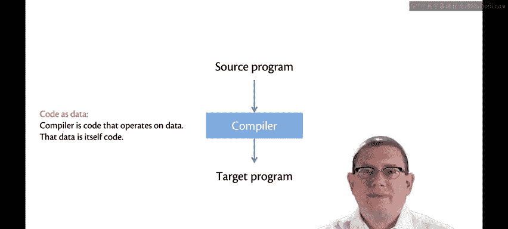

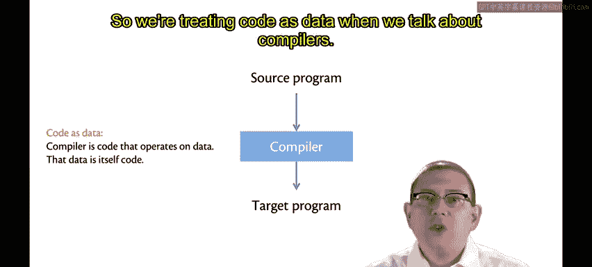

在本节课中，我们将要学习编程语言实现的两个核心概念：编译器和解释器。我们将探讨它们的基本定义、工作原理、主要区别以及现代语言实现中常见的混合技术。

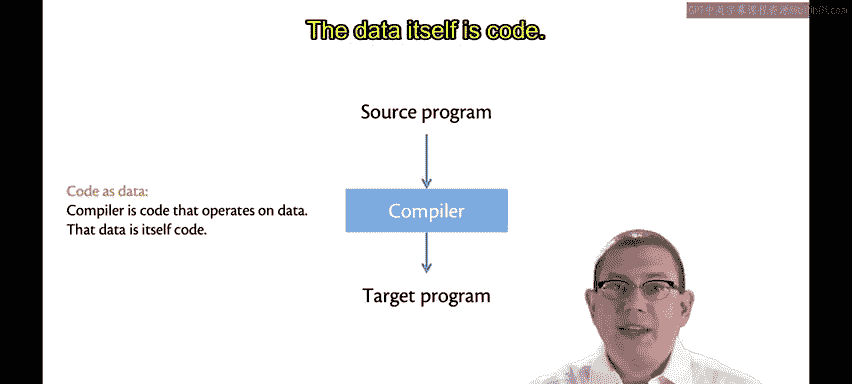

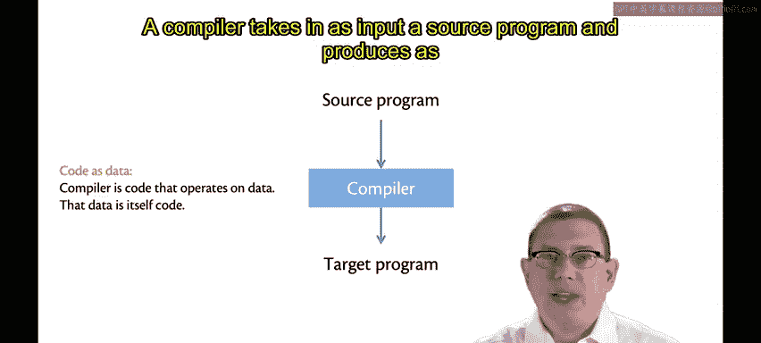

## 编译器 🛠️

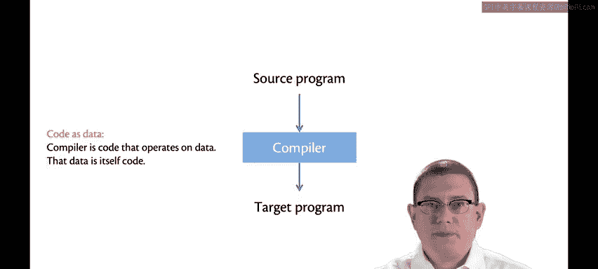

编译器是一种对程序进行操作的软件。当我们讨论编译器时，我们实际上是在将代码视为数据。

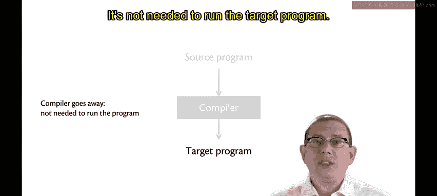

编译器的输入是一个**源程序**。

编译器的输出是一个**目标程序**。

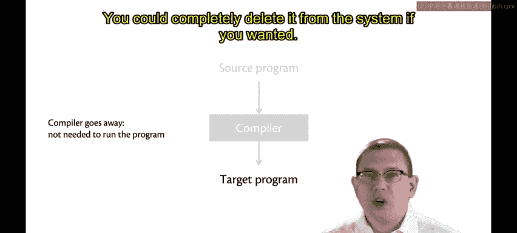

编译器完成工作后便会退出。运行目标程序时不再需要编译器。操作系统会帮助加载和启动程序，但编译器本身无需驻留。你甚至可以在目标程序运行时将其从系统中完全删除。

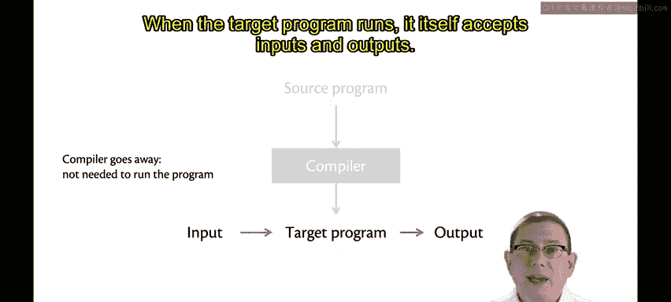

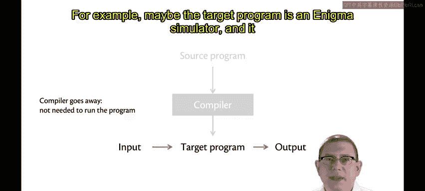

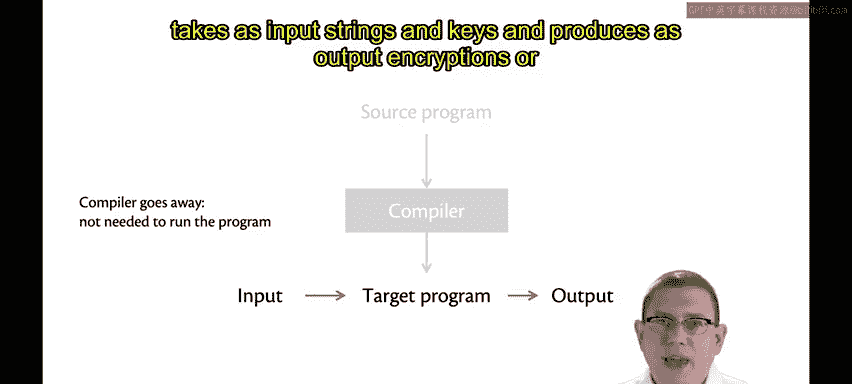

目标程序自身会接受输入并产生输出。例如，目标程序可能是一个恩尼格玛密码机模拟器，它接收字符串和密钥作为输入，并产生加密或解密的结果作为输出。

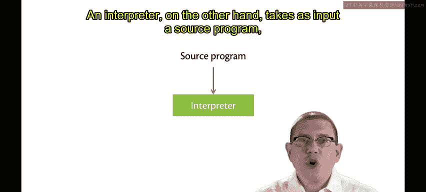

因此，编译器的主要工作是进行**翻译**。这种翻译通常意味着从像Java或OCaml这样的高级语言，向下翻译到低级语言，甚至是像x86这样的机器语言。

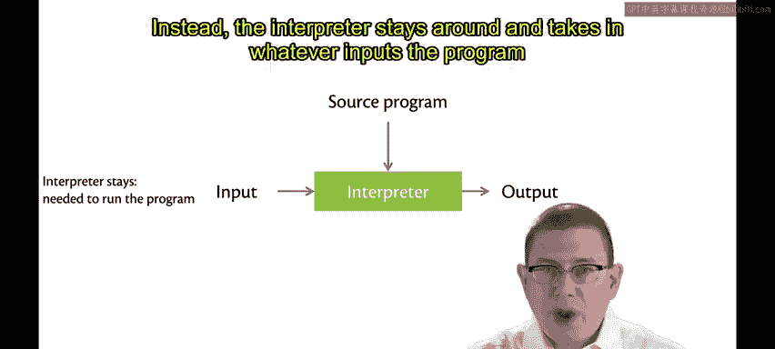

正因为如此，编译器通常能提供更好的性能，因为它们会进行优化以改进代码，使其在机器上运行得非常快。

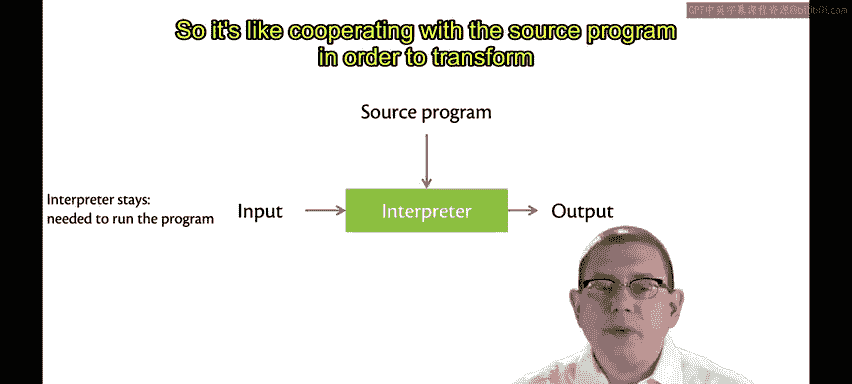

## 解释器 🧑‍💻

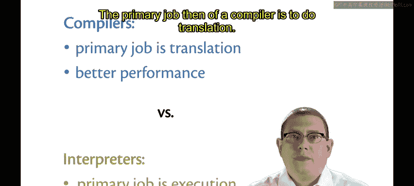

另一方面，解释器也以**源程序**作为输入。

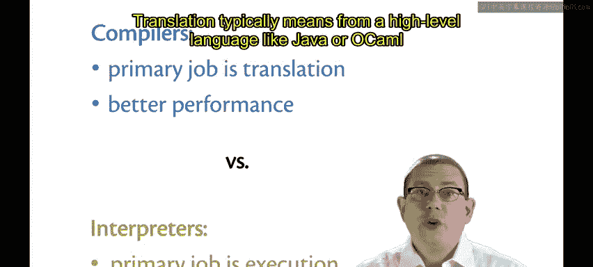

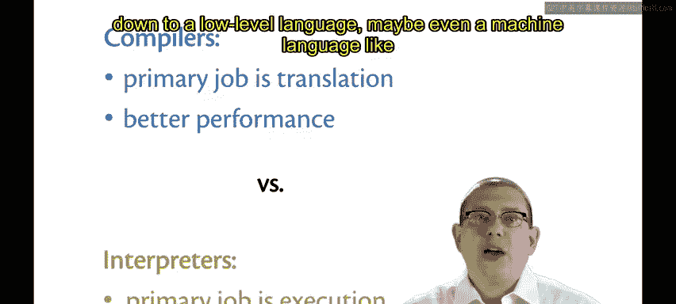

但解释器不会产生一个目标程序作为输出。

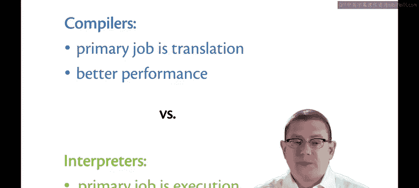

相反，解释器会持续运行。它接收程序本应接收的任何输入，并直接产生输出。

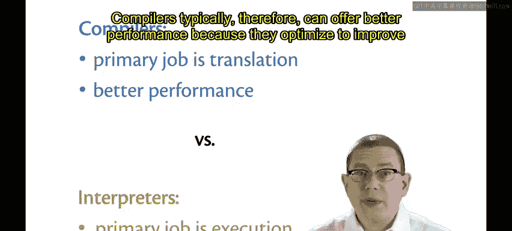

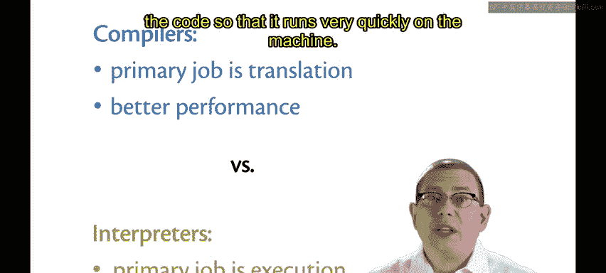

解释器与源程序协作，共同将输入转换为输出。

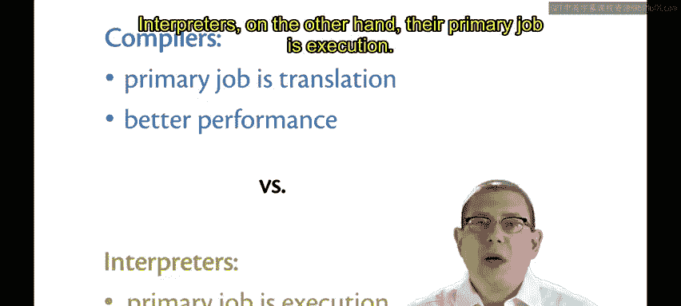

因此，解释器的主要工作是**执行**。它只想运行程序。

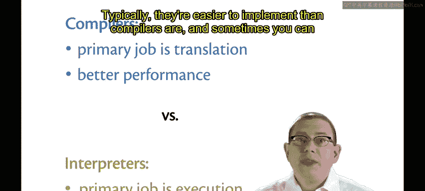

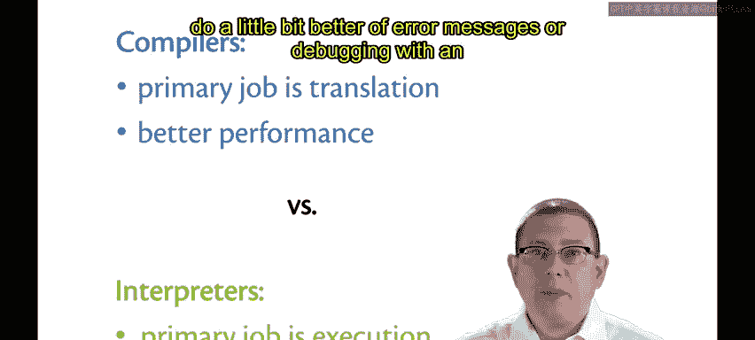

通常，解释器比编译器更容易实现。

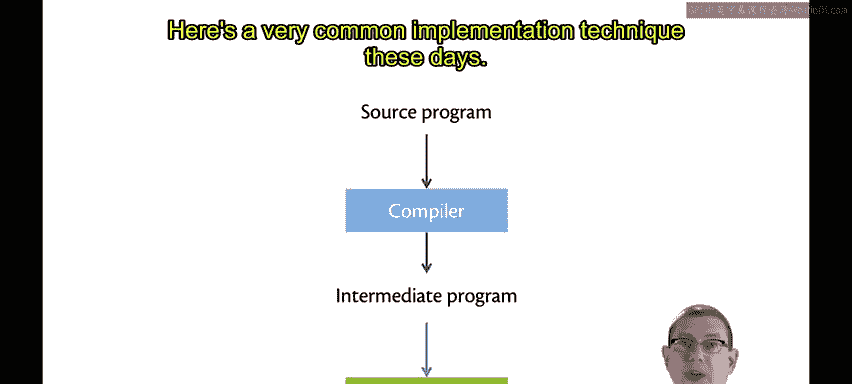

有时，使用解释器还能提供更好的错误信息或调试体验。

## 现代实现技术：混合方法 🔄

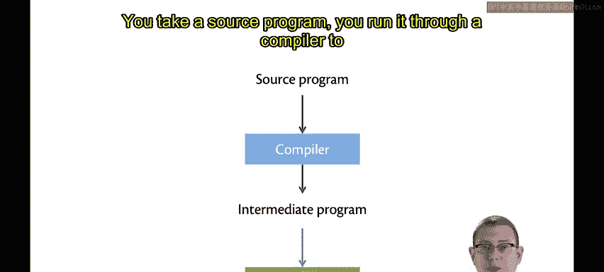

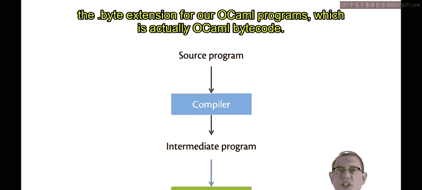

如今，一种非常常见的实现技术是混合方法。

你首先将源程序通过一个编译器，得到一个**中间程序**，这个中间程序通常使用某种字节码语言。例如，你可能听说过Java字节码，也见过OCaml程序的`.byte`扩展名，这实际上就是OCaml字节码。

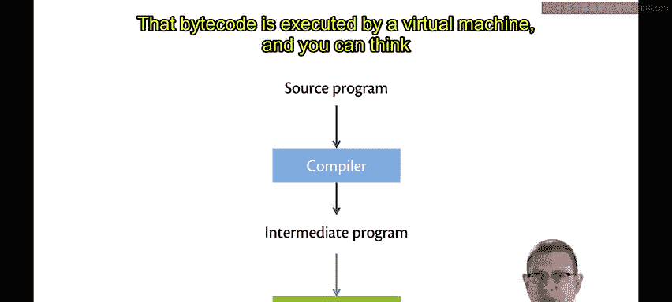

这个字节码由一个**虚拟机**执行。你可以将这里的虚拟机视为一种解释器。它接收程序，接收程序要操作的实际输入，然后与程序协作产生输出。

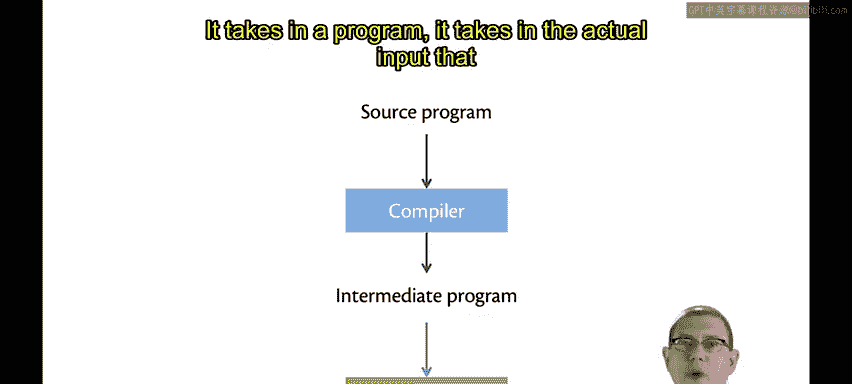

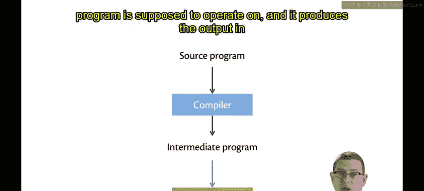

实际上，这种嵌套可以更深。例如，在Java虚拟机内部，它们实际上嵌入了一个编译器。如果某些代码被频繁执行，虚拟机可以即时将该部分代码编译成机器语言，以获得更好的性能。

因此，实现编程语言的技术是一个广泛的谱系，从纯编译到纯解释，再到各种混合策略。

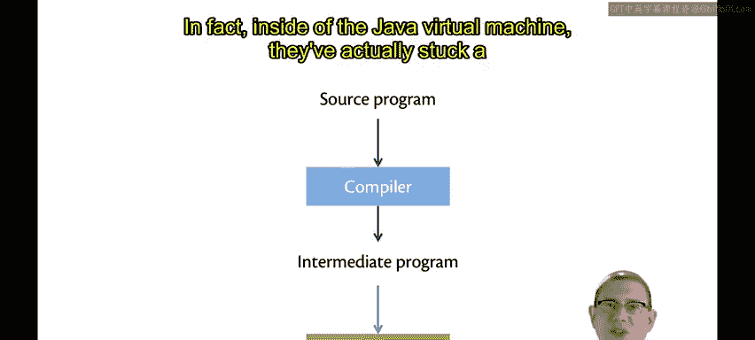

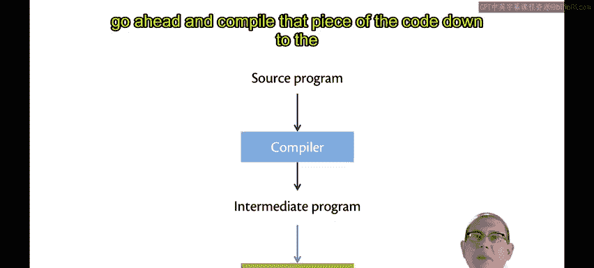

## 总结 📝

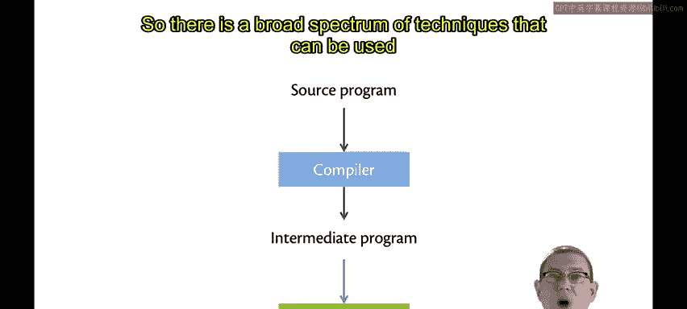

本节课中，我们一起学习了编译器和解释器的核心概念。编译器将源代码翻译成目标代码后便退出，由目标程序独立运行，通常性能更优。解释器则持续运行，直接读取并执行源代码，通常更易于实现和调试。现代编程语言实现常常采用混合方法，例如先编译成字节码，再由虚拟机解释执行，甚至结合即时编译技术来提升性能。理解这些基本概念是深入学习编程语言设计和实现的重要基础。