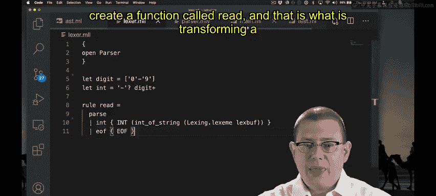

# 157：解析整数 🧮

在本节课中，我们将学习如何扩展我们的计算器程序，使其能够解析和表示整数。我们将从定义抽象语法树（AST）开始，然后逐步构建词法分析器和解析器来处理整数。

---

## 概述

我们将构建一个简单的计算器，它能够理解像 `22` 这样的整数。为此，我们需要：
1.  定义一个AST来表示整数。
2.  扩展解析器以识别整数标记。
3.  扩展词法分析器以将字符序列转换为整数标记。
4.  将所有部分连接起来，实现一个能解析整数的完整流程。

---

## 设计抽象语法树（AST）

首先，我们需要一种数据结构来表示源代码中的表达式。目前，我们只关心整数。

我们使用一个变体类型来定义AST。其中一个构造函数是 `Int`，它携带一个OCaml整数，用于表示源代码中的整数。

```ocaml
type expr = Int of int
```

这个类型目前只表示整数。我们稍后会添加加法、乘法和括号等表达式。

---

## 扩展解析器以处理整数

上一节我们定义了AST，本节中我们来看看如何让解析器识别整数。解析器与词法分析器通过**标记**进行交互。词法分析器生成一个标记流，解析器则消费这个流。

首先，我们需要在解析器中定义整数标记。目前我们只有一个 `EOF`（文件结束）标记。

```ocaml
%token EOF
```

现在，我们添加一个名为 `INT` 的新标记。这个标记需要携带一个整数值信息。

```ocaml
%token <int> INT
```

这段代码指示OCaml解析器生成器，在内部的标记变体类型中添加一个名为 `INT` 的构造函数，该构造函数携带一个 `int` 类型的值。

接下来，我们需要修改解析规则。目前，解析规则 `program` 只能解析 `EOF`。我们希望它能解析一个表达式。

```ocaml
program:
  | e = expr; EOF { e }
```

这个规则表示：一个程序由一个表达式 `e` 后跟 `EOF` 组成。解析成功后，返回表达式 `e` 对应的AST节点。

现在，我们需要定义 `expr` 规则。目前，我们只解析整数表达式。

```ocaml
expr:
  | i = INT { Int i }
```

当解析器遇到一个 `INT` 标记（例如，值为22）时，它会返回AST节点 `Int 22`。

---

## 扩展词法分析器以生成整数标记

解析器现在期望接收 `INT` 标记，因此我们需要让词法分析器能够将字符序列（如“22”）转换为这种标记。

首先，我们需要定义什么是“整数”。一个整数由一个可选的负号和一个或多个数字组成。

以下是词法分析器中的定义：
*   `digit` 匹配单个数字字符（0-9）。
*   `int` 匹配一个可选的负号（`-?`）后跟一个或多个数字（`digit+`）。

```ocaml
let digit = ['0'-'9']
let int = '-'? digit+
```

定义了模式后，我们需要指定当匹配到 `int` 模式时该做什么。我们需要返回一个 `INT` 标记，并附上具体的整数值。

词法分析器提供了一个特殊的 `lexbuf` 变量，代表当前的字符缓冲区。函数 `Lexing.lexeme lexbuf` 可以获取当前匹配到的字符串。

因此，规则如下：
1.  匹配 `int` 模式。
2.  使用 `Lexing.lexeme lexbuf` 获取匹配到的字符串。
3.  使用 `int_of_string` 函数将字符串转换为OCaml的 `int` 类型。
4.  返回标记 `INT` 和这个整数值。

```ocaml
rule read = parse
  | int { INT (int_of_string (Lexing.lexeme lexbuf)) }
  | eof { EOF }
```

---

## 连接所有部分

现在，让我们回到主程序，看看 `parse` 函数如何将词法分析器和解析器连接起来。

`parse` 函数接收一个字符串，并返回一个 `expr` 类型的AST。

以下是它的工作流程：
1.  **创建词法缓冲区**：使用 `Lexing.from_string` 将输入字符串转换为一个词法缓冲区 (`lexbuf`)。
2.  **调用解析器**：调用解析器模块生成的 `Parser.program` 函数。这个函数需要两个参数：
    *   一个从词法缓冲区读取标记的函数（即 `Lexer.read`）。
    *   词法缓冲区本身 (`lexbuf`)。
3.  **生成AST**：`Parser.program` 使用 `Lexer.read` 从 `lexbuf` 中获取标记，并根据我们定义的语法规则构建AST，最终返回结果。

```ocaml
let parse (s : string) : expr =
  let lexbuf = Lexing.from_string s in
  Parser.program Lexer.read lexbuf
```



至此，我们的程序已经可以解析整数了。例如，输入字符串 `"22"` 会被成功解析为AST节点 `Int 22`。

---

## 总结

本节课中我们一起学习了如何为计算器实现整数解析功能。我们：
1.  **设计了AST**，使用 `Int of int` 来表示整数表达式。
2.  **扩展了解析器**，定义了 `INT` 标记和相应的语法规则来构建AST节点。
3.  **扩展了词法分析器**，定义了整数的字符模式，并将其转换为携带值的 `INT` 标记。
4.  **整合了流程**，通过 `parse` 函数将词法分析和语法分析步骤串联起来。


现在，我们的程序已经能够理解并表示像 `22` 这样的基本整数了。在接下来的课程中，我们将在此基础上添加更多的运算符和表达式类型。