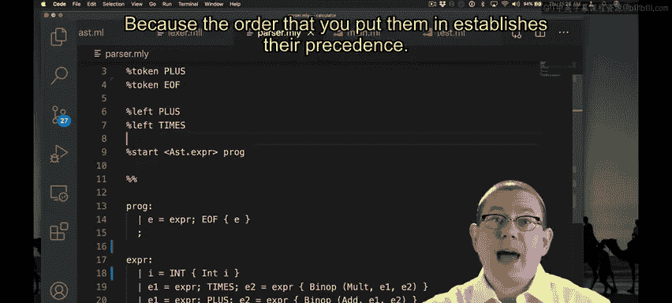

# 161：计算器 - 运算符优先级与结合性 🧮

在本节课中，我们将学习如何为我们的计算器解析器定义运算符的优先级和结合性，以确保表达式能够按照数学规则被正确解析和求值。

---

## 概述

在上一节中，我们构建了一个能够解析简单算术表达式的计算器。然而，当我们尝试解析包含多个不同运算符的表达式时，例如 `2 * 2 + 10`，解析器可能会因为不知道运算顺序而产生错误的结果。本节我们将解决这个问题，通过为解析器指定运算符的优先级和结合性，来确保表达式被正确解析。

---

## 发现问题：运算顺序冲突

为了测试我们的解析器，我们尝试解析表达式 `2 * 2 + 10`。根据数学规则，乘法优先级高于加法，因此这个表达式应该被计算为 `(2 * 2) + 10 = 14`。

然而，当我们运行测试时，解析器却将其计算为 `2 * (2 + 10) = 24`。这表明解析器没有遵循正确的运算顺序。

```ocaml
(* 错误的解析树结构 *)
Times (Int 2, Plus (Int 2, Int 10))
```

OCaml的解析器生成工具（`ocamlyacc` 或 `menhir`）在编译时也给出了警告，提示存在“冲突”。这个冲突正是源于解析器不确定应该先解析加法（`+`）还是先解析乘法（`*`）。

---

## 解决方案：定义优先级与结合性

为了解决运算顺序问题，我们需要在解析器定义文件（`.mly`）中明确声明运算符的优先级和结合性。

以下是定义的核心概念：
*   **优先级**：决定哪个运算符先被计算。例如，乘法（`*`）的优先级高于加法（`+`）。
*   **结合性**：当连续出现多个相同优先级的运算符时，决定计算顺序。例如，加法通常是左结合的，意味着 `1 + 2 + 3` 被计算为 `(1 + 2) + 3`。

在OCaml的解析器语法中，我们使用 `%left`、`%right` 或 `%nonassoc` 声明来同时指定结合性和建立优先级顺序。

```ocaml
%left PLUS     /* 左结合，优先级较低 */
%left TIMES    /* 左结合，优先级较高 */
```
**规则**：声明在列表**越下方**的运算符，其**优先级越高**。因此，`TIMES` 的优先级高于 `PLUS`。

---

## 应用与验证

在解析器文件中添加上述声明后，我们重新编译项目。之前的冲突警告消失了。



现在，当我们再次测试表达式 `2 * 2 + 10` 时，解析器生成了正确的语法树，并计算出结果 `14`。

```ocaml
(* 正确的解析树结构 *)
Plus (Times (Int 2, Int 2), Int 10)
```

---

## 结合性的作用

我们之前定义的 `%left PLUS` 确保了加法是左结合的。这意味着表达式 `1 + 2 + 3` 会被解析为 `(1 + 2) + 3`。

我们可以通过修改声明来观察结合性的影响：

*   如果将 `PLUS` 声明为 `%right`（右结合），那么 `1 + 2 + 3` 将被解析为 `1 + (2 + 3)`。虽然对于加法结果相同，但解析树的结构改变了。
*   同样，我们可以故意错误地定义优先级，例如让 `PLUS` 的优先级高于 `TIMES`。这时，`2 + 2 * 10` 会被错误地计算为 `(2 + 2) * 10 = 40`。这演示了优先级声明如何直接影响解析结果。


*（图示：修正优先级后，表达式被正确解析）*

---


## 总结

本节课中，我们一起学习了如何为算术表达式解析器定义运算符的优先级和结合性。我们了解到：
1.  未明确定义优先级会导致解析冲突和错误的计算结果。
2.  在OCaml解析器规范中，使用 `%left`、`%right` 等声明可以同时设定运算符的结合性和优先级顺序。
3.  声明的位置决定了优先级高低，下方的运算符优先级更高。
4.  正确的优先级（乘除高于加减）和结合性（算术运算符通常左结合）是保证计算器行为符合数学直觉的关键。


通过这一机制，我们的计算器现在能够正确地处理复杂的混合运算表达式了。