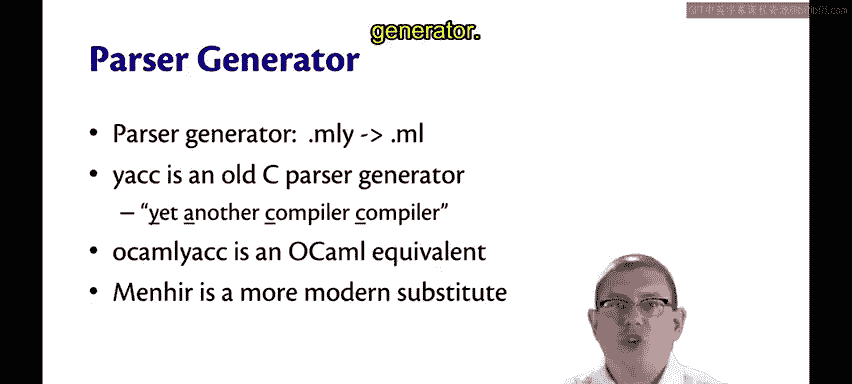
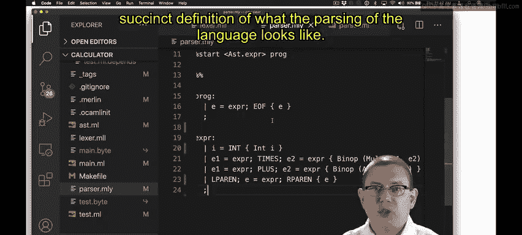
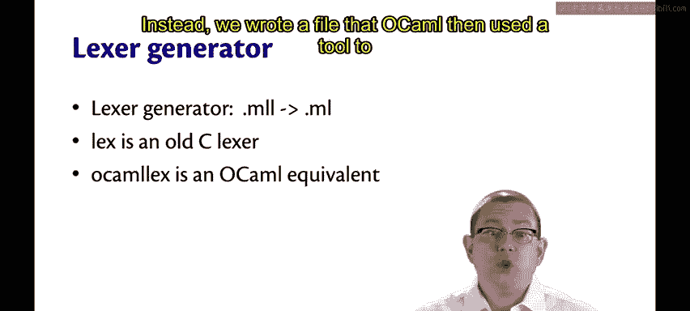
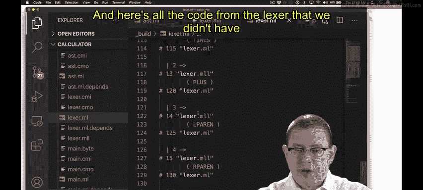
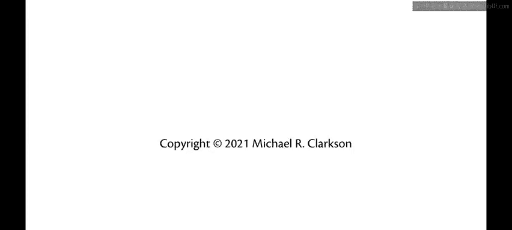

# 164：Menhir与Ocamllex详解 🧩

在本节课中，我们将深入学习如何为OCaml语言实现一个解析器。具体来说，我们将探讨如何使用解析器生成器（Menhir）和词法分析器生成器（Ocamllex）来将令牌流转换为抽象语法树，从而避免手动编写大量繁琐的代码。

## 解析器生成器概述

上一节我们介绍了词法分析的基本概念，本节中我们来看看解析器的具体实现。解析器的核心任务是将词法分析器生成的令牌流转换为抽象语法树（AST）。在OCaml中，我们通常不直接手写解析器，而是使用一个名为**Menhir**的解析器生成器。

如果你查看我们之前创建的解析器，会发现它是一个 `.mly` 文件。这并非标准的OCaml代码文件。实际上，我们运行一个随OCaml分发的工具，该工具读取这个 `.mly` 文件，并从中生成一个 `.ml` 文件。在构建目录中，我们可以找到这个生成的文件，例如 `parser.ml`。

该文件包含了由OCaml解析器生成器自动生成的大量代码，这些代码基于我们编写的那个更简洁的定义文件来完成解析工作。这使我们无需手动编写所有复杂的解析逻辑。

## 历史背景与工具演变

接下来，我们来解释一下为什么使用这些工具。在C语言中，有一个古老的解析器生成器叫做 **YACC**（Yet Another Compiler Compiler）。其理念是，你输入一个定义语言的文件，然后编译它以生成能够编译该语言的程序。**OcamlYacc** 是YACC的OCaml版本。

后来，出现了一个更现代的版本，名为 **Menhir**。我们目前使用的正是Menhir解析器生成器来为简单的计算器语言构建解析器。文件扩展名 `.mly` 中的 “y” 源于YACC，是对这段历史的致敬。

## 解析器定义文件（.mly）详解

在我们的 `parser.mly` 文件中，我们声明了一系列令牌。其中只有一个令牌（`INT`）携带了额外的数据（一个OCaml整数），我们需要指定其类型。所有这些都是词法分析器将产生的令牌。`EOF` 是一个特殊的文件结束令牌，表示不再产生更多令牌。

我们还声明了关于运算符优先级和结合性的规则。我们尝试过为加法定义左结合与右结合。左结合意味着括号向左分组，右结合则意味着向右分组。你也可以使用 `nonassoc`，这会使解析器认为 `x + y + z` 是歧义的，从而强制程序员使用括号来澄清意图。

在结合性列表中，位置越靠下的令牌，其优先级越高。因此，由于 `TIMES` 出现在 `PLUS` 下方，表达式 `1 + 2 * 3` 会被解析为 `1 + (2 * 3)`，而不是 `(1 + 2) * 3`。

## 词法分析器生成器（Ocamllex）

在我们的实现中，我们使用了词法分析器生成器，而非手动编写词法分析器。我们编写了一个 `.mll` 文件，OCaml随后使用一个工具来生成词法分析器。

OCaml实际上将这个文件编译成了 `lexer.ml` 文件。同样，我们可以在构建目录中找到它。这里包含了所有我们无需自己实现的词法分析器代码，包括一些看起来非常奇怪的代码。

这使我们免于手动实现这些复杂逻辑，非常方便。这个词法分析器生成器将 `.mll` 文件转换为 `.ml` 文件。在C语言中，有一个古老的词法分析器生成器叫做 **Lex**。我们使用的是 **Ocamllex**，它是Lex的OCaml等效工具。因此，`.mll` 文件末尾的额外 “l” 代表 “lex”。

## 词法分析器定义文件（.mll）详解

在我们的 `lexer.mll` 文件中，我们有一个头部，其中包含了 `open Parser`。这实际上是会被复制到生成文件中的OCaml代码。这里的 `open` 是为了方便，使得解析器的令牌定义在词法分析器中可用。

在词法分析器中，我们为一些令牌类编写了标识符：`white`（空白字符）、`digit`（数字）和 `int`（整数）。我们实际上使用了**正则表达式**来完成这项工作。正则表达式是计算机科学中一个非常有用的工具，如果你还没接触过，将来在相关课程中一定会学到。在这里，我用它们来帮助定义令牌的语法。

以下是定义这些正则表达式的规则：
*   `white` 被定义为任何空格字符或制表符。在方括号中列出它们，是OCaml正则表达式语法，表示匹配其中任意一个字符。后面的加号 `+` 表示一个或多个。
*   `digit` 被定义为字符 ‘0’ 到 ‘9’。在方括号中使用连字符 `-` 表示ASCII码中从 ‘0’ 到 ‘9’ 的任意字符。
*   `int` 被定义为一个或多个数字（`digit+`），前面可以有一个可选的负号（`-?`）。问号 `?` 表示可选。

然后，我们有一个产生式规则，该规则描述了如何从字符流中产生令牌。我将该规则命名为 `read`，但 `rule` 和 `parse` 是关键字。在花括号 `{}` 内的一切内容都是返回值。因此，`read` 最终成为一个可用于从令牌流中读取令牌的函数。

`parse` 是一个关键字。当我写下 `| white { read lexbuf }` 时，其含义是：如果字符流中的下一个字符匹配正则表达式 `white`，则递归地调用 `read` 函数处理流中剩余的字符，从而跳过空白字符。这里的 `lexbuf` 是词法分析器已知的一个变量，它实际上就是字符流。

如果字符流中的下一个字符匹配任何这些字符串（如 `"+"`），那么我们将返回相应的令牌。如果字符流中的字符匹配 `int` 正则表达式，那么我们将返回一个 `INT` 令牌，并使用一些内置函数将匹配到的字符串转换为OCaml整数。`Lexing.lexeme lexbuf` 就是匹配到的整数字符串。最后，当字符流为空时，我们返回文件结束令牌 `EOF`。

## 总结

本节课中，我们一起学习了如何使用Menhir和Ocamllex为OCaml程序构建解析器和词法分析器。我们了解到，通过编写简洁的 `.mly` 和 `.mll` 定义文件，可以利用工具自动生成复杂且正确的解析代码，这大大提高了开发效率并减少了错误。核心在于定义令牌、优先级、结合性以及使用正则表达式描述词法规则。掌握这些工具是构建编译器或解释器的重要一步。