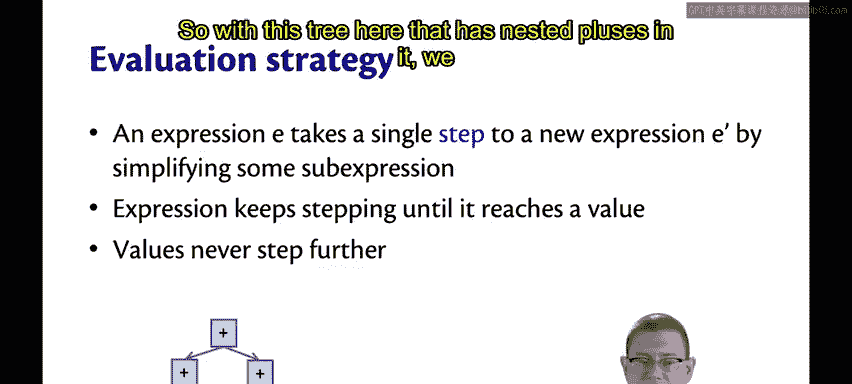
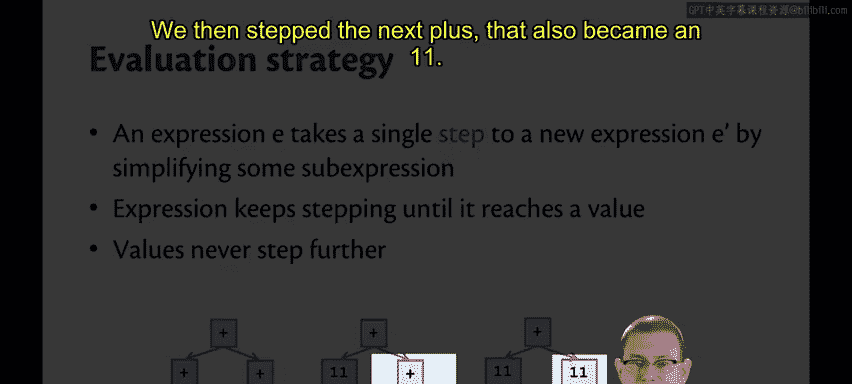
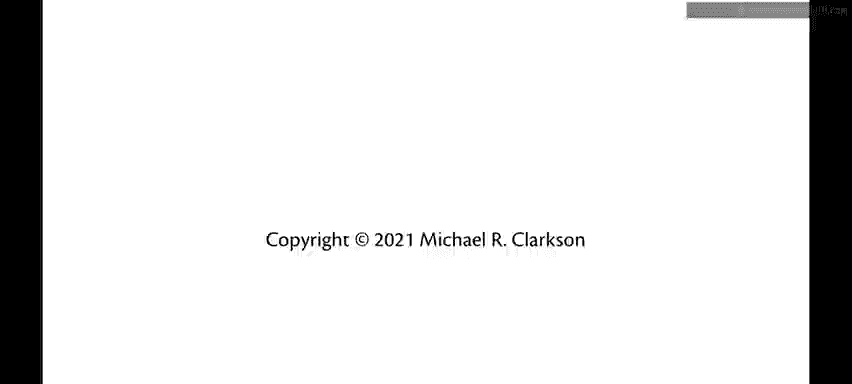

# 166：小步求值模型 🧮

在本节课中，我们将学习解释器实现中的一个核心概念：**小步求值模型**。我们将探讨如何通过一系列简单的“步骤”来简化抽象语法树，最终将其规约到一个代表最终值的节点。

## 概述

我们的解释器实现的最后一部分，我暂时称之为“求值器”。需要说明的是，我们在此处跳过了类型检查的环节，这部分内容将在本课程单元的末尾进行讨论。

对于我们的简单计算器语言，其抽象语法树的求值过程是：我们从一个复杂的树结构开始，通过一系列步骤，最终将其简化为一个仅代表该语言值的整数节点。

## 小步求值策略

我们的求值策略是逐步进行的。具体方法是：取一个表达式，通过简化它的某个子表达式，使其向前“迈出一步”，变成一个新的表达式 `E'`。然后我们不断重复这个“迈步”过程，直到得到一个“值”。值本身不会再进行任何进一步的步骤。

以下是一个包含嵌套加法的树结构示例：

我们首先对它的左侧进行求值，使得左下角的加法步骤规约为 `11`。

接着，我们处理下一个加法步骤，它也变成了 `11`。

最后，我们处理最高层的加法步骤，它最终变成了 `22`。

## 后续内容预告

在接下来的系列视频中，我们将更深入地探讨这种**小步求值模型**。

## 总结

本节课我们一起学习了小步求值模型的基本思想。我们了解到，解释器可以通过定义一系列简单的规约规则（即“步骤”），将复杂的表达式逐步化简为最终的值。这个过程是理解编程语言运行时行为的基础。在后续课程中，我们将应用此模型来形式化地定义更复杂语言的求值过程。