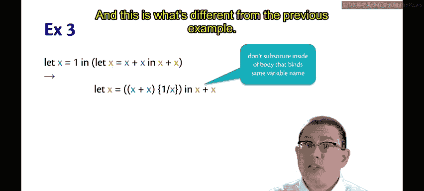
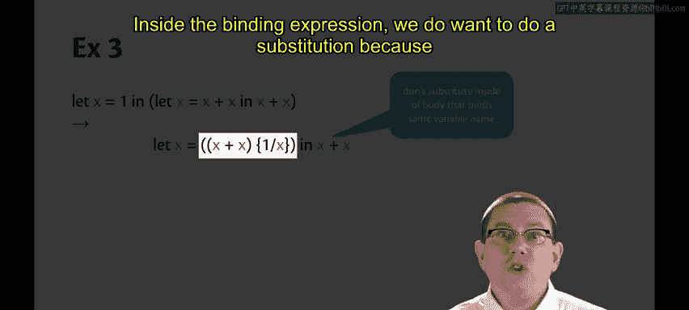
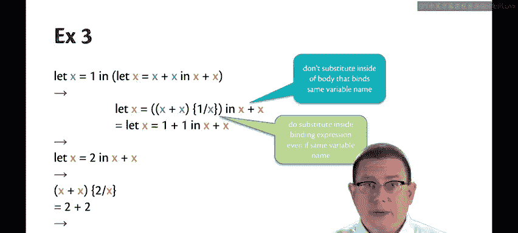

# 169：替换示例 🧩

在本节课中，我们将通过几个具体的例子，来逐步建立对“替换”这一核心概念的理解。我们将看到在OCaml的求值过程中，如何正确地用值替换变量，并理解替换在绑定表达式和主体表达式中的不同行为。

---

## 概述

我们将分析三个逐步复杂的表达式求值示例。通过这些例子，我们将直观地理解替换的定义，并总结出替换操作的关键规则。

---

## 第一个示例：基础替换

首先，我们来看一个简单的例子，以理解替换的基本过程。

假设我们有表达式：
```ocaml
let x = 2 + 2 in x + x
```

这个表达式的求值过程如下：
1.  绑定表达式 `2 + 2` 单步规约为 `4`。
2.  接着，我们取主体表达式 `x + x`，并将其中所有的 `x` 替换为 `4`。请注意，这里的替换本身不是一个求值步骤，它只是将两个表达式视为等价。
3.  替换后，我们得到 `4 + 4`。
4.  `4 + 4` 最终单步规约为 `8`。

在这个例子中，替换直观地将主体表达式中所有出现的变量 `x` 都替换成了值 `4`。

---

## 第二个示例：变量遮蔽与作用域

上一个例子展示了基础替换。现在，我们来看一个更复杂的例子，它涉及同一个变量名的多次绑定，这能帮助我们理解变量遮蔽和作用域。

考虑以下表达式：
```ocaml
let x = 5 in (let x = 6 in x)
```
为了清晰区分两个 `x`，我们用颜色标记：外层的 `x` 是蓝色，内层的 `x` 是橙色。

以下是求值过程：
1.  首先进行单步规约。绑定表达式 `5` 已经是一个值，我们用它替换掉主体表达式中所有蓝色的 `x`。
2.  替换后，我们得到 `(let x = 6 in x)`。**请注意**，我们**没有**在内层 `let` 表达式（它绑定了相同的变量名 `x`）的内部进行替换。这是因为我们希望变量遮蔽和作用域能按照我们之前学习的方式正常工作。
3.  接下来，我们求值这个内层的 `let` 表达式，将 `6` 替换到其主体表达式 `x` 中。
4.  这意味着 `x` 被替换为 `6`。
5.  因此，整个表达式最终规约为 `11`。

从这个例子中，我们学到了关于何时停止替换的重要一点：当进入一个重新绑定同名变量的新作用域时，不应替换该作用域内部的同名变量。

---

## 第三个示例：绑定表达式内的替换

前两个例子帮助我们理解了主体表达式中的替换规则。现在，我们来看第三个更复杂的例子，它将揭示在绑定表达式内部进行替换的特殊情况。

考虑这个表达式：
```ocaml
let x = 1 in let x = x + x in x + x
```
这里，我们绑定了 `x` 两次。在第二次绑定（橙色 `x`）时，其绑定表达式 `x + x` 中使用了第一次绑定的 `x`（蓝色 `x`）。

让我们逐步分析：
1.  我们想进行单步规约。这意味着我们将去掉最外层的 `let` 表达式（它将 `x` 绑定到 `1`），并规约到内层的 `let` 表达式。在这个过程中，我们需要在内层 `let` 表达式中进行一些替换。
2.  我们必须非常小心地进行替换。一方面，正如我们在上一个例子中学到的，我们**不**想在主体表达式 `x + x` 内部进行替换，因为这里重新绑定了相同的变量名。我们希望变量遮蔽和作用域正确工作。因此，在 `x + x` 内部，我们不会用 `1` 替换 `x`。
3.  **但是**，与上一个例子不同的是，在**绑定表达式** `x + x` 中，我们**确实**需要进行替换，因为那里的 `x + x` 确实指的是将 `x` 绑定到 `1` 的那个作用域。
4.  因此，这个替换会发生，并将 `x + x` 规约为 `1 + 1`。

**这里的新情况是：即使绑定表达式使用了相同的变量名，我们也会在绑定表达式内部进行替换。**



因此，在绑定表达式和主体表达式中进行替换的规则是不同的。



根据我们目前所做的一切，剩下的部分很容易推导：
-   `let x = 1 + 1 in x + x` 会规约到 `let x = 2 in x + x`。
-   这又会规约到将 `2` 替换 `x` 后的 `x + x`，即 `2 + 2`。
-   最后，`2 + 2` 规约为 `4`。

---

## 总结

在本节课中，我们一起学习了三个关于替换的示例，逐步建立了对替换定义和规则的理解。

我们学到的重要内容包括：
-   替换是用值替换表达式中变量的过程，它本身不直接构成求值步骤，但用于建立表达式之间的等价关系。
-   当遇到重新绑定同名变量的新作用域（如内层 `let`）时，不应替换该新作用域主体内的同名变量，这是变量遮蔽规则的要求。
-   **关键区别**：替换在**绑定表达式**和**主体表达式**中的行为不同。即使在绑定表达式中出现了与即将绑定的变量同名的标识符，只要它引用的是外层作用域的变量，就需要进行替换。



这些规则共同确保了OCaml的词法作用域和变量遮蔽行为符合我们的预期。