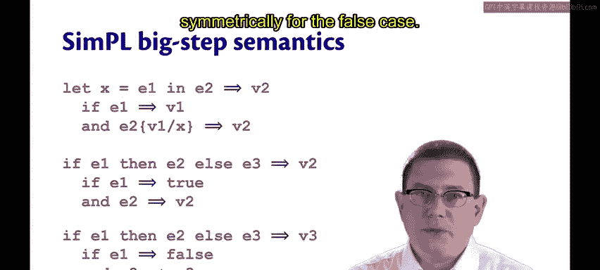
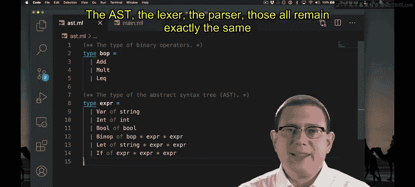

# 173：SimPL大步语义解释器实现

在本节课中，我们将为SimPL语言实现一个“大步语义”解释器。通过这个过程，我们将理解大步语义与小步语义这两种不同风格的形式语义和求值关系之间的区别。

## 大步语义规则概述

上一节我们介绍了小步语义，本节中我们来看看SimPL语言的大步语义规则。大步语义直接描述一个表达式如何一步求值到最终结果（值）。

*   **值**：一个值（整数或布尔值）通过大步语义直接求值为自身。
*   **二元操作符**：表达式 `e1 + e2` 大步求值为值 `v`，当且仅当满足以下三个条件：
    1.  `e1` 大步求值为值 `v1`。
    2.  `e2` 大步求值为值 `v2`。
    3.  `v` 是执行原始操作 `v1 + v2` 的结果。
*   **变量**：单独的变量名无法通过大步语义求值，这表示遇到了未绑定的变量。
*   **let表达式**：表达式 `let x = e1 in e2` 大步求值为值 `v2`，当且仅当满足以下两个条件：
    1.  `e1` 大步求值为值 `v1`。
    2.  将 `e2` 中的 `x` 替换为 `v1` 后得到的新表达式大步求值为 `v2`。
*   **if表达式**：`if` 表达式的语义与上述规则类似。整个 `if` 表达式大步求值为对应分支的值，具体取决于条件守卫表达式大步求值的结果。

## 解释器实现

现在，让我们开始实现SimPL的大步语义解释器。抽象语法树（AST）、词法分析器和语法分析器都与小步语义解释器中的实现完全相同。

唯一需要修改的是 `main.ml` 文件中的部分实现。错误信息和替换函数的实现保持不变。主要变化是：我们移除了 `step` 函数，现在 `eval` 函数将负责完成所有求值工作。

`eval` 函数接收一个表达式，并返回一个新表达式，这个返回的表达式就是输入表达式通过大步语义求值得到的最终值。

以下是 `eval` 函数的核心实现步骤：

1.  **处理值和变量**：
    *   整数或布尔值已经是值，直接返回自身。
    *   尝试对变量求值将返回未绑定变量错误。

2.  **处理let表达式**：
    *   首先，求值 `e1` 得到 `v1`。
    *   接着，将 `e2` 中的 `x` 替换为 `v1`，得到 `e2'`。
    *   最后，求值 `e2'` 得到最终结果 `v2`。
    *   这种多行实现通常会被提取为一个辅助函数，这是一种常见的实现模式。

3.  **处理二元操作符**：
    *   求值 `e1` 和 `e2`。
    *   同时模式匹配求值结果和操作符类型。
    *   检查操作数是整数，然后执行对应的运算（加、乘、小于等于）并返回结果。
    *   其他情况（如类型错误）会引发错误。

4.  **处理if表达式**：
    *   求值条件守卫表达式。
    *   如果结果为 `true`，则求值 `e2` 分支。
    *   如果结果为 `false`，则求值 `e3` 分支。
    *   如果守卫求值结果不是布尔值（例如是整数），则引发错误。

## 测试与总结

完成实现后，我们可以运行测试套件来验证解释器的正确性。这个测试套件与小步语义解释器所使用的完全相同。如果所有测试都通过，则表明我们的大步语义解释器实现成功。

本节课中我们一起学习了如何为SimPL语言实现一个大步语义解释器。我们理解了大步语义的规则，它直接描述了表达式到最终值的求值过程，并与之前学习的小步语义（描述表达式如何通过一系列小步骤变换）形成了对比。通过具体的代码实现，我们掌握了在函数式编程中构建此类解释器的常见模式和技巧。