# 180：闭包 🧠

在本节课中，我们将学习OCaml函数语义的核心概念——闭包。我们将了解闭包如何通过保存定义时的环境来实现“时间旅行”，从而确保函数在调用时能访问到正确的变量绑定。

---

## 闭包的定义

上一节我们介绍了函数的基本概念，本节中我们来看看闭包的具体实现。

闭包是一个包含两部分内容的数据结构：**代码**和**定义环境**。它并非一个普通的OCaml对，而是语言实现层面的一个不可分割、无法直接通过语法访问的实体。

一个匿名函数 `fun x -> e` 在环境 `env` 中被求值时，会**大步语义**地规约到一个闭包。这个闭包保存了函数代码 `fun x -> e` 以及函数被定义时的环境 `env`。

我们可以将其记作一个“对”：
```
闭包 = (代码, 定义环境)
```
更形式化地，对于函数 `fun x -> e` 在环境 `env_def` 中被定义，其闭包表示为：
```
closure = (fun x -> e, env_def)
```

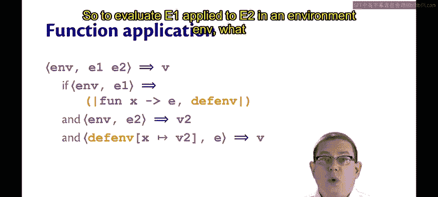

---

## 函数应用的求值规则

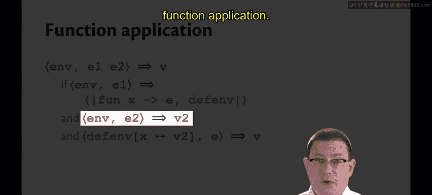

理解了闭包的定义后，我们来看看如何应用闭包进行函数调用。

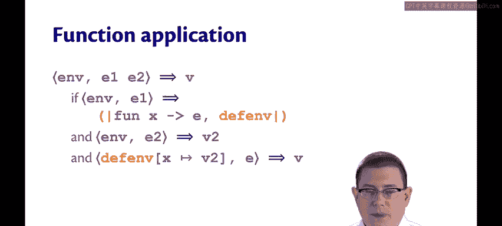

为了在环境 `env` 中对表达式 `e1 e2`（即 `e1` 应用于 `e2`）进行求值，需要遵循以下步骤：

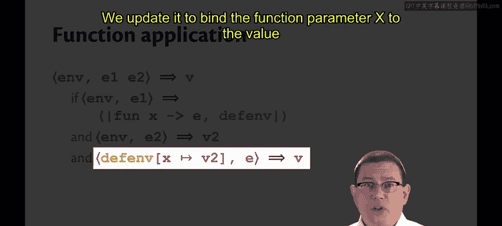

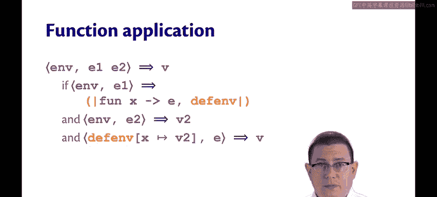

以下是具体的求值步骤：
1.  首先，在当前环境 `env` 中对 `e1` 进行求值。由于程序已通过类型检查，`e1` 必须是一个函数，因此求值结果应为一个闭包。假设该闭包为 `(fun x -> e0, env_def)`，其中 `env_def` 是该函数的定义环境。
2.  接着，仍在当前环境 `env` 中对参数表达式 `e2` 进行求值，得到一个值 `v2`。
3.  最后，进行关键的“时间旅行”：在**定义环境** `env_def` 的基础上，将形参 `x` 绑定到实参值 `v2`，从而扩展出一个新环境 `env_def[x -> v2]`。然后在这个新环境中对函数体 `e0` 进行求值，得到的结果 `v` 就是整个函数应用表达式的最终值。

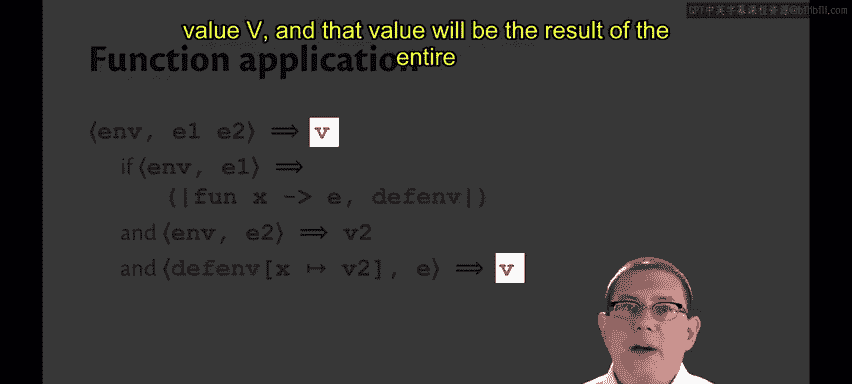

这个过程可以用以下推导式表示：
```
env ⊢ e1 ⇓ (fun x -> e0, env_def)    env ⊢ e2 ⇓ v2    env_def[x -> v2] ⊢ e0 ⇓ v
———————————————————————————————————————————————————————————————————————————————
                     env ⊢ e1 e2 ⇓ v
```

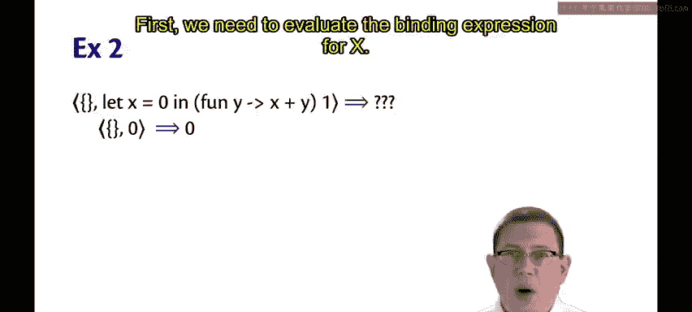

---

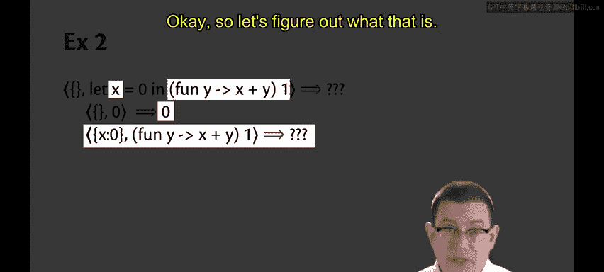

## 示例分析

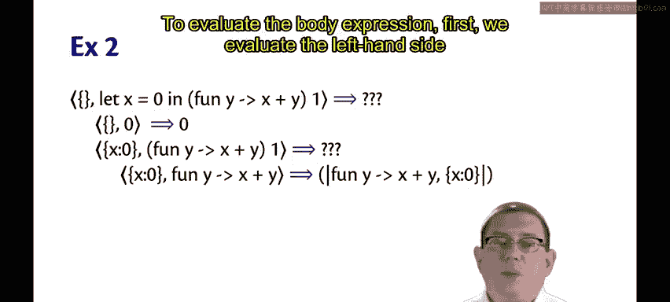

让我们通过几个具体例子来巩固对闭包求值过程的理解。

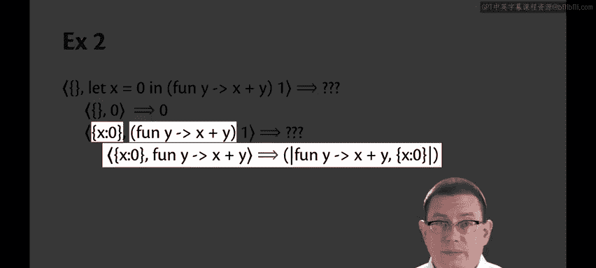

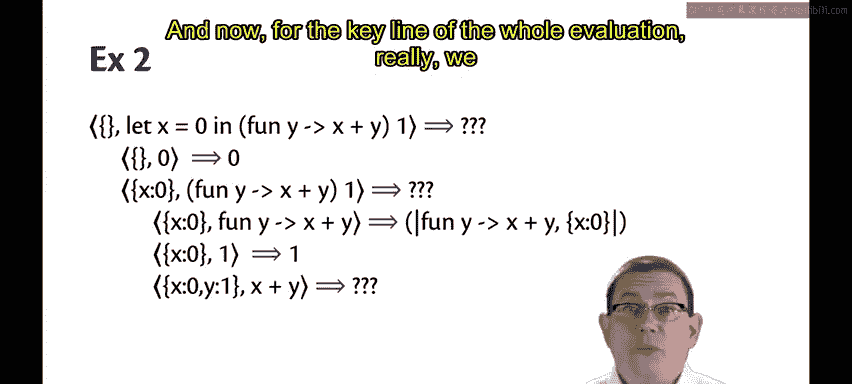

### 示例一：基础闭包

考虑以下代码：
```ocaml
let x = 0 in
(fun y -> x + y) 1
```

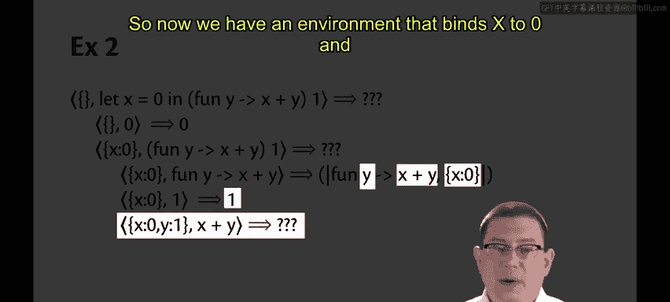

以下是其求值过程的逐步分析：
1.  首先，在环境中将 `x` 绑定为 `0`。
2.  接着，对函数应用 `(fun y -> x + y) 1` 进行求值：
    *   求值函数部分 `fun y -> x + y`：这会创建一个闭包，其代码是 `fun y -> x + y`，定义环境是 `{x: 0}`。
    *   求值参数部分 `1`：得到值 `1`。
    *   应用函数：使用闭包中的定义环境 `{x: 0}`，将形参 `y` 绑定为实参值 `1`，得到新环境 `{x: 0, y: 1}`。在此环境中求值函数体 `x + y`，即 `0 + 1`，最终得到结果 `1`。

### 示例二：环境捕获

现在，让我们回顾之前可能引发困惑的代码，看看闭包如何解决作用域问题：
```ocaml
let x = 1 in        (* 行 1 *)
let f = fun y -> x in (* 行 2: f 的闭包捕获了 {x: 1} *)
let x = 2 in        (* 行 3 *)
f 0                  (* 行 4 *)
```

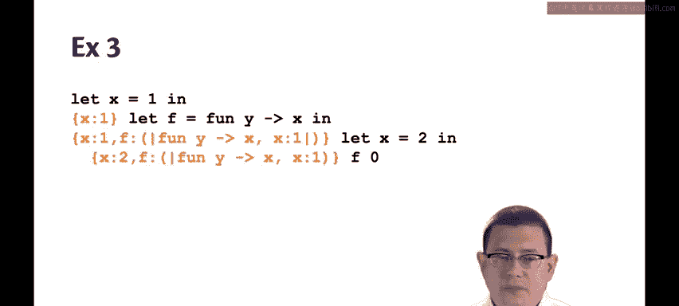

以下是关键步骤分析：
1.  执行到第4行时，动态环境包含：`x -> 2`（来自第3行）和 `f -> closure(fun y -> x, {x: 1})`（来自第2行）。
2.  对 `f 0` 求值：
    *   `f` 求值为其闭包 `(fun y -> x, {x: 1})`。
    *   参数 `0` 求值为 `0`。
    *   应用函数：在闭包保存的定义环境 `{x: 1}` 中，将 `y` 绑定为 `0`，得到环境 `{x: 1, y: 0}`。在此环境中求值函数体 `x`，查找到 `x` 的值为 `1`。
3.  因此，`f 0` 的最终结果是 `1`，正确反映了函数 `f` 定义时 `x` 的绑定值（1），而非调用时 `x` 的值（2）。这正是**静态作用域**或**词法作用域**的行为。

---

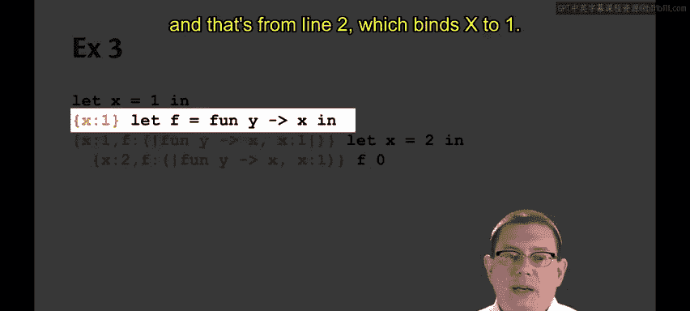

## 总结

本节课中我们一起学习了OCaml中闭包的核心机制。

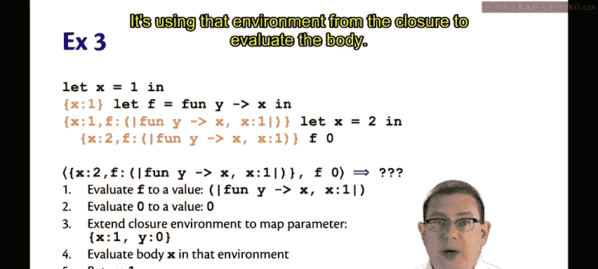

闭包是一个包含函数代码及其**定义时环境**的数据结构，它是实现函数式语言中“词法作用域”或“静态作用域”的基石。在函数应用时，闭包机制通过“回到”函数定义时的环境进行求值，确保了变量引用的正确性，无论函数在何处被调用。这使得函数成为真正的“一等公民”，可以携带其定义上下文自由传递。