**OCaml编程：9.28：词法作用域与动态作用域 📚**

在本节课中，我们将学习编程语言中两个核心概念：**词法作用域**与**动态作用域**。我们将探讨它们的区别、各自的优缺点，以及为什么现代语言设计普遍选择词法作用域。

---

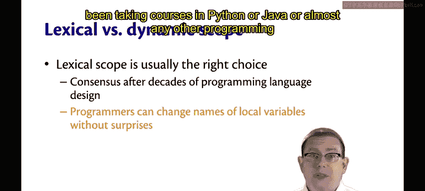

### 概述

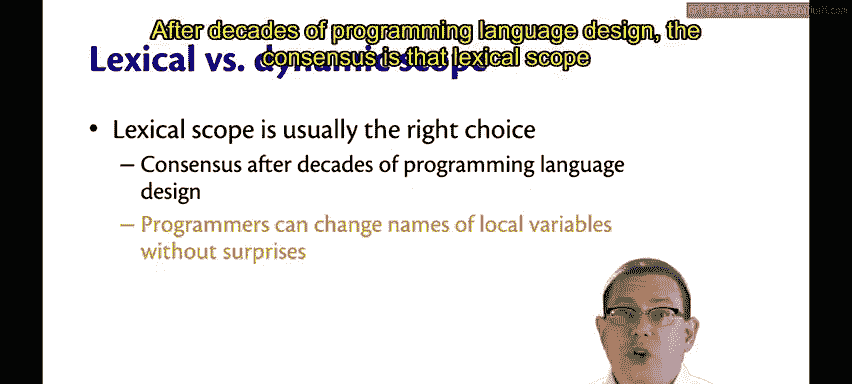

我们已经了解了词法作用域和动态作用域。如果你学习过Python、Java或几乎所有其他编程语言，那么你一直以来被教授的都是词法作用域。

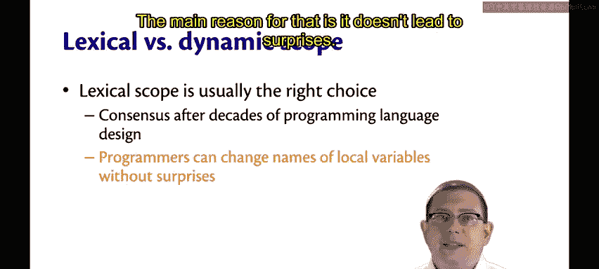

经过数十年的编程语言设计实践，业界共识是**词法作用域是正确的选择**。

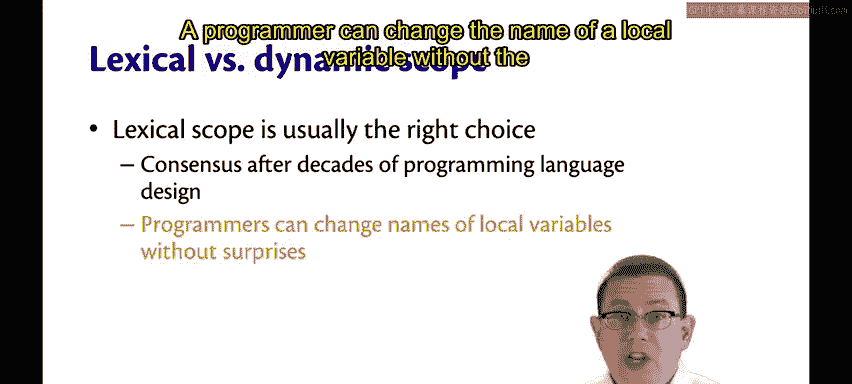

其主要原因在于它不会导致意外的结果。

### 词法作用域的优势：避免意外

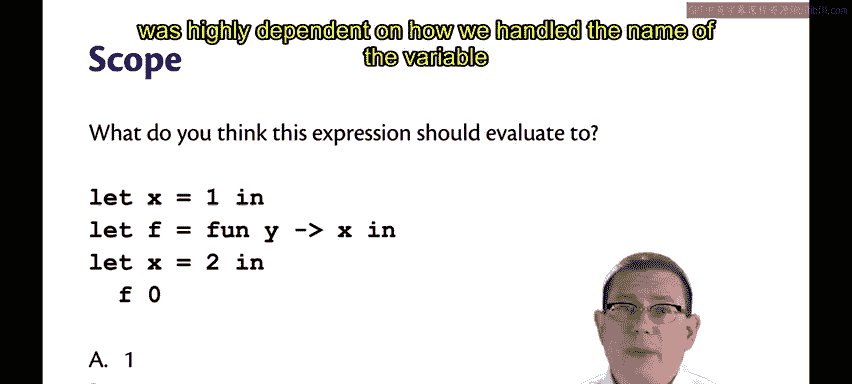

程序员可以更改局部变量的名称，而不会改变函数的意义。

回想一下我们之前的例子，程序的意义高度依赖于我们如何处理变量 `x` 的名称。

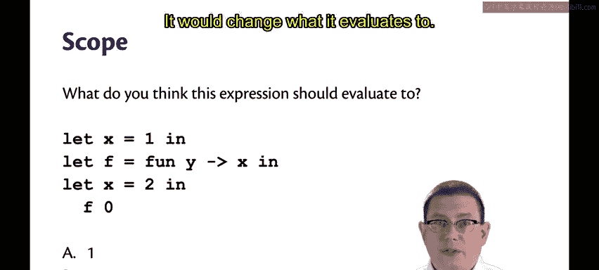

在动态作用域下，如果我们将 `x` 的第二个绑定改为 `let z = ...` 或其他变量名，那么它将改变这个程序的意义，改变其求值结果。

但在词法作用域下，我们可以自由地将变量 `x` 的第二个绑定更改为我们想要的任何其他变量名，而这不会影响计算的结果。

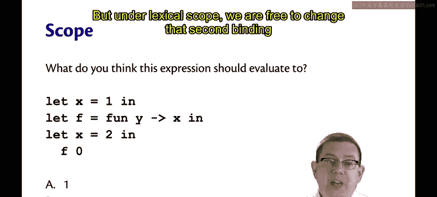

这就是我所说的“词法作用域导致更少意外”的含义。你可以更改变量名，而不会遇到那种意外情况。

### 动态作用域的现状与例外

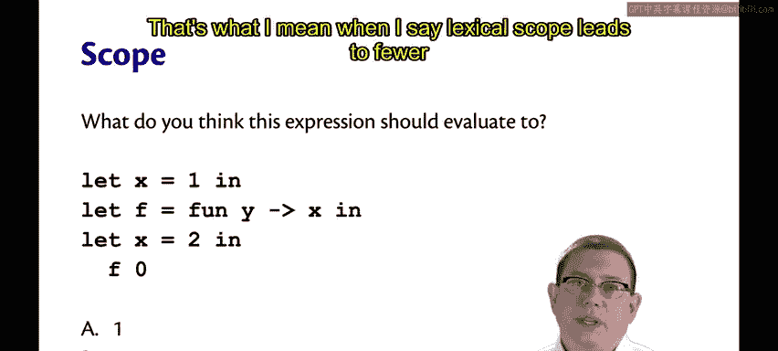

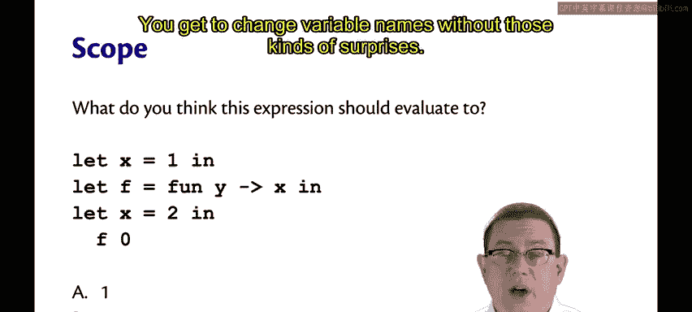

然而，动态作用域在某些情况下仍然有用。

因此，一些语言默认使用它或提供某种形式的支持，例如LaTeX、Perl、Racket等。不过，如今大多数语言都不再使用动态作用域。

有一个重大的例外，有趣的是，它被称为**异常**。如果你思考一下异常，它们在某种程度上类似于动态作用域。

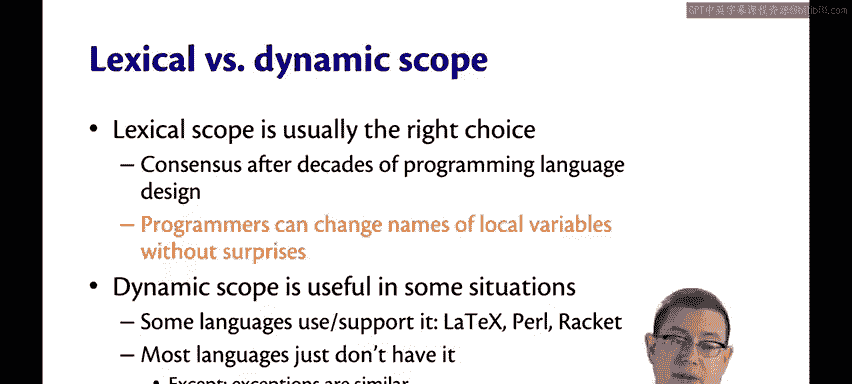

抛出（raise或throw）一个异常实际上会将控制权转移到最近可以捕获该异常的地方。

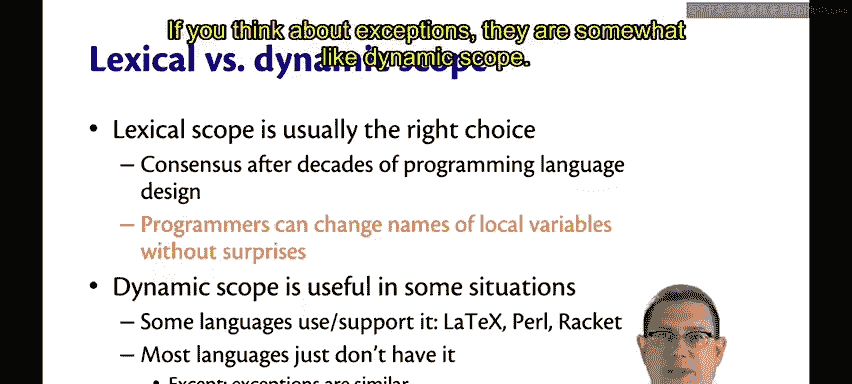

这有点类似于动态作用域如何使用变量的最近绑定。

尽管如此，我发现思考动态作用域非常困难，因为它不是大多数语言的工作方式。

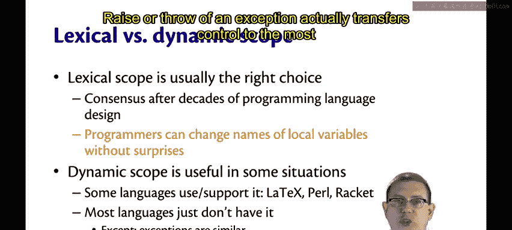

### 实践与探索

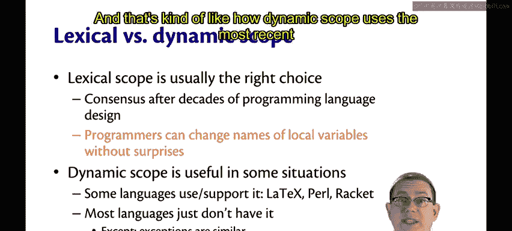

在教材中，你会找到一个解释器，你可以用它来试验表达式，并在动态作用域和词法作用域之间切换，以观察它们如何求值。

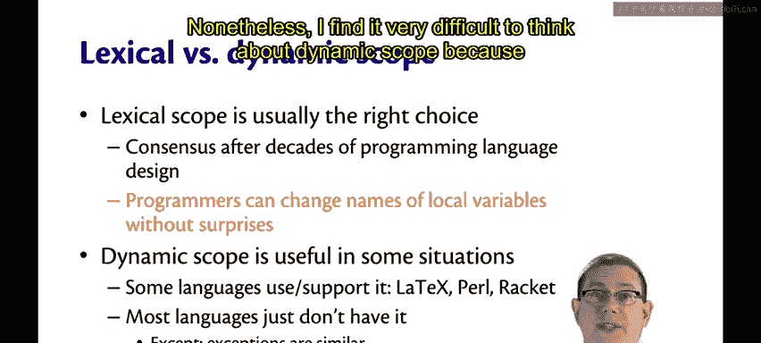

---

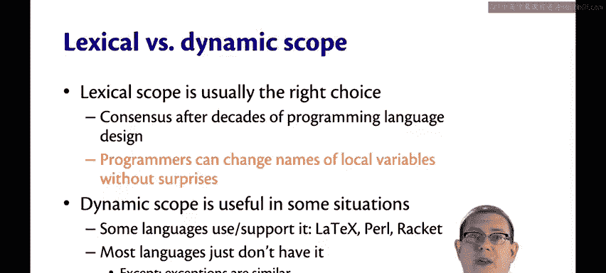

### 总结

本节课中，我们一起学习了：
1.  **词法作用域**是静态的，根据代码的书写结构确定变量绑定，是现代语言的主流选择。
2.  **动态作用域**是动态的，根据运行时调用栈确定变量绑定，容易导致意外行为。
3.  词法作用域的主要优势在于**可预测性**和**可维护性**，允许安全地重命名变量。
4.  动态作用域在某些特定领域（如配置、异常处理机制）仍有其价值，但已非主流。
5.  异常处理机制在控制流转移方式上与动态作用域有相似之处。

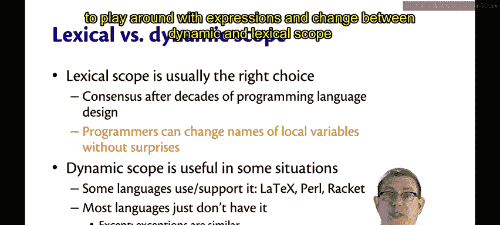

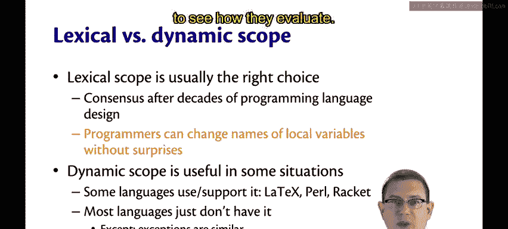

理解这两种作用域模型，有助于你更深入地把握程序的行为和不同编程语言的设计哲学。