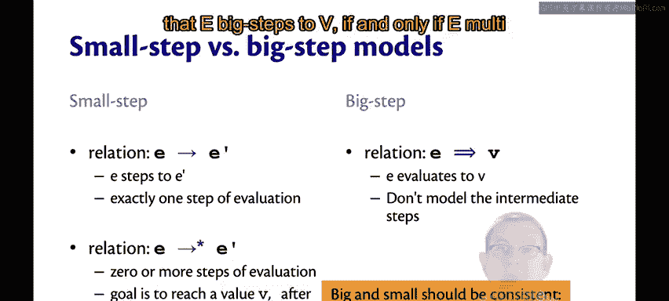
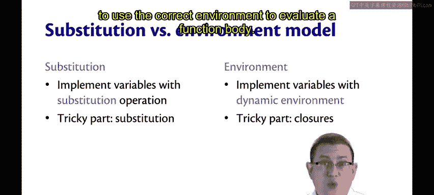
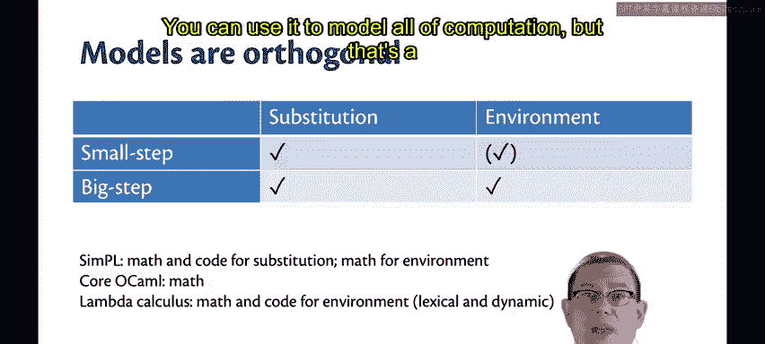
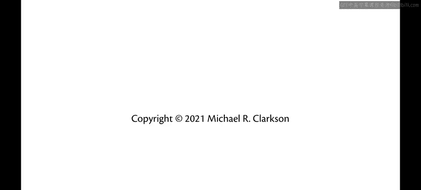

OCaml编程：9.30：所有模型回顾 🧠

在本节课中，我们将回顾之前学习过的多种程序求值模型，梳理它们之间的关系与区别，帮助初学者建立一个清晰的理解框架。

---

### 模型概览

我们目前已经学习了许多求值关系和模型。为了清晰地掌握它们，让我们进行一个系统的回顾。

### 小步与大步求值模型

上一节我们介绍了求值的基本概念，本节中我们来看看两种主要的求值方式：小步模型和大步模型。

在小步求值模型中，我们定义了一个单步求值关系，记作 **`e -> e'`**。这表示表达式 `e` 经过恰好一步求值，变为表达式 `e'`，不多也不少。

我们还定义了一个多步求值关系，记作 **`e ->* e'`**。这是单步求值关系的自反传递闭包，意味着表达式 `e` 经过零步或多步求值后，变为表达式 `e'`。我们的最终目标是求值到一个值 `v`，之后无法再进行任何求值步骤。

为了表示多步求值的起点和终点，我们引入了大步求值关系，记作 **`e => v`**。这个关系表示表达式 `e` 直接求值为值 `v`，而不展示中间的求值步骤。

需要记住的是，这两种模型在本质上是一致的。具体来说，**`e => v` 当且仅当 `e ->* v`**。

### 替换模型与环境模型

在理解了求值的步进方式后，我们来看看实现变量绑定的两种不同模型：替换模型和环境模型。

在替换模型中，我们通过替换操作来实现变量。这个模型的难点在于正确定义替换，特别是**避免捕获的替换**。

在环境模型中，我们通过一个动态环境来实现变量。这可以看作一种“惰性”的替换。这个模型的难点在于理解**闭包**。

有趣的是，在这两种模型中，最复杂的部分都是如何实现函数，无论是如何在函数体内部进行替换，还是如何使用正确的环境来求值函数体。

### 模型的组合与正交性

这些模型是正交的。这意味着你可以自由组合它们。

以下是可能的组合方式：
*   你可以拥有一个小步替换模型。
*   你也可以拥有一个大步替换模型。
*   同样，你也可以拥有一个大步环境模型。

课程中，我首先展示了小步替换模型，然后是大步替换模型，最后是大步环境模型。至于小步环境模型，其中并无特别需要展示的新颖之处，因此略过。

### 不同语言中的应用

我们已经将这些模型应用到了不同的语言中。

我们研究了 **Simple** 语言，它像一个带有 `let` 表达式和 `if` 表达式的计算器。对于这个语言，我提供了替换模型的数学定义和代码，以及环境模型的数学定义。

我们还研究了 **Core OCaml** 语言。对于它，我同样提供了上述所有三种模型的数学定义。

在教材中，你还会看到对另一种语言的讨论，称为 **Lambda 演算**。Lambda 演算只包含函数、应用和变量这三种语法形式。教材提供了其环境模型的数学定义和代码，包括一个允许你在词法作用域和动态作用域之间切换的解释器。我希望你有机会尝试使用那个解释器。

顺便一提，Lambda 演算非常强大，你可以用它来模拟所有的计算过程。不过，这属于另一门课程的范畴了。

---

### 总结

本节课中我们一起学习了程序求值模型的回顾。我们梳理了小步与大步求值模型的区别与联系，对比了替换模型与环境模型在实现变量绑定上的不同机制，并理解了这些模型是正交的，可以应用于不同的编程语言。掌握这些模型有助于深入理解编程语言的运行原理。