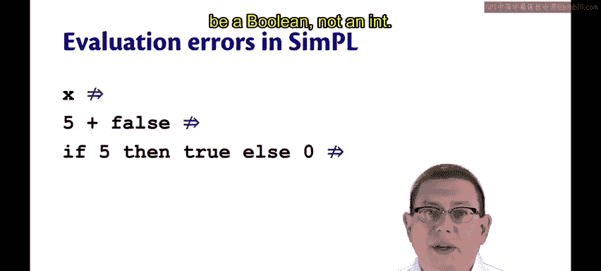
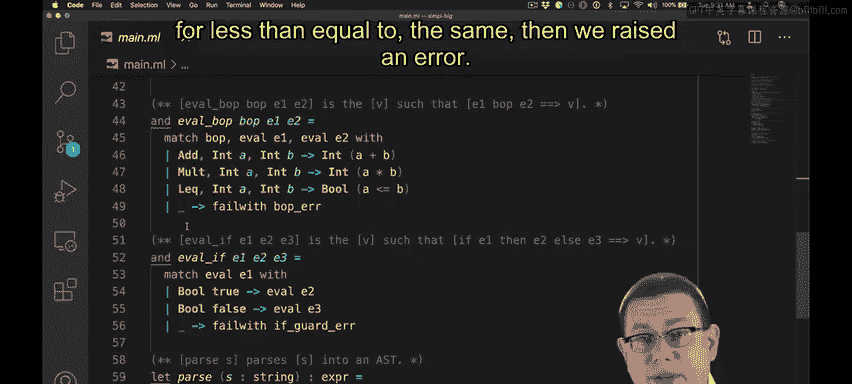
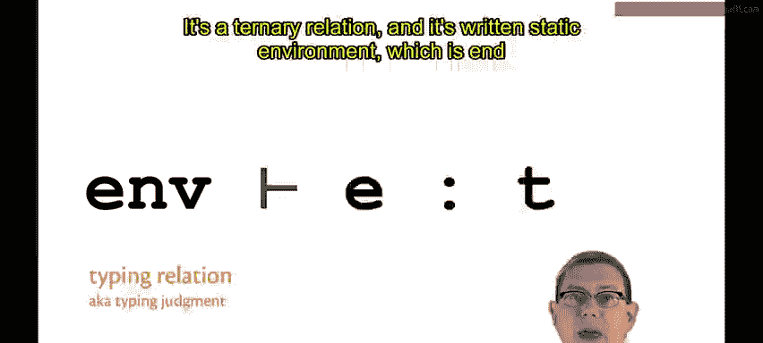
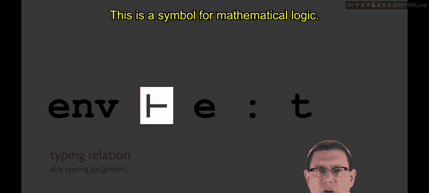

# 184：类型检查基础 🧠

在本节课中，我们将要学习类型检查的基本概念。类型检查是一种在程序运行前分析代码、发现潜在类型错误的技术。通过这种方式，我们可以避免许多运行时错误，提升程序的健壮性。

上一节我们介绍了解释器中的运行时错误，本节中我们来看看如何通过类型检查来预防这些错误。

## 类型检查的目标 🎯

当我们为简单的语言构建大步替换模型解释器时，有三个地方可能发生运行时错误。

1.  一个单独的变量无法求值，因为它应该已经被替换掉了。
2.  如果一个二元操作符存在类型错误，则无法求值。例如，`+` 的一边是整数 `5`，另一边是布尔值 `false`。
3.  一个 `if` 表达式要求其条件守卫是布尔值，而不是整数。

在解释器代码中，这些情况都对应着我们在运行时抛出的错误。

*   当我们遇到一个未被替换的变量并试图求值时，会抛出“未绑定变量”错误。
*   当我们遇到一个二元操作符，其两边的参数类型不正确时（例如 `add` 需要两个整数，`mult` 和 `less than equal to` 同理），会抛出错误。
*   对于 `if` 表达式，如果守卫条件最终求值结果不是 `true` 或 `false`，我们也会抛出异常。

类型检查的目标就是预防此类错误。我们希望程序永远不要发生这类运行时错误。毕竟，这些错误不仅会困扰程序员，还可能最终出现在我们的终端用户或软件客户面前。我们不希望他们看到这类错误，我们更愿意从一开始就预防它们。😡 这就是类型检查能做的。类型检查可以帮助我们预防所有这类在编译时真正可检测到的错误，使它们永远不会在运行时发生。

因此，类型检查器会分析一个程序。😡 如果程序包含任何可检测的类型错误，类型检查器将拒绝该程序。如果这些错误在编译时被检测到，它将绝不允许该程序运行。😡

## 静态环境 📚

为了实现这个目标，类型检查器需要一种我们之前未曾见过的新环境。我之前提到过，我们已经有了动态环境，它将标识符映射到值。

现在，为了进行类型检查，我们将拥有一个**静态环境**。这将是一个从标识符到类型的映射。所以，如果 `x` 在运行时将是 `42`，那么在编译时，我们可能知道 `x` 的类型是 `int`。

你可以将静态环境视为最终动态环境的一种近似，或者更准确地说，是一种抽象。😡 我们抽象掉实际的值 `42`，只是说我们知道它将是某个 `int`，只是不知道是哪一个。

静态环境也像动态环境一样具有作用域。例如，在将 `42` 绑定到 `x` 之后的内层作用域中，在编译时我们知道在那个作用域中，`x` 将具有 `int` 类型。然后，在 `y` 被绑定到 `3110` 的内层作用域中，我们知道 `y` 也将具有 `int` 类型。

因此，静态环境（也称为**类型上下文**）为我们提供了在编译时变量类型的作用域概念。😡

## 类型判断关系 📐

为了精确地数学化表达类型检查，我们需要一个新的关系。😡 我们之前有过很多关系，但大多是关于求值的：我们有大步求值关系、小步求值关系、替换和环境模型关系。😊

现在，我们将有一个**类型检查关系**，也称为**类型判断**，即对表达式类型做出判断。

它是一个三元关系，写作：`Γ ⊢ e : t`。

*   `Γ` 代表静态环境。
*   `⊢` 符号（读作“推出”或“证明”）是数理逻辑中的符号。
*   `e : t` 表示表达式 `e` 具有类型 `t`。

所以，`e : t` 这部分是完全正常的，你在 OCaml 中已经习惯了。但静态环境通常对我们隐藏，在 OCaml 中我们通常看不到它，也没有办法真正打印出静态环境是什么。然而在这里，我们将把它写下来，因为我们有这个描述类型判断的数学关系。

以下是该类型关系的几个例子：

1.  假设我们试图对 `x + 2` 进行类型检查，并且我们在一个已经知道 `x` 具有 `int` 类型的静态环境中进行。那么，在该环境中，表达式 `x + 2` 具有 `int` 类型是成立的。你和我都知道我们可以通过观察得出这个结论，因为我们很了解 OCaml。很快，我们将写下实际的数学规则，使任何人都能推导出这一点。

2.  假设我们在一个不同的环境中，如这里的第二个例子。如果 `x` 具有 `bool` 类型，那并不能推出 `x + 2` 具有 `int` 类型。事实上，在 OCaml 中尝试将一个布尔值和一个整数相加是毫无意义的。

3.  同样，如果 `x` 具有 `int` 类型，那么 `x + 2` 不具有 `bool` 类型，这也是无意义的。

4.  作为最后一个例子，在空的静态环境中（没有标识符被绑定到任何类型），不能推出 `x` 具有 `int` 类型。事实上，它根本不能推出 `x` 有任何类型，因为 `x` 没有在静态环境中绑定。

## 总结 📝

本节课中我们一起学习了类型检查的基础知识。我们了解到类型检查的目标是在编译时预防运行时类型错误，从而提升程序可靠性。为了实现这一目标，我们引入了**静态环境**（或类型上下文）的概念，它是一个从变量名到类型的映射，用于在编译时跟踪变量的类型信息。最后，我们介绍了用于形式化描述类型检查过程的**类型判断关系** `Γ ⊢ e : t`，它构成了类型系统推理的数学基础。在接下来的课程中，我们将深入探讨构成这些判断的具体规则。