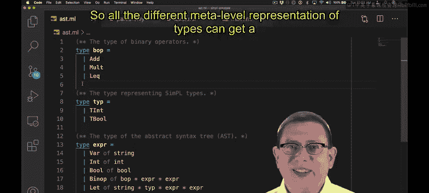
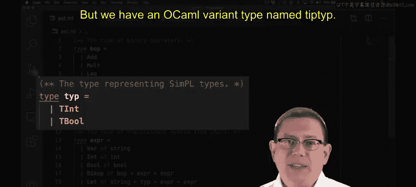
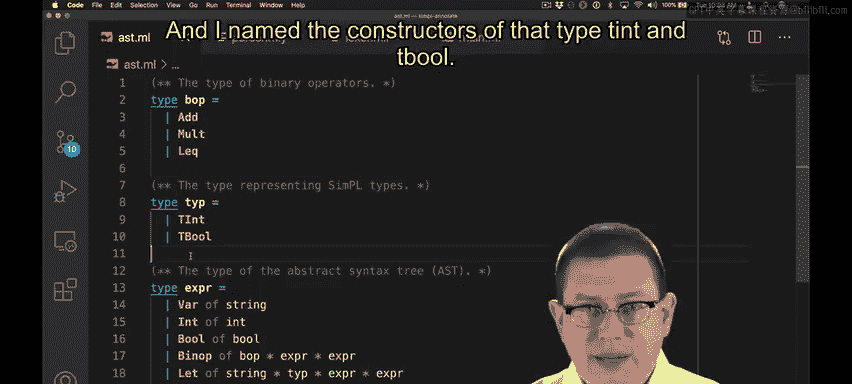
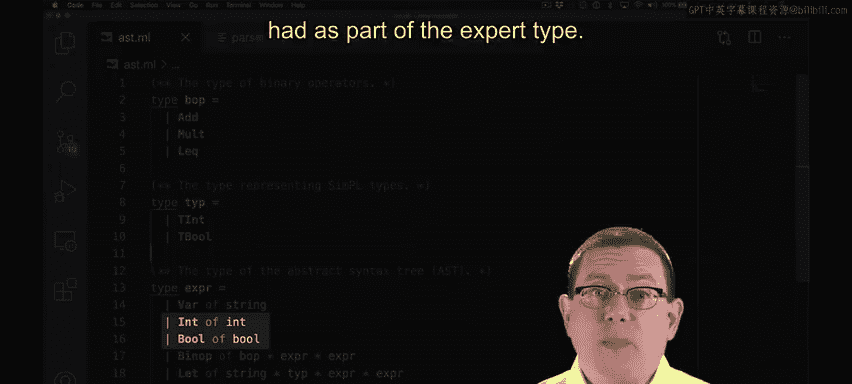
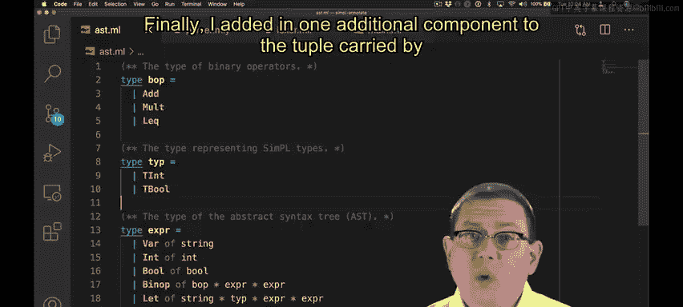
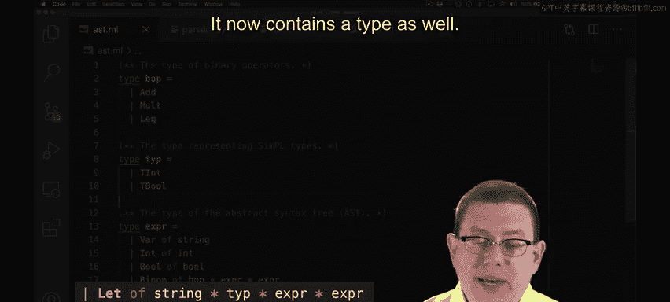
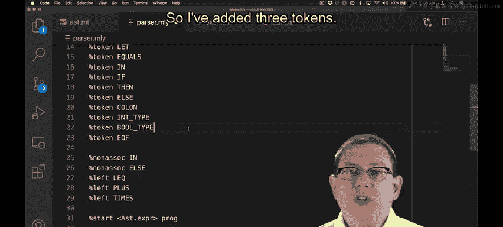
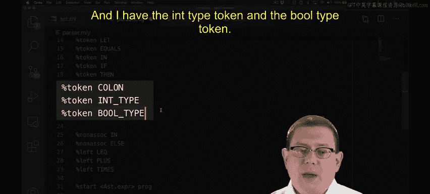
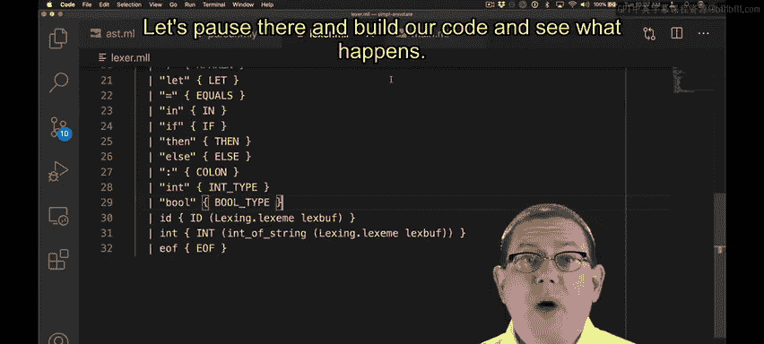

**OCaml编程｜CS3110：OCaml Programming： Correct + Efficient + Beautiful：P186：为SimPL解释器添加类型系统**

在本节课程中，我们将学习如何为SimPL语言实现一个类型检查器。我们将从修改抽象语法树开始，逐步添加对类型注解的支持，并更新解析器、词法分析器以及解释器的相关部分。

---

### **修改抽象语法树**

首先，我们需要在OCaml中定义一个类型来表示SimPL的类型。为了避免与OCaml的关键字`type`冲突，我们使用`typ`作为类型名。

```ocaml
type typ = TInt | TBool
```

这里，`TInt`和`TBool`是构造器，分别代表整数类型和布尔类型。我们使用`T`前缀是为了与表达式中已有的`Int`和`Bool`构造器区分开。





接下来，我们需要修改`let`表达式的结构，使其包含一个类型注解。`let`表达式现在将携带一个额外的类型组件。

```ocaml
type expr =
  | Let of string * typ * expr * expr
  | ... (* 其他表达式构造器 *)
```





这样，每个`let`绑定都明确指定了其变量的类型。

---





### **更新词法分析器与解析器**

为了在源代码中解析类型注解，我们需要扩展词法分析器和解析器。

在词法分析器中，我们需要添加三个新的词法单元：
*   `COLON`：用于表示类型注解前的冒号（`:`）。
*   `INT_TYPE`：对应关键字`int`。
*   `BOOL_TYPE`：对应关键字`bool`。





在解析器中，我们需要修改`let`表达式的产生式规则，使其包含冒号和类型声明。同时，添加一个`typ`产生式，用于解析`int`或`bool`类型，并返回对应的AST节点（`TInt`或`TBool`）。

完成这些修改后，我们可以尝试编译代码。此时，编译器可能会报错，提示`let`表达式缺少类型组件。这正是我们接下来需要修复的问题。

---

### **调整解释器**



现在，我们需要更新解释器的两个核心函数：替换函数和求值函数，以处理新增的类型注解。

在替换函数中，类型本身不包含需要替换的变量，因此我们只需原样传递类型`T`即可。

```ocaml
let rec subst e x v = match e with
  | Let (y, t, e1, e2) ->
      Let (y, t, subst e1 x v, if x = y then e2 else subst e2 x v)
  | ... (* 其他分支 *)
```

在求值函数中，运行时我们不再关心类型注解，因为类型检查的目的在求值前已经完成。因此，我们可以使用下划线`_`来忽略`let`表达式中的类型组件。

```ocaml
let rec eval = function
  | Let (x, _, e1, e2) ->
      let v1 = eval e1 in
      eval (subst e2 x v1)
  | ... (* 其他分支 *)
```

通过这种方式，我们确保了类型信息在编译时被检查，但在运行时被安全地忽略。

---

### **总结**


在本节课中，我们一起学习了如何为SimPL解释器添加一个简单的类型系统。我们首先定义了表示类型的OCaml变体`typ`，然后修改了AST，使`let`表达式能够携带类型注解。接着，我们更新了词法分析器和解析器以识别新的语法。最后，我们调整了替换和求值函数，确保类型信息在运行时被正确处理（即被忽略）。这些步骤构成了为动态语言添加静态类型检查的基础。