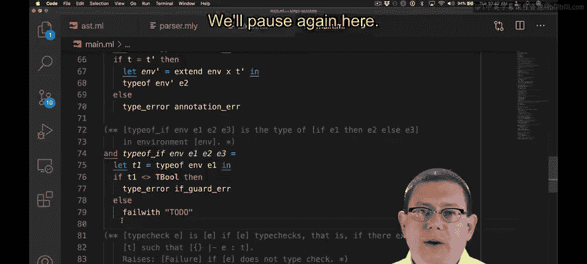
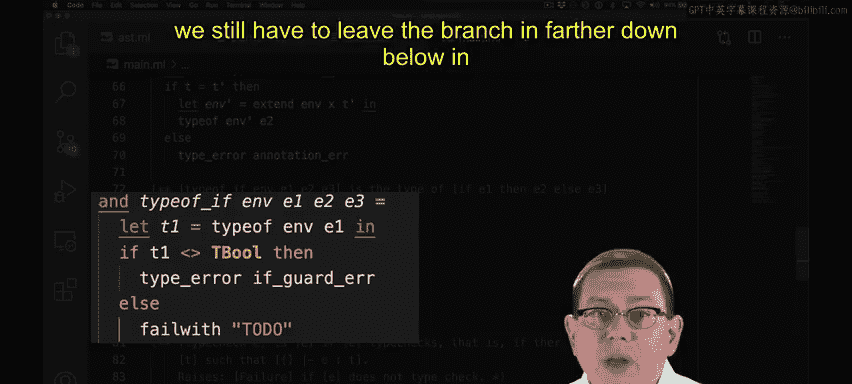
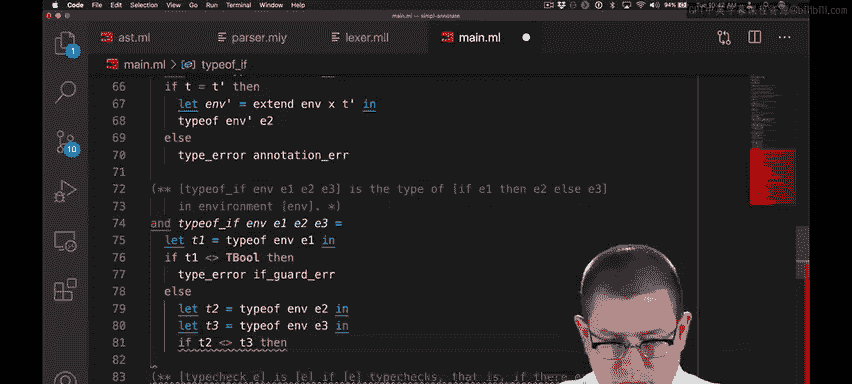
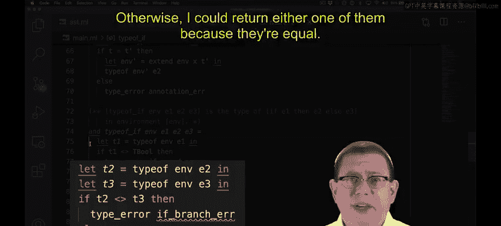
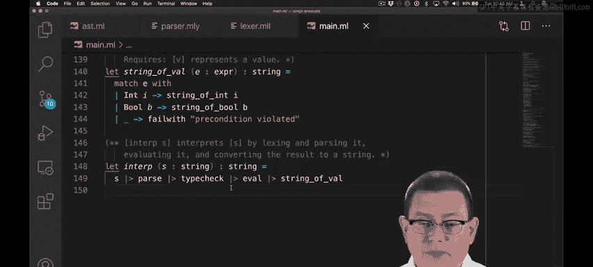
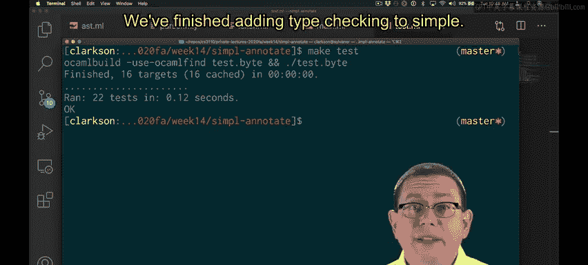
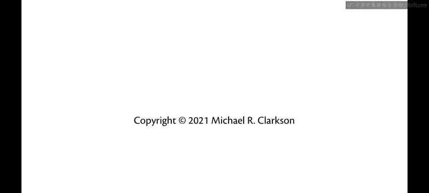

# 188：SimPL类型检查器实现（第二部分） 🧠

在本节课中，我们将继续学习如何为SimPL语言实现类型检查器。我们将重点实现`let`表达式和`if`表达式的类型检查规则，并最终完成整个类型检查器的构建。

上一节我们介绍了类型检查的基本框架和部分表达式的检查。本节中，我们来看看如何实现`let`表达式和`if`表达式的类型检查。

---

## 实现`let`表达式的类型检查

接下来，我们实现`let`表达式的类型检查。我们将在此处暂停，开始积累一系列辅助函数。此时，我可能需要为每个辅助函数编写规范。

如何实现`let`表达式的类型检查？我们之前为`let`类型检查设计的规则明确指出了方法：我需要检查表达式`E1`，确保其类型与程序员指定的类型`T`一致，然后将其绑定扩展到静态环境中，以便检查`E2`。

我们将实现这个规则。好的，我们在此处暂停。我们已经检查了`E1`，得到了它的类型`T'`。然后我们比较`T`和`T'`，看它们是否相同。

如果相同，说明程序员的类型标注正确，代码中的类型无误。我们可以继续检查`E2`。我在这里引入了一个新的辅助函数，用于将名称绑定到新类型，从而扩展静态环境。

在扩展后的静态环境中，我将检查`E2`的类型并返回该类型。我们稍后会编写这个辅助函数。现在，让我先完成`let`的类型检查：如果`T`和`T'`不相同，则出现类型检查错误。

这是一个新的错误类型，在之前的运行时从未出现过，因为我们之前没有类型系统。因此，我需要引入一个新的字符串来表示类型标注错误。

现在，我的类型标注错误消息已准备就绪。`let`表达式的类型检查几乎完成，我只需要编写那个扩展函数。当然，由于这只是一个关联列表，我可以轻松实现这个扩展函数。

我所做的只是将新的绑定添加到列表前端。我需要担心重复绑定吗？语言的语义涉及**遮蔽**：内部作用域中的变量绑定会遮蔽外部作用域中的同名绑定。

因此，通过将新绑定放在列表前端，我确保了新绑定会遮蔽任何先前的绑定。这样，我恰好得到了正确的语义，甚至无需担心遍历列表以移除重复绑定。

至此，`let`表达式的类型检查完成。现在我可以继续添加下一个语法形式。

---

## 实现`if`表达式的类型检查

好的，我们在此处暂停。我已经为`if`表达式的类型检查引入了新的辅助函数，现在只需要实现类型检查规则：即检查条件表达式的类型是否为`bool`，并检查两个分支的类型是否相同。

我们再次在此处暂停。

我已经实现了对条件表达式类型的检查，确保它是`bool`类型。如果不是`bool`类型，我将引发类型错误。这是另一个可能成为运行时错误或类型错误的例子。我们将通过类型检查在运行时防止此错误，但在代码下方仍需保留分支。

现在我们可以实现分支检查。

我递归地检查两个子表达式，获取它们的类型`T2`和`T3`。如果这两个类型不相同，我将引发类型错误；否则，由于它们相等，我可以返回其中任意一个，这里我选择返回`T2`。

现在我遇到了一种以前从未存在过的类型错误。这是因为在运行时，我从未同时评估`then`和`else`分支并比较它们的类型——评估语义只评估其中一个分支。

然而，在类型检查中，我们必须同时检查两个分支。这意味着我们遇到了一种永远不会对应任何运行时错误的类型错误。好的，我现在已经添加了错误消息。至此，`if`表达式的类型检查实现完成。

---

## 完成类型检查器

此外，整个`type_of`函数的实现也已完成。这意味着我的整个解释器现在已经构建完毕。我已经为其添加了所有类型检查功能。

现在我可以运行测试套件了。当然，在实现过程中，我应该一直使用测试驱动开发来运行这些测试用例。我相信你理解如何有效地使用它。有些时候你需要使用它，有些时候可能不需要。在这里，我对自己所做的事情有信心，所以觉得没有必要使用它，但如果需要，我随时可以返回使用。

我这里有一个测试套件，基本上是我们一直用于简单解释器的相同测试套件，但现在我为其添加了一些类型检查。我的`let`表达式都带有类型标注，并且我在这里有一些案例来检查类型检查功能，包括：

*   操作数类型不匹配的二元运算符
*   具有各种类型错误的`if`表达式
*   未绑定的变量

让我们运行这个测试套件。它成功了，太好了！我们已经完成了为SimPL添加类型检查的工作。😡

---

## 总结

本节课中我们一起学习了如何为SimPL语言实现完整的类型检查器。我们详细实现了`let`表达式和`if`表达式的类型检查规则，理解了类型标注、静态环境扩展以及分支类型一致性检查等核心概念。通过将类型检查集成到解释器中，我们能够在程序运行前捕获类型错误，从而构建出更健壮、更安全的程序。