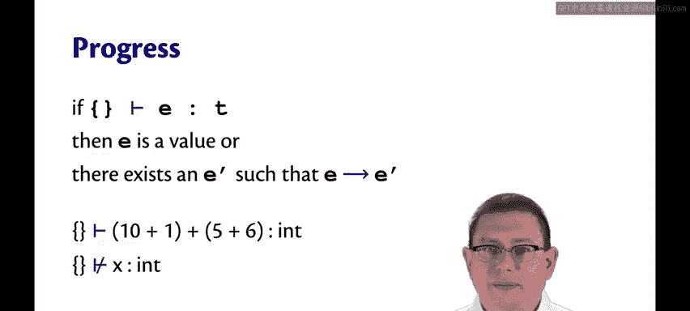
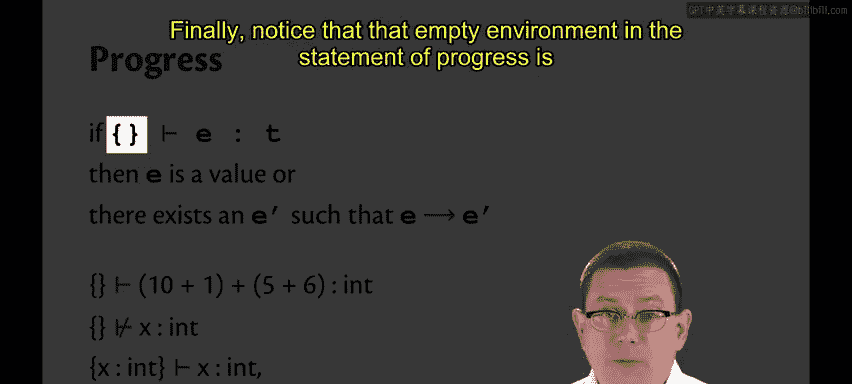
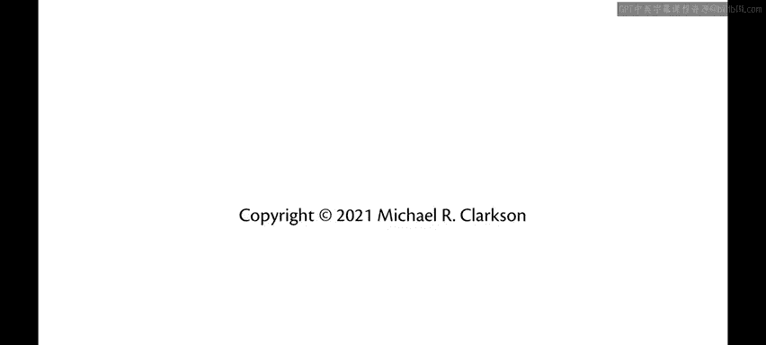

# 189：类型安全 🛡️

在本节课中，我们将要学习类型安全的核心概念。类型检查的目标是确保运行时错误不会发生。我们将探讨如何通过“进展”和“保持”这两个性质来形式化地证明类型系统能够防止程序在求值过程中“卡住”。

## 概述

我们曾多次提到，类型检查的目标是确保运行时错误不会发生。尽管如此，在实现带有类型检查的解释器时，我们仍需为运行时错误提供处理分支。类型系统能够防止这类错误，这一结论是我们通过理论证明而非让OCaml编译器信服来确立的。

我们希望预防的求值错误，可以描述为求值过程“卡住”的情况。

## 求值“卡住”的定义

如果一个表达式 **E** 不是一个值，并且 **E** 无法执行单步求值，那么我们就说表达式 **E** 的求值过程“卡住”了。这里我们回到了单步求值模型来给出这个定义。

这意味着它“卡住”是因为尚未达到一个值，计算尚未完成，但却无法从当前状态继续向前推进。更精确地说，类型系统的目标是保证在求值过程中，没有任何表达式会“卡住”。

## 类型安全：进展与保持

这个概念有一个名称，叫做**类型安全**。类型安全意味着永远不会“卡住”。实际上，类型安全可以分解为两个部分，分别称为**进展**和**保持**。

*   **进展** 性质指出，一个表达式总是可以执行一步求值，除非它已经是一个值。
*   **保持** 性质指出，执行一步求值永远不会改变表达式的类型。

让我们更仔细地阐述这两个性质。

### 保持性质

保持性质是说：如果一个环境表明一个表达式具有类型 **T**，并且该表达式经过单步求值得到一个新表达式 **E'**，那么在同一个环境中，**E'** 仍然具有相同的类型 **T**。因此，求值步骤保持了类型。

以下是保持性质的一个例子：
假设有复杂表达式 `10 + 1 + 5 + 6`。我们知道它可以执行一步求值，将 `10 + 1` 规约为 `11`。确实，`11 + 5 + 6` 继续具有 `int` 类型。

### 进展性质

进展性质是说：如果一个表达式具有类型 **T**，那么以下两种情况之一必然成立：
1.  **E** 已经是一个值。
2.  存在另一个表达式 **E'**，使得 **E** 可以单步求值为 **E'**。

例如，`10 + 1 + 5 + 6` 具有 `int` 类型，并且确实存在一个它可以单步求值到的 **E'**，正如我们在上一张幻灯片中看到的。

进展性质对类型错误的表达式不做任何断言。例如，在空环境中，`x` 不能被赋予 `int` 类型。但这没关系，进展性质并没有说 `x` 是一个值或者说它必须能执行一步求值，因为它没有正确的类型。事实上，这是一个会产生运行时错误的表达式，因此我们无法为其赋予类型是一件好事。

最后，请注意进展性质陈述中的“空环境”实际上很重要，我们不能将其扩展到任意环境。

例如，如果我们从一个确实将 `x` 绑定到 `int` 的环境开始，那么我们就能断定 `x` 是良类型的，因为 `x` 在那个环境中确实具有 `int` 类型。但是 `x` 不是一个值，并且 `x` 无法执行求值步骤。因此，对于进展性质而言，要求是空环境这一点至关重要。

## 证明类型安全

为了证明类型安全，我们可以将进展和保持性质结合起来使用。

以下是此类证明的概要：
我们的主张是：良类型的程序不会“卡住”，这就是类型安全的含义。
1.  我们首先假设程序是良类型的。
2.  然后我们根据程序到达一个值所需的步数进行归纳证明。
    *   **基本情况**：剩余步数为零。这意味着我们已经得到了一个值。既然它已经是一个值，它就不是“卡住”的，因为“卡住”意味着不是一个值且无法执行一步求值。因此，证明的这一部分完成。
    *   **归纳步骤**：假设剩余一步或多步求值。根据**进展**性质，如果一个程序是良类型的，那么它总是可以执行一步求值。因此，我们可以执行下一步。
        现在可能剩余零步或多步，但我们至少执行了一步。根据**保持**性质，当我们执行那一步时，得到的新表达式仍然是良类型的。
        这意味着归纳假设可以应用，因为我们有一个良类型的程序，但它距离到达一个值所需的步数少了一步。因此，根据归纳假设，这个新的良类型程序不会“卡住”。证明完成。

这不是一门我期望你们在本课程中能够掌握的证明，我只是想让你们了解此类证明的结构。如果你对了解更多感兴趣，可以学习 CS4110 课程。但这就是目标，这就是我们拥有类型系统的原因：它们确保我们的良类型程序在求值过程中不会“卡住”。

## 总结

本节课中我们一起学习了类型安全的核心概念。我们定义了求值“卡住”的状态，并引入了**进展**与**保持**这两个关键性质来形式化类型安全。通过结合这两个性质，我们可以从理论上证明良类型的程序在求值过程中永远不会陷入“卡住”的境地，从而避免了特定的运行时错误。理解这些原理有助于我们深入认识静态类型系统为程序可靠性提供的保障。