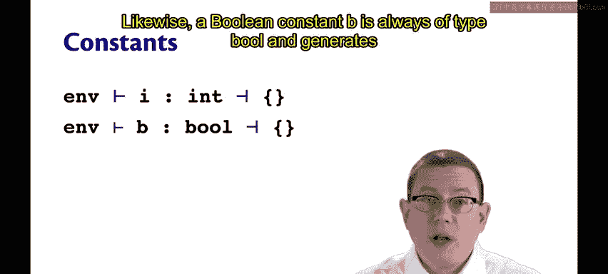
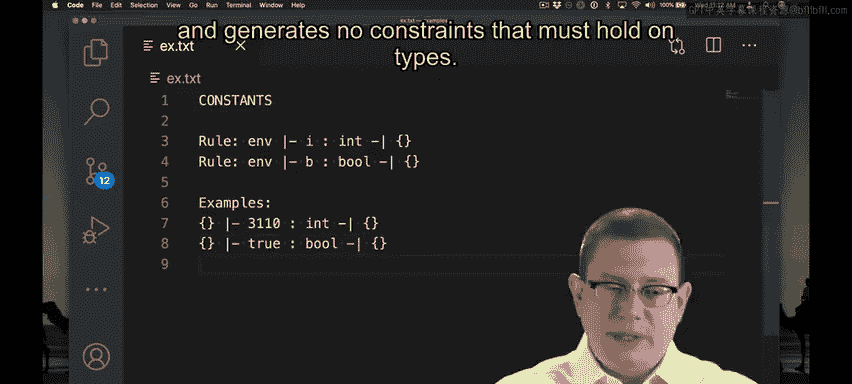
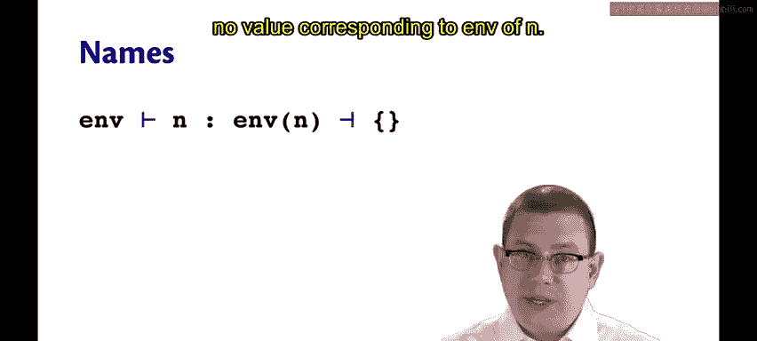
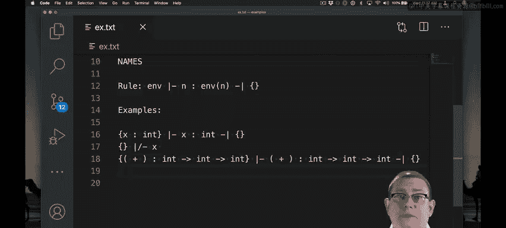

# 192：常量与名称的类型推断 🧠

在本节课中，我们将学习类型推断关系中最基础的两个部分：常量（如整数和布尔值）和名称（如变量和运算符）的类型推断规则。我们将通过简单的例子来理解这些规则如何工作。

---

上一节我们介绍了类型推断的基本概念，本节中我们来看看如何为常量和名称进行类型推断。

## 常量的类型推断



常量的类型推断规则非常简单。以下是具体规则：

*   **整数常量**：一个整数常量 `i` 总是具有 `int` 类型，并且不产生任何类型约束。
*   **布尔常量**：一个布尔常量 `b` 总是具有 `bool` 类型，并且不产生任何类型约束。

让我们来看几个例子：


在空环境 `Γ = {}` 中：
*   整数常量 `3110` 具有类型 `int`。
*   它产生的约束集合为空集 `C = {}`。

（这里用空花括号 `{}` 同时表示空环境和空约束集合。环境是一组绑定的集合，约束是一组类型等式的集合。）



同理，在空环境 `Γ = {}` 中：
*   布尔常量 `true` 具有类型 `bool`。
*   它产生的约束集合为空集 `C = {}`。

---

## 名称的类型推断

名称的类型推断规则同样直接。以下是具体规则：



在静态环境 `Γ` 中，一个名称 `n` 的类型就是环境 `Γ` 为它指定的类型，并且不产生任何约束。

当然，如果该名称 `n` 在环境 `Γ` 中没有绑定，那么类型推断在此处就会失败，因为无法为 `n` 找到对应的类型。

让我们通过例子来理解：


**例子 1：名称在环境中**
假设我们有一个静态环境 `Γ`，它将 `x` 绑定到类型 `int`。
在这个环境中，推断名称 `x` 的类型：
*   结果是类型 `int`。
*   产生的约束集合为空集 `C = {}`。

**例子 2：名称不在环境中**
假设我们在空环境 `Γ = {}` 中尝试推断 `x` 的类型。
由于 `x` 不在环境中，推断失败。我们无法推断出任何类型。

**例子 3：内置运算符**
我们如何推断 `+` 运算符的类型？
我们编写的每个程序都应该从一个初始的静态环境开始，这个环境包含了内置布尔运算符的类型。
因此，初始环境 `Γ` 中应该始终包含：`+` 的类型是 `int -> int -> int`。
同样，`*` 也应有相同的类型，`<=` 应有类似的类型。

有了这个环境，名称推断规则就能告诉我们如何推断 `+` 的类型：直接在环境中查找。
所以，`+` 必须具有类型 `int -> int -> int`，并且不产生任何约束。

---

## 初始环境中的内置绑定

以下是进行类型推断时，每个初始静态环境中都应包含的三个核心绑定：



```ocaml
Γ = {
    (+) : int -> int -> int,
    ( * ) : int -> int -> int,
    (<=) : int -> int -> bool
}
```


这些绑定确保了语言中的基本算术和比较运算符具有正确的类型。

---

本节课中我们一起学习了类型推断的基础规则。我们了解到：
1.  **常量**（整数和布尔值）具有固定的、预定义的类型（`int` 或 `bool`），且不产生约束。
2.  **名称**（变量、运算符）的类型通过查询当前静态环境 `Γ` 获得。如果名称未在环境中定义，则类型推断失败。
3.  程序的**初始环境**必须包含内置运算符（如 `+`, `*`, `<=`）的类型绑定，这是进行后续复杂表达式推断的基石。


理解这些简单案例是掌握更复杂的函数应用、`let` 表达式和条件表达式类型推断规则的关键第一步。