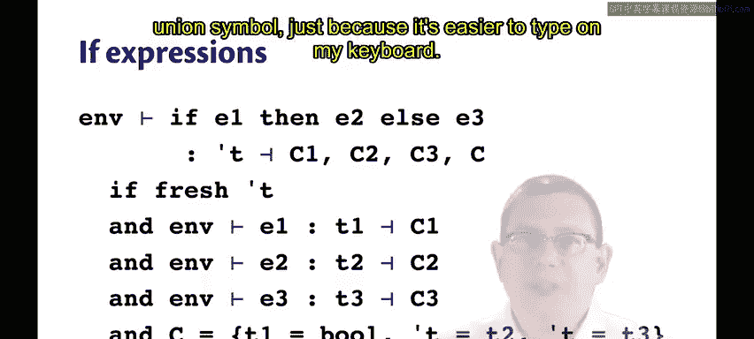
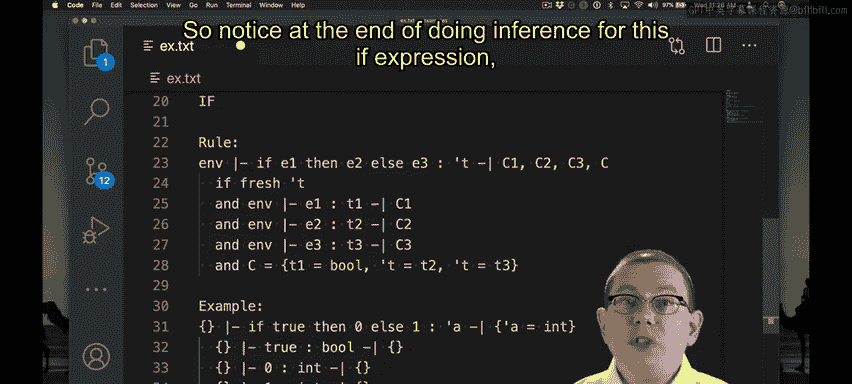
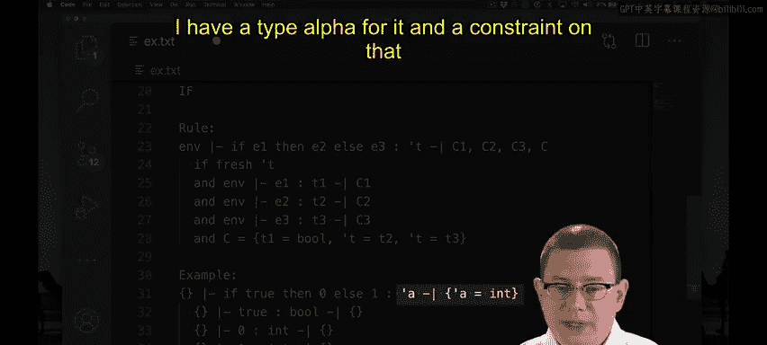
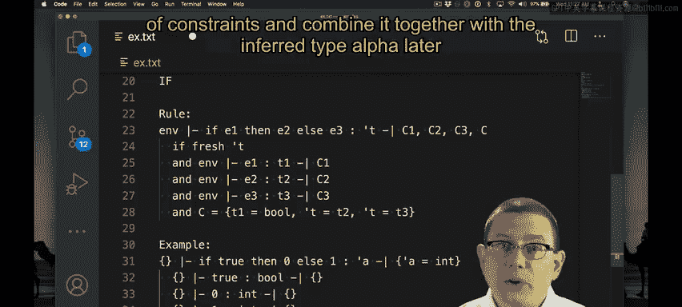
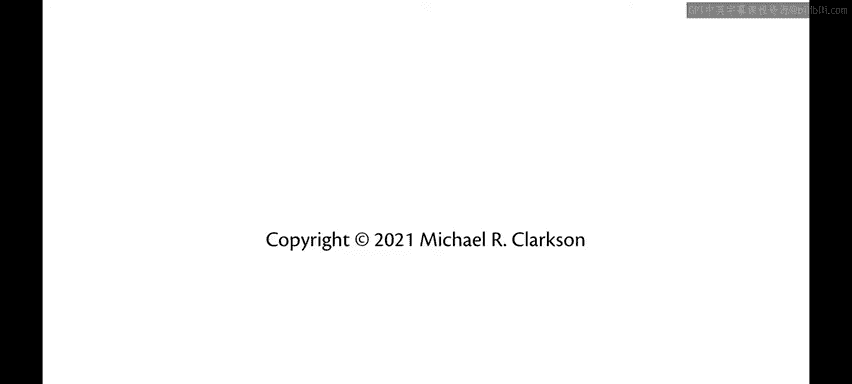

# 193：if表达式的类型推断 🧠

## 概述
在本节中，我们将学习OCaml中`if`表达式的类型推断过程。这是类型推断开始变得复杂的第一个地方，因为它涉及多个子表达式以及它们之间的类型约束。

## if表达式的类型推断规则
上一节我们介绍了类型推断的基本概念，本节中我们来看看如何将其应用于`if`表达式。

我们将在静态环境`M`中推断`if E1 then E2 else E3`的类型。

我们将推断出一个类型`τ`（读作“tau”），并且会涉及一系列约束。这是第一次真正生成约束。

让我们逐步分析这个过程。

### 第一步：创建新的类型变量
首先，`τ`应该是一个**新鲜的类型变量**。所谓“新鲜”，意味着它在程序的类型推断过程中从未被使用过，因此是全新的。

`if`表达式的类型将被推断为这个新的类型变量`τ`。这是因为仅从语法上看，在不深入分析`E1`、`E2`或`E3`的情况下，我们还不知道这个`if`表达式的类型应该是什么。

当然，你我都知道，如果深入分析`E2`和`E3`，我们就能推断出来，因为`if`表达式的类型就是其`then`分支和`else`分支的类型。但从算法角度，我们还不能这样做。

### 第二步：推断子表达式的类型
接下来，我们将使用静态环境`M`，对三个子表达式分别进行类型推断。

我们将推断`E1`的类型，它将是某个类型`T1`。我们无法控制这个类型会是什么。类型推断算法可能返回`bool`，可能返回一个类型变量，甚至可能返回更复杂的东西。我们只知道它是一个类型，所以将其记为`T1`。

对`E2`和`E3`也是如此。它们各自都会独立地生成自己的一组约束，因为其内部可能嵌套了代码。

让这些约束分别为`C1`、`C2`和`C3`。



### 第三步：整合约束
现在，为了整合所有信息，我们知道这里出现的类型之间必须满足一些关系。这些关系被记录在额外的约束集`C`中。

集合`C`将包含：
*   `T1 = bool`，因为我们需要将守卫（guard）的类型约束为布尔型。
*   `τ = T2` 且 `τ = T3`，因为在`if`表达式中，`then`分支和`else`分支的类型必须相同。

因此，类型推断返回`τ`作为`if`表达式的类型，同时返回所有来自子表达式的约束`C1`、`C2`和`C3`，并额外加上对守卫类型、`then`分支类型和`else`分支类型的这三个新约束。

用公式表示，推断结果如下：
```
type: τ
constraints: C1 ∪ C2 ∪ C3 ∪ {T1 = bool, τ = T2, τ = T3}
```

## 示例分析
让我们尝试一个推断`if`表达式类型的例子。

假设我们要推断 `if true then 0 else 1` 的类型。

### 第一步：创建类型变量
首先，我需要创建一个新鲜的类型变量。例如，我使用`α`作为之前未在此处使用过的类型变量。

因此，我将返回`α`作为这个`if`表达式的类型。当然，还会附带一些约束，我需要找出这些约束是什么。

### 第二步：推断子表达式类型
为此，我需要继续推断守卫的类型。如何推断呢？守卫是一个布尔常量，所以我们使用之前介绍的常量规则，该规则给出类型`bool`且不生成任何约束。

我还需要推断`then`分支和`else`分支的类型。
*   `then`分支是常量`0`，其类型为`int`，不生成约束。
*   `else`分支是常量`1`，其类型也为`int`，不生成约束。

### 第三步：生成并整合约束
最后，我需要形成由`if`表达式本身添加在之前所有约束之上的约束集。

我的约束集将是：
*   `bool = bool`（来自守卫类型`T1`必须等于`bool`的规则）。
*   `α = int`（来自`τ`必须等于`then`分支类型`T2`的规则）。
*   `α = int`（来自`τ`必须等于`else`分支类型`T3`的规则）。

现在，我知道了这个整体表达式需要满足的约束集。我需要包含所有来自子表达式的约束，但那些都是空集，所以不必再写。然后我有上面定义的集合`C`，即`{bool = bool, α = int, α = int}`。

当然，我可以简化它。但真正有趣的是`α = int`。如果我想要在纸上稍微简化一下，可以将其写为我的约束集。



在算法实现中，你可能会也可能不会注意到这里有重复项，或者出现了平凡的恒等式。你可以编写额外的代码来稍微简化这些内容。



请注意，在完成`if`表达式的推断后，我得到了一个类型`α`和关于该类型的约束。你和我可以看着它说：“哦，这意味着整个`if`表达式的类型是`int`。”

但请记住，在将其实现为算法时，我们最终可能会得到一个需要解决的大型约束集，可能因为数量太多而人脑难以解决。我们将在后面讨论如何解决这个约束集，并将其与推断出的类型`α`结合起来。





## 总结
本节课中，我们一起学习了`if`表达式的类型推断过程。关键点在于：为整个表达式引入一个新鲜的类型变量`τ`，分别推断其三个子表达式的类型和约束，然后添加三个核心约束——守卫表达式类型必须为`bool`，且`then`和`else`分支的类型都必须与`τ`相等。这个过程是构建OCaml强大类型系统的基础步骤之一。