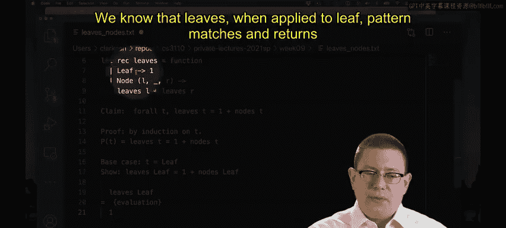

# OCaml编程：6.30：树上的归纳法 🌳

在本节课中，我们将要学习如何对树这种更复杂的数据结构进行归纳证明。我们将看到，虽然树的结构比列表或自然数更复杂，但归纳法的核心思想是相通的。

## 概述

上一节我们介绍了对列表和自然数的归纳法。本节中，我们来看看如何将归纳法应用于二叉树。我们将学习归纳证明的格式，并通过一个具体的例子——证明树中叶子节点的数量等于节点数量加一——来巩固理解。

## 树的结构与归纳法格式

我们之前已经见过如何对自然数和列表进行归纳。那么对于更复杂的变体呢？当然，你也可以对那些结构进行归纳。

让我们看看如何对树进行归纳。请记住，我们在这里定义的二叉树与列表并没有太大不同。它只是多携带了一个部分：列表携带一个子列表，而二叉树携带两个子树，这就是全部的区别。

因此，对树进行归纳证明的格式与对列表或自然数的归纳证明非常相似。

假设你想要证明一个性质 **P** 对所有树 **t** 都成立。并且你想通过对 **t** 进行归纳来证明。

首先，存在一个**基础情况**，即 **t** 是最小的可能树。在这个例子中，就是 `Leaf`，因为它在这里代表空树。就像对于列表，我们有最小的可能列表 `Nil`；对于自然数，我们有最小的自然数 `0`。所以我们需要证明性质 **P** 在这个最小值（即 `Leaf`）上成立。

我们还有一个**归纳情况**。在这种情况下，树更大。实际上，它比之前的某个东西大一个单位。就像我们有一个自然数的后继，或者一个在开头 `cons` 了某物的列表一样，这里我们有一个由两个较小的树构成的树。在这个例子中，必须是两个，因为我们讨论的是二叉树。所以，我们有一个 `Node`，它有一个左子树、一个右子树以及一个存储在该节点的值。

我们将尝试证明性质 **P** 对于用 `Node` 构造的这个更大的树成立。与之前不同的是，我们得到了**两个归纳假设**。我们实际上可以将性质 **P** 应用于该类型的两个较小的值。这在以前从未发生过，因为我们之前只有一个较小的值（一个自然数，或者列表的尾部那个较小的列表）。这里我们有一个左子树和一个右子树，因此我们可以假设性质 **P** 对左子树和右子树都成立。

## 一个例子：计算树中的叶子和节点数量

让我们通过计算树中叶子和节点的数量来做一个例子。

树中节点的数量将是我们遍历树时遇到 `Node` 构造函数的次数。树中叶子的数量将是我们找到 `Leaf` 构造函数的次数。所以叶子都在底部，节点都在中间和顶部。

我想要证明的命题是：**树中叶子的数量等于节点数量加一**。事实上，如果你想暂停一下，画几棵树，你可能会在一些例子中确信这一点成立。但我们如何严格地证明它呢？

以下是证明的步骤：


1.  **定义函数**：首先，我们定义两个递归函数来计算叶子数和节点数。
    ```ocaml
    let rec leaves = function
      | Leaf -> 1
      | Node (_, l, r) -> leaves l + leaves r

    let rec nodes = function
      | Leaf -> 0
      | Node (_, l, r) -> 1 + nodes l + nodes r
    ```

2.  **陈述命题**：对于任意树 `t`，证明 `leaves t = 1 + nodes t`。我们将通过对 `t` 的结构归纳来证明。


### 基础情况：`t = Leaf`



我们需要证明 `leaves Leaf = 1 + nodes Leaf`。


根据 `leaves` 函数的定义，当模式匹配到 `Leaf` 时返回 `1`。所以 `leaves Leaf` 求值为 `1`。


根据 `nodes` 函数的定义，当模式匹配到 `Leaf` 时返回 `0`。所以 `nodes Leaf` 求值为 `0`。

因此，右边 `1 + nodes Leaf` 等于 `1 + 0`，即 `1`。


左边 `leaves Leaf` 也等于 `1`。两边相等，基础情况得证。

### 归纳情况：`t = Node (v, l, r)`

归纳假设：假设性质对左子树 `l` 和右子树 `r` 成立。即：
*   `leaves l = 1 + nodes l` （归纳假设 L）
*   `leaves r = 1 + nodes r` （归纳假设 R）


我们需要证明：`leaves (Node (v, l, r)) = 1 + nodes (Node (v, l, r))`。

**证明过程：**

从左边开始：
`leaves (Node (v, l, r))`
根据 `leaves` 函数的定义，匹配到 `Node` 时，返回 `leaves l + leaves r`。
所以，左边等于 `leaves l + leaves r`。

根据归纳假设 L 和 R，我们可以将其替换为：
`(1 + nodes l) + (1 + nodes r)`。

现在处理右边：
`1 + nodes (Node (v, l, r))`
根据 `nodes` 函数的定义，匹配到 `Node` 时，返回 `1 + nodes l + nodes r`。
所以，右边等于 `1 + (1 + nodes l + nodes r)`，即 `2 + nodes l + nodes r`。


现在比较左右两边：
左边：`(1 + nodes l) + (1 + nodes r) = 2 + nodes l + nodes r`
右边：`2 + nodes l + nodes r`


左右两边完全相等。因此，在归纳情况下，命题也成立。

## 总结


本节课中我们一起学习了如何对二叉树进行归纳证明。我们了解到，其基本格式与列表归纳法相似，但关键区别在于归纳情况中，由于一个 `Node` 包含两个子树，因此我们获得两个归纳假设。我们通过一个具体的命题——树中叶节点数等于内部节点数加一——完整演示了基础情况和归纳情况的证明步骤，巩固了对树归纳法的理解。掌握这种方法对于证明关于递归树形数据结构的性质至关重要。