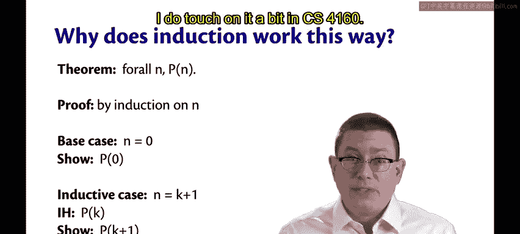
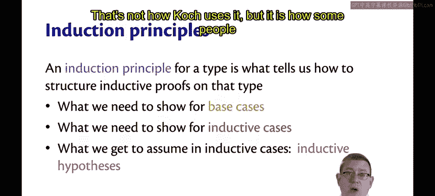
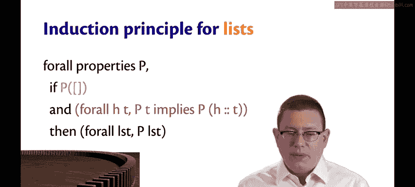
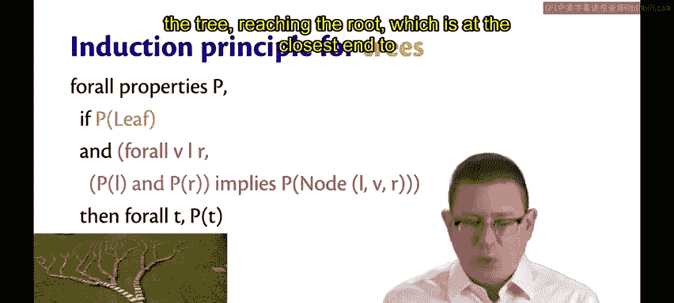
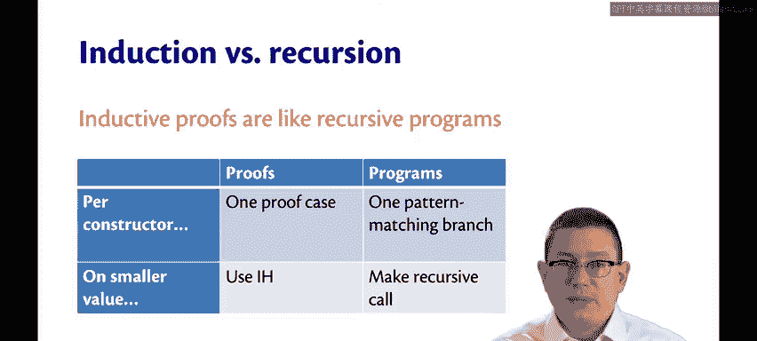

# 康奈尔大学《OCaml编程｜CS3110：OCaml Programming： Correct + Efficient + Beautiful》中英字幕 - P102：-102-Induction and Recursion Chap6 Video 32.zh_en - GPT中英字幕课程资源 - BV1Tx4y1s7sP

Now that we've done all of these inductive proofs， you might be wondering。

 why does induction work this way， Why do these proofs all have the same common format。

 Why even is this a valid way to do reasoning entity do。That's a deep question。

And one that really you need to take a class on mathematical logic to explore the depths of。

 I do touch on it a bit in CS4160。

But let me try to give you a little bit of the intuition here。😡。

Every type that we define comes along with what's called an induction principle。😡。

The induction principle for a type is what tells us how to structure inductive proofs on that。

So basically it tells us what we need to show for base cases for inductive cases and what we get to assume in the inductive cases。

 which is to say the inductive hypotheses we do have to be a little bit careful here with the phrase inductive hypotheses。

 some authors use it in various ways， as I've used it here it's what we assume in the inductive case but some people will use it to refer to the property P being proved that's not how I use it。

 that's not how CoC uses it but it is how something。

So the induction principle for natural numbers， which you learned at least in CS 2800 and maybe in other places as well。

It can be stated as follows。It says for all properties， P。😡，If P holds of zero。

And then as a kind of separate logical statement here， for all K， PK implies PK plus 1。

Then we can conclude that for all N， P holds n。So if I've color coded this here。

 let me flip back to the previous slide， the base cases， inductive cases and inductive hypotheses。

You can see those color coded here。Okay so that's the induction principle。

 but why is that the induction principle and why is that a valid reasoning technique？Well。

 there are various metaphors that you can use before actually proving this in a logic class。

 but here's one metaphor I like， and that's of dominoes。Imagine that you have a chain of dominoes。

Now， in this metaphor， P holding means you can knock down a domino。So if P holds of zero。

 that means you can knock down that very first domino that's shown there。😡。

And then the middle line here with the red， which says that if you can knock over Domino K。

 then you're also able to knock over Domino K plus1。

That's sort of saying that the dominoes are spaced and oriented in the right way， if one falls。

 then it will cause the next one to fall and so forth and so on。Okay。

 so if you can establish that you are able to knock over the first domino and if you can establish that knocking over one domino causes the next domino to fall。

 then you've established that you can knock over all of the dominoes。😡。

That is the essence of why induction works here， and that's why the induction principle is stated this。

😡，All right， so for NAT， our data type that we define for natural numbers as opposed to sort of hijacking the built in integers。

 the induction principle looks almost exactly the same。

And that should be no surprise because we know how closely related NAt and natural numbers are。

So if P holds of z is the base case， the inductive case in the middle here。

 if we know that P holds of k， and that implies P holds of the successor of K。

 then we're able to conclude that P holds of all nets。It's the same underlying metaphor ofdom。

What about lists？It's the same thing， again。We're just showing that a P holds of that smallest case still emptyless。

And then if we can show P holds of any tail T that implies that P holds of a list that's one bigger because we added one thing onto it。

 think of that as like adding on one domino to the chain， if you will。

Then P holds of all。Now finally， what about trees， this gets a little more complicated。

 but it's really kind of the same if P holds of a leaf。

And if for all ways of building up the components of a node。

 So a value a left subt and a right subte， if you know that。P holds of L and P holds of R。

 Then that implies P holding of that bigger node than P holds of all trees。

So here the domino metaphor still applies， it's just a little harder to think about the leaves are all the way back at the back of this picture hard to see。

 but we're sort of saying that if you can knock over those leaves way there in the background and if any time two branches of the tree come together and join up if both of those fall and therefore knock over the next domino that's at sort of the next branch up in the tree。

 then eventually we'll be able to knock over all of the domins in the tree reaching the root which is at the closest end to us in this picture。

Finally， there is an interesting relationship here between induction and recursion。

 I think of inductive proofs like recursive programs。

 in fact if you take 4160 you will see exactly what I mean by that because they really will be recursive programs。

So here's a little bit of intuition about what I mean by that。

Let's compare proofs and programs and let's think about the data types we define。😡。

For each constructor of a data type that we define in a proof， we typically have one proof case。

So think about lists， we had a base case for nil and an inductive case for K。Think about trees。

 We had a base case for leaf。 We had an inductive case for node。

So that's one proof case per constructor。Similarly， when we write programs。

 if we're writing a function on one of these data types。

 we typically will have one pattern matching branch per constructor in that function。

 so if you want to know what the length of a list is。

 you have a pattern matching branch for nil and one for cons if you want to know what the size of a tree is。

 you have a branch for leaf and a branch for node。Likewise。

 think about what we do for smaller values of data types。In a proof。

 we got one inductive hypothesis per smaller value that was involved。So for lists。

 we got one inductive hypothesis on the tail for trees， we got two inductive hypotheses。

 one for the left and one for the right。Likewise， in programs when we write functions over these data types。

 we typically make a recursive call for each smaller value。

If you want it to determine what the length is of the list， you make one recursive call on the tail。

You want to determine what the sizes of a tree you make two recur of calls on the two subtrees。

So there's a lot of similarity here and inductive proofs really are similar to recursive programs。

