# 康奈尔大学《OCaml编程｜CS3110：OCaml Programming： Correct + Efficient + Beautiful》中英字幕 - P103：-103-Total Correctness Chap6 Video 33.zh_en - GPT中英字幕课程资源 - BV1Tx4y1s7sP

Fittingly， the last topic we'll talk about is termination。

We've been talking about how to prove the correctness of programs。

And what we've been talking about so far is really what's known as partial correctness。

Partial correctness means that if a program terminates， then its output is correct。

There's also a notion of total correctness。Total correctness means that the program does terminate definitely。

 and its output is correct。😡，So total correctness is actually partial correctness plus termination。

The program definitely terminates and it's correct。

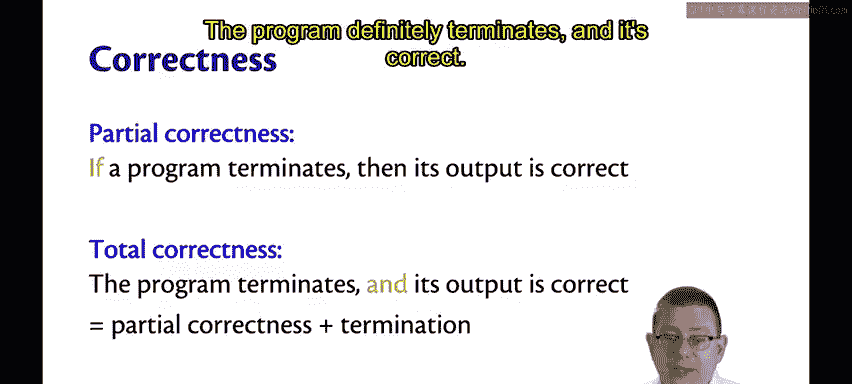

Termination is hard to prove。That's why actually all along here。

 we've really only been doing partial correctness。Alllan Tin。

 in fact showed this in 1936 that there cannot exist a general algorithm that decides whether other algorithms terminate。

Now we as humans might be able to do very clever mathematical proofs that programs terminate。

 but a computer can't do this on its own in all cases。If you want to know more about this。

 you can either Google the halting problem or take CS4820， Igo， in fact。

 maybe some of you are in there right now and have already learned this。

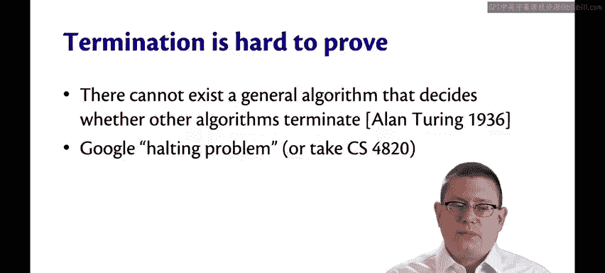

There are some heuristics that can help though。Let me give you one that's useful in the kind of proofs that we have been doing here。

A recursive function terminates。If both of the following things are true。

All recursive calls that it makes are in a smaller input。

And all of the base cases are guaranteed to terminate。

Now I need to be careful here about what I mean by these terms。 Let me give you an example， though。

 first。What about the factorial function？We've looked at this many times before。

Are we guaranteed that it terminates？Well。Here the recursive call is on a smaller value instead of calling on n。

 we're calling on n minus1。

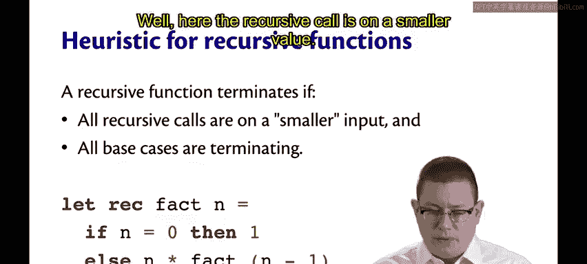

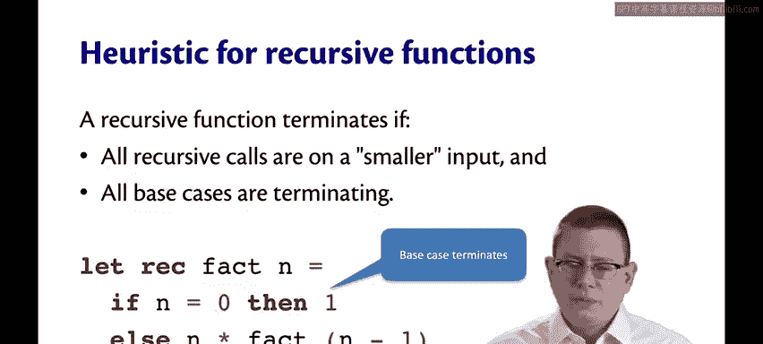

And here， the base case terminates。So this recursive function does terminate on all natural numbers。

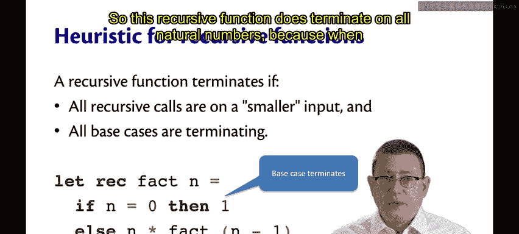

Because when we pass in a natural number here， call it N。

We either recurse on the next smaller natural number n minus1。

 or we get down to the bottom natural number， which is zero。But on integers。That's not true。

Supp you called fact here on negative one。

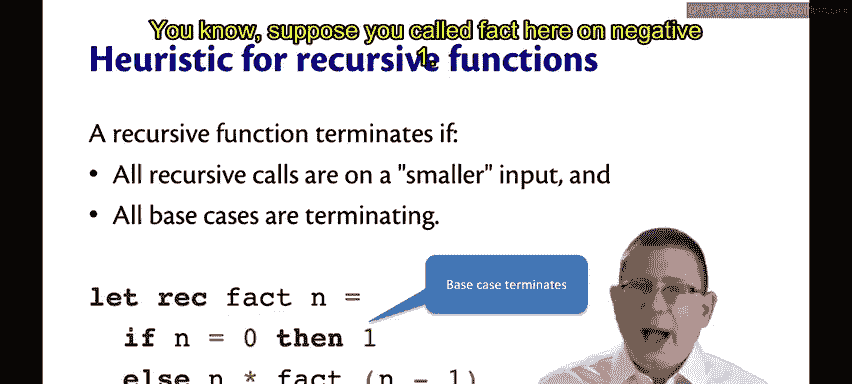

Well， then you know what's going to happen， you're going to keep calling fact on negative one。

 the negative two and so forth because nothing in here accounts for the possibility that n was negative。

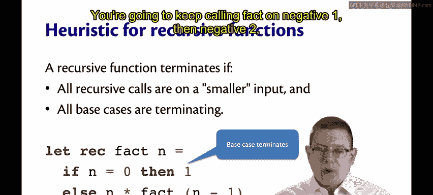

In factact， that would be a precondition if we were writing this down in as part of a real program that we coded。

Okay， so let's be careful here about smaller and base cases。 What are smaller inputs？

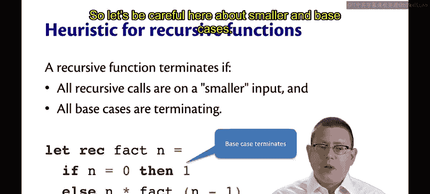

Let's assume a less than relation on function inputs that characterizes what we mean by smaller。

Now this doesn't have to be the same as the notion of less than on integers or natural numbers or whatever。

 but it could be if that happens to be the type that we're working with。

 it wouldn't be if we were working with lists right there a smaller list would have maybe one fewer elements in it。

 a smaller tree might have one less node or fewer subtrees in it。Okay， whatever this relation is。

 of course， let greater than be the opposite of it。

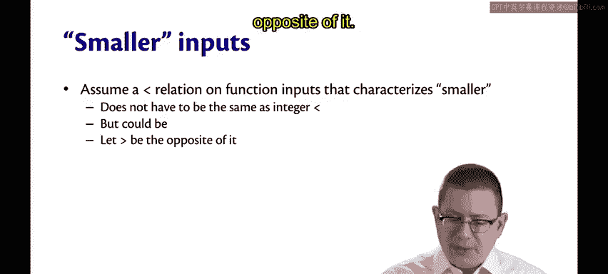

Here's what we mean。😡，We're requiring that there are no infinite descending chains according to that order。

😡，What I mean by an infinite descending chain is a sequence of elements of the type， XO， X1， X2， x3。

 so forth and so on， where the first one's bigger than the second。

 the second one's bigger than the third and so forth and so on。

 so you have this like infinite chain downward of the first thing is bigger than the smaller。

 smaller， smaller， smaller， smaller。If there's no infinite descending chains。

Then you eventually get to the bottom somehow， according to this relation。

 you can't get infinitely smaller than it。Okay， in mathematics。

 that makes this less than that we're thinking about what's called a well founded relation。

 so the intuition of well founded there ought to be just that that you can always get to the bottom of it。

So the natural numbers are well founded。You start at any natural number you want。

 eventually by getting smaller and smaller and smaller， by going down by one at each step。

 you get down to zero。The mathematical integers， though， are not well found。😡。

Because you can keep going infinitely low。

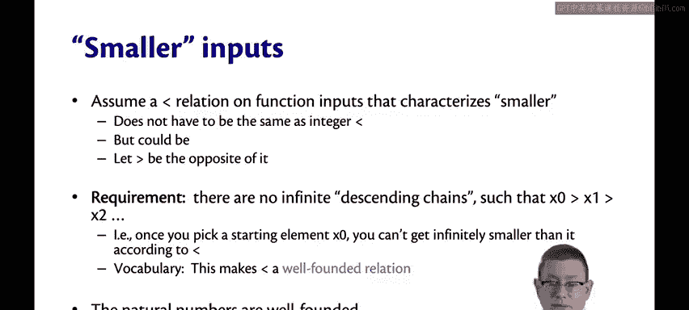

Well founded， implies terminating。Under those conditions。

 of that heuristic that we just talked about。

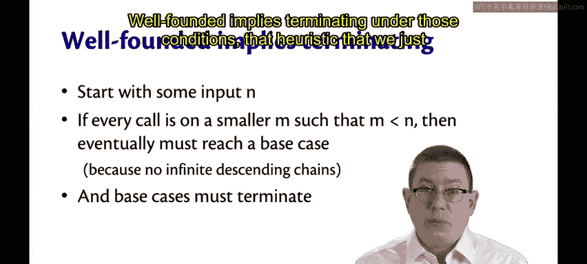

So if you have a well founded relation on the type that you are recursing on。

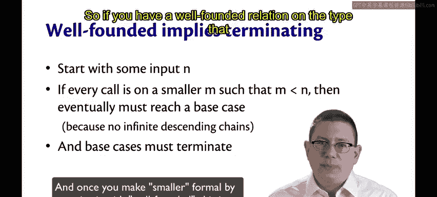

Then as long as you start with any input in。If you can guarantee in the code that every call is on a smaller value M。

 such that M is less than N。Then eventually， you must reach a base case。😡。

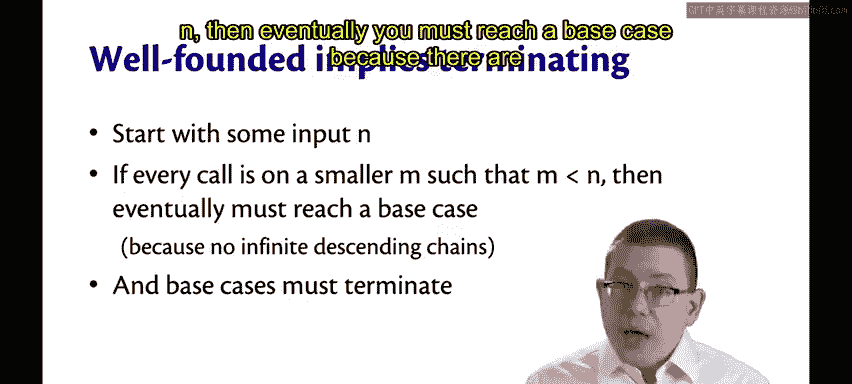

Because there are no infinite descending chains， that's what it means to be well founded。

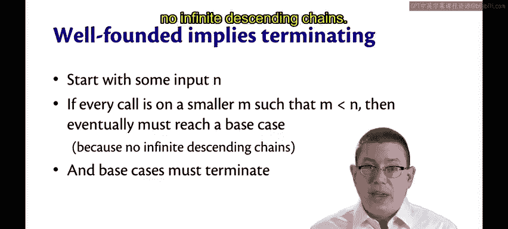