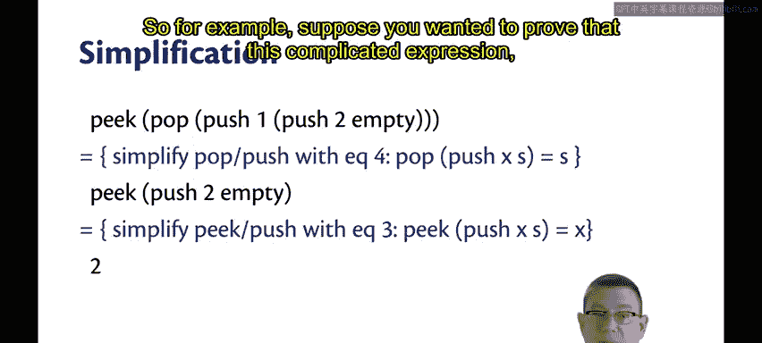
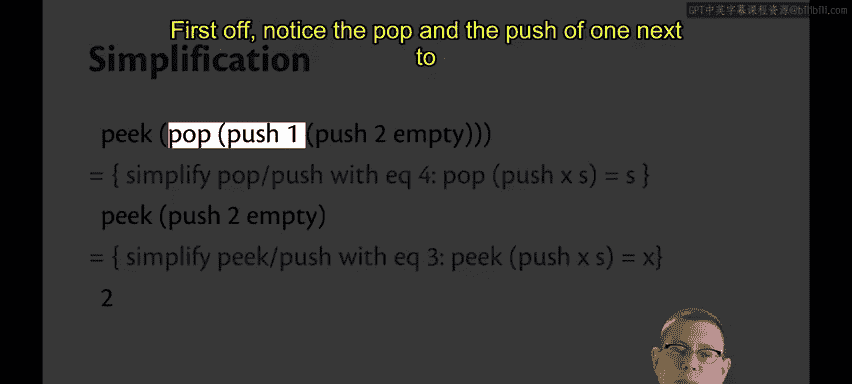
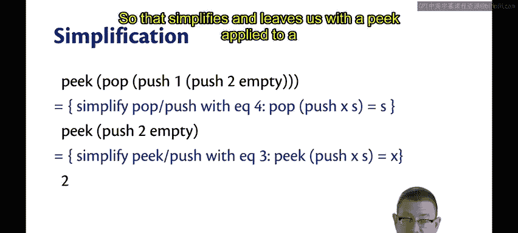
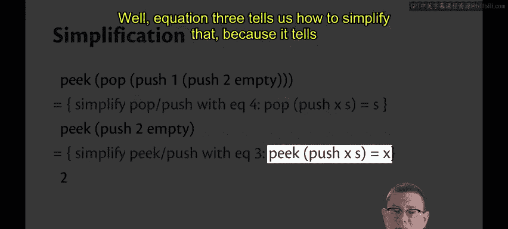
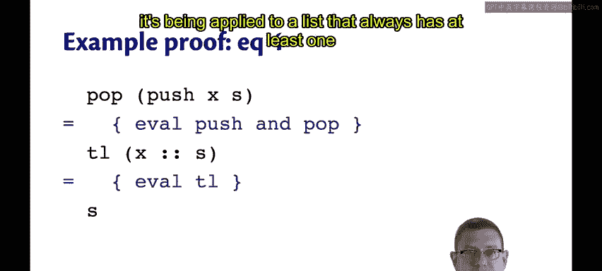

# 康奈尔大学《OCaml编程｜CS3110：OCaml Programming： Correct + Efficient + Beautiful》中英字幕 - P104：-104-Equational Specification of Stacks Chap6 Video 34.zh_en - GPT中英字幕课程资源 - BV1Tx4y1s7sP

Let's start our study of algebraic specification by looking at our old friend， the stack interface。

You'll see in this version of the interface， I'm not using options anywhere。

 so presumably these operations are raising exceptions。

 I've also color coded these to help us keep track of which operations are being used where now we could try to write the standard kind of specifications for the stack that we always write。

For example， for push， we might say that push XS is the stack S with x pushed on the top。

This is not a kind of specification that's really suited for the verification that we are doing right now。

That's okay。 There's another kind of specification。

And it's called an equational specification or an algebraic specification。

 Here's an equational specification for stacks。 First is empty of empty is equal to true。

So notice this is equational because I'm using any quality in the middle here。

 I'm saying that two program expressions are equal。

And it's about the operations and how they interact with one another。

 so here I'm saying that if you apply the operation is empty to the value empty that's part of the specification。

 then you get back true。😡，Here's the second equation。Is empty applied to the stack Push X， S。

Is equal to false。Because that stack has an element on it， it at least has X。

 so it has to be non empty。Here's the third equation。Peak applied to push X， S， Give us back X。

In other words， if we just pushed an element onto the stack， then we peak。

 we're going to get that element back。And the final equation， number 4。Pop applied to push XS。

 gives us back S， whatever that might happen to be。

 It gets rid of that element X that had just been pushed onto the stack and gives us back the original stack。

So that's four equations that characterize the way these operations interact with one another。

Furthermore， all of these equations show us how to simplify an expression。

Notice how the right hand side of each of these equalities is a simpler expression than the left hand side of each of these equalities。

So not only are they telling us how the operations interact。

 they're telling us how they simplify at the same time。

You can use this kind of equational specification to do the proofs based on equalities that we've seen so far。

😡，So for example， suppose you wanted to prove that this complicated expression。

Peak pop， push one push too empty。 actually reduced to two。 First off。

 notice the pop and the push of one next to each other in the middle。

Well， E 4 tells us something about that。 It tells us that you can kind of cancel out that push with that pop and just be left with the original stack。

So that simplifies and leaves us with a peak applied to a push。

Well， equation 3 tells us how to simplify that because it tells us how a peak kind of cancels out a bush。

And that leaves this was just the element too。So it's a really simple proof。

 we don't need to know anything about the underlying implementation。

 we don't need to know anything about what mathematically or abstractly a stack means we just get to use this equational specification to do the reasoning。

So why is it called algebraic specification， it's because it's kind of similar to the equations you see in an algebra class。

 whether that's high school algebra or an abstract algebra class in college。

 that characterize the behavior of mathematical operations。

So you've probably seen equations that characterize plus and minus and times and so forth。

 here are some of the equations you need to correctly specify the operations。

 whether it's for integers or fancier kinds of things like polynomials or matrices。

 they should behave according to these equations。It's the same thing here。

 We're just writing down equations that characterize what it means to be a correct stack rather than correct arithmetic。

Given an implementation， though， we can now attempt to prove that the implementation is correct。

 which is to say that it satisfies its specification。And now for that notion of specification。

 we're using the equational specification of stacks。

So here's a really super simple implementation of stacks with lists just using a bunch of list module functions。

😊，And all of these implementations are correct according to those equations。😊，Now。

 how do you go about proving that， when you take each equation and you show that the left hand side does simplify to the right hand side using these particular functions as the implementations。

And it's really simple for this one， all of our equations from that specification actually hold just by evaluation from this implementation。

😊，So let me give you one brief example of that。The fourth equation。

 which shows that pop and push cancel out each other。Well here if we evaluate pop and push。

 then we're going to replace push with the cons operation， pop with the tail operation。

 and that's going to give us back just the original stack because that's how tail is defined。

Notice now that I am allowing raising of exceptions， which I had ruled out before。

 but also notice that this code will never raise an exception because it's been applied to a list that always has at least one element。

