# OCaml编程：6.35：队列的等式规范 📚

在本节课中，我们将学习如何为队列数据结构编写等式规范。我们将看到，与栈相比，队列的规范更为复杂，这主要是因为队列操作的行为取决于队列是否为空。我们将通过一个生动的“路易斯午餐车”排队例子来理解这些规范，并探讨如何用双列表结构实现队列，以及如何证明其正确性。

---

上一节我们介绍了栈的等式规范，本节中我们来看看如何为队列编写类似的规范。

队列的等式规范与栈的规范在类型上看起来相似，但核心区别在于操作的行为。仅仅改变模块和操作的名称是不够的，我们需要更详细的等式来描述队列的独特行为。

以下是队列操作的核心等式规范：

1.  **`is_empty empty = true`**
    空队列的 `is_empty` 操作返回真。

2.  **`is_empty (enq x q) = false`**
    对一个元素执行入队操作后，队列不再为空。

3.  **`front (enq x q) = if is_empty q then x else front q`**
    这个等式描述了 `front` 和 `enq` 的交互。它说明，新元素入队后，队首元素取决于原队列是否为空。

4.  **`deq (enq x q) = if is_empty q then empty else enq x (deq q)`**
    这个等式描述了 `deq` 和 `enq` 的交互。它说明了入队和出队操作的顺序可以交换，但结果取决于队列的初始状态。

让我们深入理解第三和第四个等式。

### 理解 `front` 与 `enq` 的交互 🍔

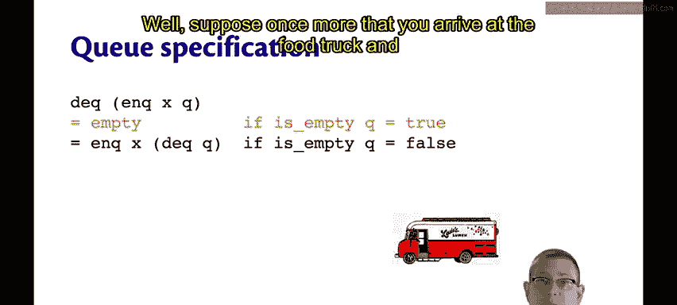

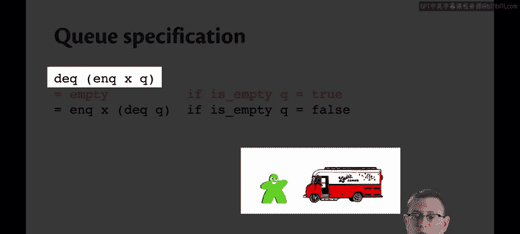

假设你正要去路易斯的午餐车买饭。第三个等式告诉我们关于排队的情况。

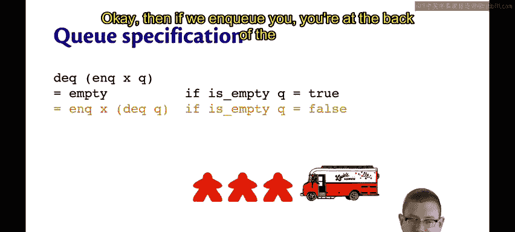

*   **如果队列原本是空的**（没人排队），那么你入队后，你就直接站在了队伍的最前面（队首）。即 `front (enq x empty) = x`。
*   **如果队列原本不空**（前面已经有人排队），那么你入队后，会站在队伍末尾。队首仍然是原来那个人，不会改变。即 `front (enq x q) = front q`（当 `q` 不空时）。

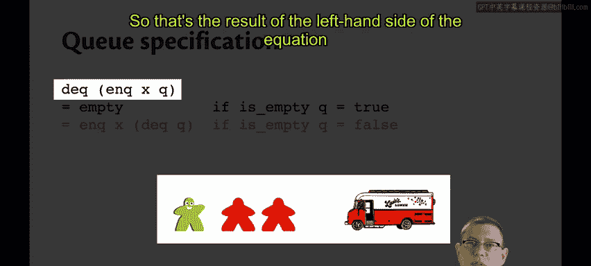

### 理解 `deq` 与 `enq` 的交互 🔄

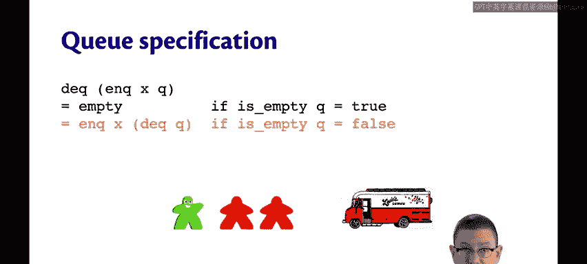

现在来看第四个等式，它描述了出队和入队操作的交互。

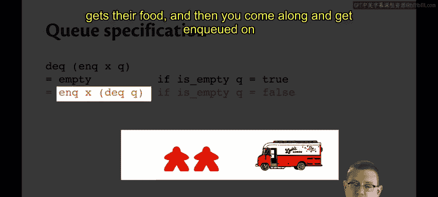

*   **场景一：先入队，再出队**
    1.  你到达时队伍为空。
    2.  你入队（`enq`）。
    3.  然后你出队（`deq`）——因为你前面没人，你立刻得到服务。
    4.  结果队列变空。这对应等式 `deq (enq x empty) = empty`。

*   **场景二：队伍不空时的交互**
    假设初始队列 `q` 中有三个人：`[A; B; C]`（A在队首）。
    *   **等式左边**：`deq (enq you q)`
        1.  你先入队（`enq`），队伍变为 `[A; B; C; you]`。
        2.  然后队首A出队（`deq`），队伍变为 `[B; C; you]`。
    *   **等式右边**：`enq you (deq q)`
        1.  队首A先出队（`deq`），队伍变为 `[B; C]`。
        2.  然后你入队（`enq`），队伍变为 `[B; C; you]`。

    可以看到，无论先入队再出队，还是先出队再入队，最终得到的队列 `[B; C; you]` 是一样的。这就是第四个等式的含义。

---

### 队列的实现：双列表队列 📝

我们可以用非常简单的列表来实现队列，但更高效和经典的是**双列表队列**实现。

这种实现使用两个列表 `(f, b)` 来表示一个队列。整个队列的元素顺序是：**前列表 `f`**，后接**后列表 `b` 的逆序**。即队列 = `f @ (List.rev b)`。

它有一个关键的**表示不变式**：**只有当 `f` 为空时，`b` 才必须为空**。这保证了操作的效率。

以下是核心操作的OCaml代码实现：

```ocaml
type ‘a queue = ‘a list * ‘a list (* (front, back) *)

let empty = ([], [])

let is_empty (f, _) = f = []

let enq x (f, b) =
  if f = [] then ([x], []) else (f, x :: b)

let front (f, _) = List.hd f (* 可能抛出异常 *)

let deq (f, b) =
  match f with
  | [] -> failwith “deq: empty queue” (* 可能抛出异常 *)
  | [_] -> (List.tl f, List.rev b) (* f只剩一个元素，出队后需将b反转作为新f *)
  | _::fs -> (fs, b) (* f有多个元素，直接出队 *)
```

**关于异常的重要说明**：我们的等式规范**没有定义**对空队列进行 `front` 或 `deq` 操作的行为。因此，在实现中，我们可以选择抛出异常，而这在基于该规范的证明中无需考虑。

---

### 证明与抽象函数 🔬

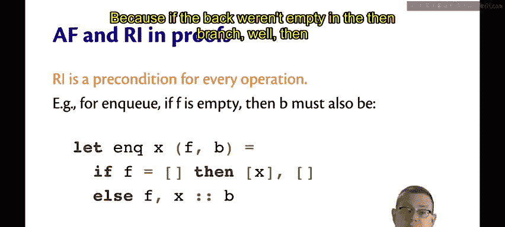

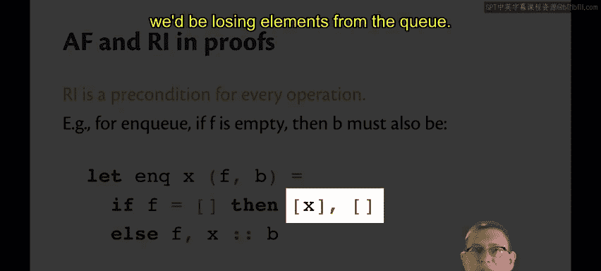

证明双列表队列实现符合等式规范需要大量工作，其中两个概念至关重要：

1.  **表示不变式**：这是每个数据抽象操作的前置条件。例如，在 `enq` 的实现中，我们**假设**传入的队列 `(f, b)` 满足不变式（若 `f` 为空，则 `b` 为空）。这个假设对于证明 `enq` 的正确性必不可少。

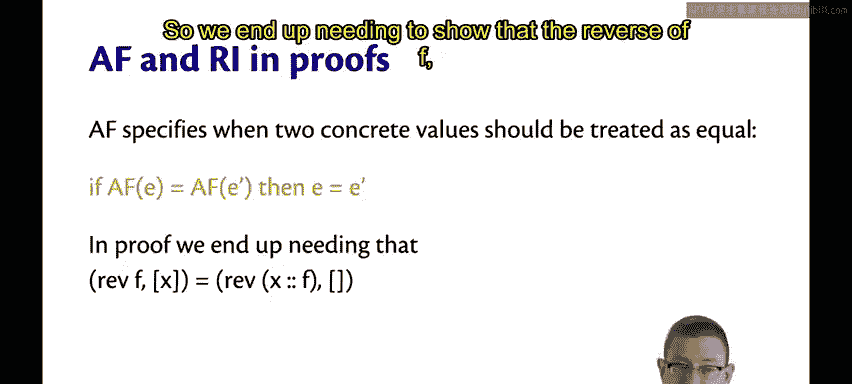

2.  **抽象函数**：这是连接具体表示（双列表）和抽象概念（队列）的桥梁。它定义为：
    `abs (f, b) = f @ (List.rev b)`

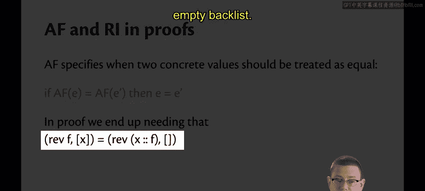

在证明过程中，我们可能会遇到两个具体的双列表对 `(f1, b1)` 和 `(f2, b2)` 在OCaml代码层面不相等，但它们**代表同一个抽象队列**的情况。例如，我们需要证明：
`(f, [x])` 和 `(x::f, [])` 在某种意义上是“相等”的。

此时，我们引入基于抽象函数的**新等价关系**：
**如果 `abs(r1) = abs(r2)`，那么在等式证明中，我们可以认为具体表示 `r1` 和 `r2` 是相等的。**

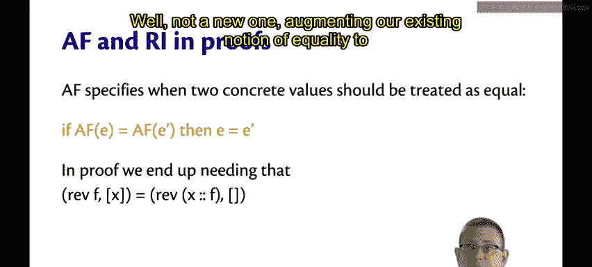

这使我们能够断言，即使具体代码不同，只要它们通过抽象函数映射到同一个抽象队列，那么对于队列操作来说，它们就是等价的。这正是证明双列表队列实现正确性的关键。

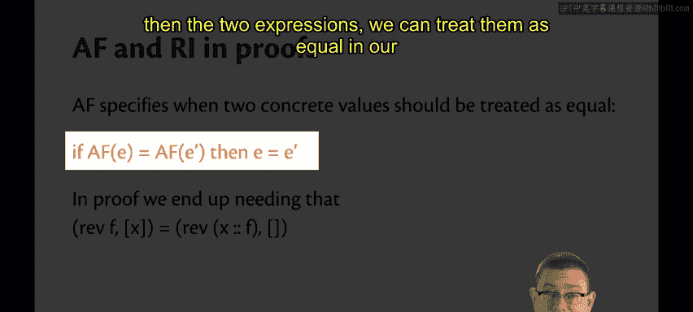

---

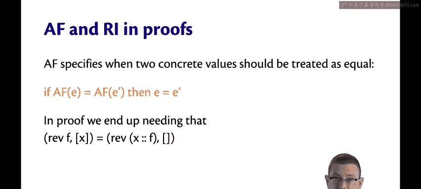

本节课中我们一起学习了如何为队列编写等式规范，理解了其与栈规范的区别主要在于对“空状态”的依赖。我们通过午餐车排队的例子直观理解了 `front`/`enq` 和 `deq`/`enq` 的交互等式。最后，我们探讨了双列表队列的实现，并指出了在证明其正确性时，**表示不变式**和**抽象函数**所扮演的核心角色。