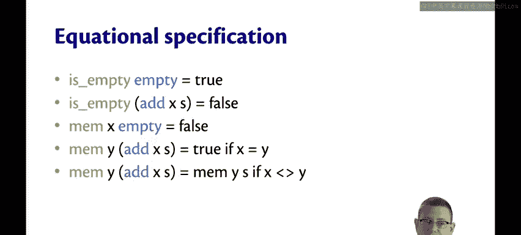
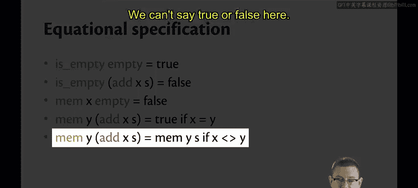
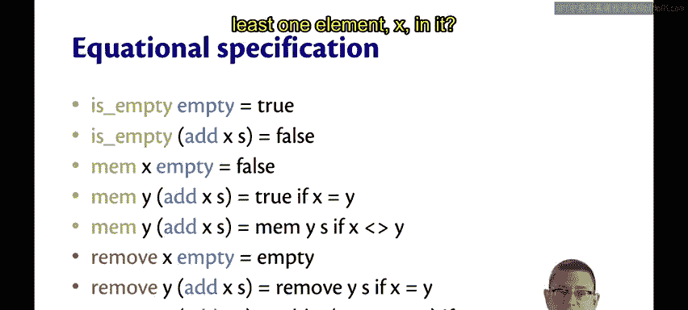
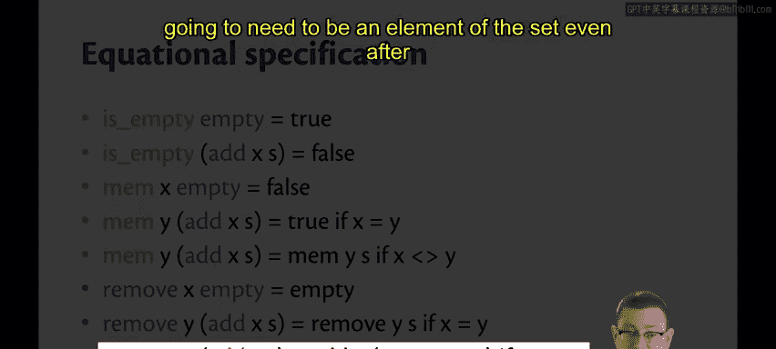
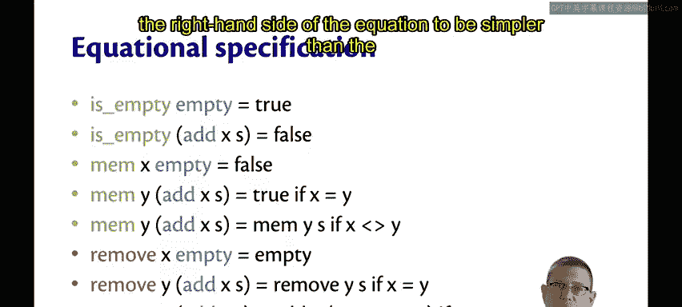
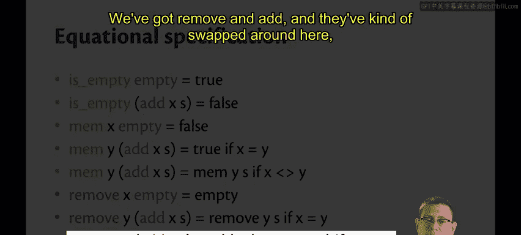
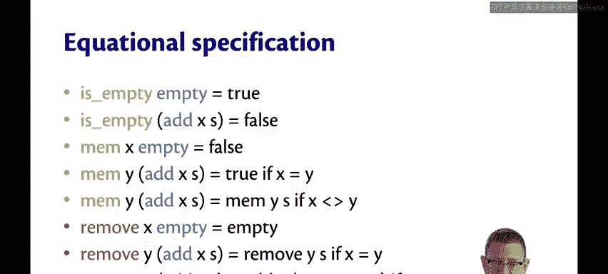
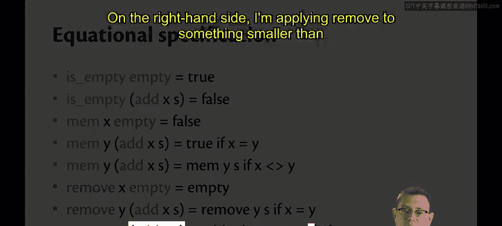
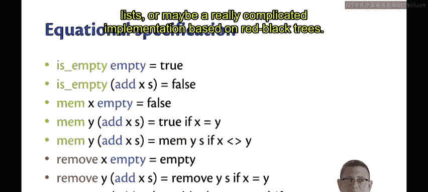

# 康奈尔大学《OCaml编程｜CS3110：OCaml Programming： Correct + Efficient + Beautiful》中英字幕 - P106：-106-Design of Equations Chap6 Video 36.zh_en - GPT中英字幕课程资源 - BV1Tx4y1s7sP

One thing you might be wondering now is how do we come up with these equations that are in our equational specifications。

 There is actually a bit of a methodology for generating these equations that I want to show you。

It has to do with canonical forms。So here， the word canonical means conforming to some rule。

 and the rule that I have in mind is that expressions should only build up a data structure。

Let me show you an example of that。Suppose you had this stack that just contained the element too。

The canonical way of building that stack is just by pushing two onto the empty stack。

But there are many， many non canonical ways of building up the stack containing just two。

 like maybe you push two on， then you push one on， and then you pop the one off。

Infinitely many more that you could imagine for them。

Now every value of a data structure can be created solely with operations that create these canonical forms。

 let's give some names for those kinds of operations。

So I'm going to use the word generator to refer to operations that create canonical forms。

I'm going to use the wordmanipulator to refer to operations that create non canonical forms。

And I'll use the word query to refer to operations that create a value of a different type than the data structure itself。

Okay， so let's look at some examples of these with our stack signature。

And now you'll see why I've been color coding these things this way all along。

The blue here are the generators。 They create canonical forms。

 assuming that they're given canonical forms， so empty is canonical。

 that's the simplest way to create the empty stack。

 And then if you have a canonical form stack and you just push one more elements onto it。

 that's the simplest way you could get that stack。 It's still canon。The green operations are queries。

 they don't return a stack value is empty returns bull， peak returns an alpha。😡，And finally。

 Pop is a manipulator。😡，It returns a stack， but it's not the simplest way that you could ever have constructed that stack。

😡，Because if you're going to pop something off， then you could have just never put it on to speak it。

Qes are the same， by the way， all of these operations are essentially the same as we've seen before。

 it's just how they interact that differs little according to the equational specification。

So how do we design equations？We take the cross product of the queries and manipulators with the generators。

So pick one from the left hand side。Like maybe you pick is empty。

And then pick another from the right hand side。 So maybe you pick empty。

Now that you have those two together， think cleverly about what the result of them should be。😡。

So what should is empty of empty be？Should be true。So we write down that as our first equation。

Now let's do another example of this， suppose for the green one you pick is empty and the blue one you pick push。

Allright so now we've got the left hand side of that equation is empty applied to push excess。

 we've got to give those arguments to it。Now we think， well of course， that should be false。

 so we write down that as our second equation。Let's go again。Let's pick another green one。

 How about peak。And another blue one to go with it。 How about push。

So what should the result of peak applied to push XS be， Well if we think about that。

 we know that it should be X。And finally， the same thing for P。Now。

 theres still a couple more equations that are missing， according to this methodology。

 and those correspond to the places where errors could be raised。

 So I haven't said what happens when you apply peak to empty or pop to empty。

That was deliberate here， I'm leaving that unspecified because I don't want to say exactly what the errors have to be。

Now we could develop a richer specification here that goes into detail equationally about what those should be。

 we would need to introduce some notion of errors at that point， we could use options for that。

 for example， maybe we could do the optional version of this interface where peak and P return some or none depending on what's passed in。

Let me give you another example of that with a different data structure， a set。

So here's a specification for sets， or rather just a signature for it。We have empty， is empty。

 add mem and remove。I could color code those as generators， manipulators and queries。

 so empty and is empty we've seen before Add is going to be a generator。

 if you give me a set in cononical form， it can give me back a set。

MM is another query because it tells me whether an element is in the set。

 but it doesn't return a set。And remove is a manipulator because any way that you construct a set with remove。

 you could also have constructed it without。So how do we design equations here， Well。

 we take this cross product is empty and mem or our queries removes our manipulator empty and add are our generators。

So we just start picking pairs from this cross product and thinking about what the equation should be for that pair。

Let's do that。The empty ones are the easy ones， these correspond to things we've seen already with stacks and queuees。

What's the result of mem on an empty set？ Well， x can't be the member of an empty set。

 so that's got to be false。What about a together with them。Well。

 as we saw with cus where sometimes we needed to have sort of two different versions of an equation。

 depending on whether some Boolean condition held， that's going to be the case here as well。

And it's going to be based on whether the element we're tracking membership of， in this case， why。

Is the same as or different than the element X being added to the set。

So if x and y are the same element here， then yeah。

 y is a member of that set because we just added it as x。On the other hand。

 if they're not the same value， then。We don't really know whether Y is a member of S yet。

 we're going to have to simplify that by just saying， well。

 check now whether Y is actually an S or not。😡，We can't say true or false here。

 we have to kind of recurse in a way。

What about remove and empty。 Well， here I'm going to specify that the remove of an element from an empty set is simply the empty set。

 It doesn't change it。 I'm not going to make that an error。

And what about removing an element from a set that has at least one element X in it？

Once more it's going to depend on whether x and y are equal， so if they are equal。

 we can get rid of the add X， but we still have to recurse because maybe y also occurs later in S like it's been added somewhere before too。

 so we have to keep removing it from the set。On the other hand， if x and Y are not the same。

 then we need to keep the add x around because that's still going to need to be an element of the set even after we remove Y。

 but we have to recurse down。😡。

So let's return to the notion of how these equations really should be simplifying the expression。

 which is to say that we really want the right hand side of the equation to be simpler than the left hand side for the very final equation here。

 you might argue that's not true。 we've got remove and add and they've kind of swapped around here。

 but all of the same terms are sitting around。 so how did I really simplify anything。

Here's the sense in which I simplified it。I'm applying the non generator， the manipulator here。😡。

To a smaller input on the right hand side than I did on the left hand side。So on the left hand side。

 I applied remove to something that was big and involved in ad。On the right hand side。

 I'm implying remove to something smaller than that， just the S that was inside of the ad。😡。

So that's the way I've simplified it， I've pushed that non generator down inside where hopefully if I keep doing this with bigger expressions。

 I'll be able to cancel it out eventually。Now that I have an equational specification for sets。

 I could use it to verify an implementation， maybe a really simple implementation based on lists or maybe a really complicated implementation based on red black trees。

