# OCaml编程：7.1：引用（Refs）入门 🧠

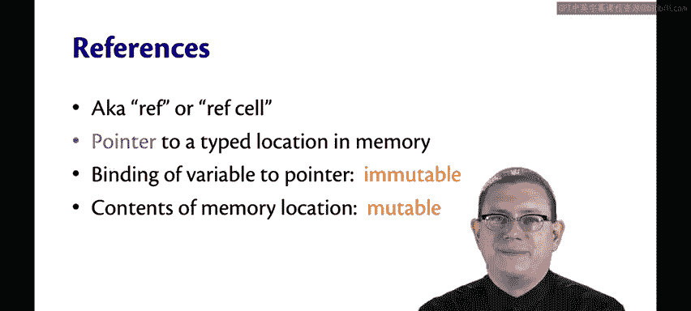

在本节课中，我们将要学习OCaml中的**引用**。引用是OCaml中实现可变状态的一种方式，它允许我们创建可以修改其内容的内存单元。我们将从基本概念开始，逐步了解如何创建、访问和修改引用。

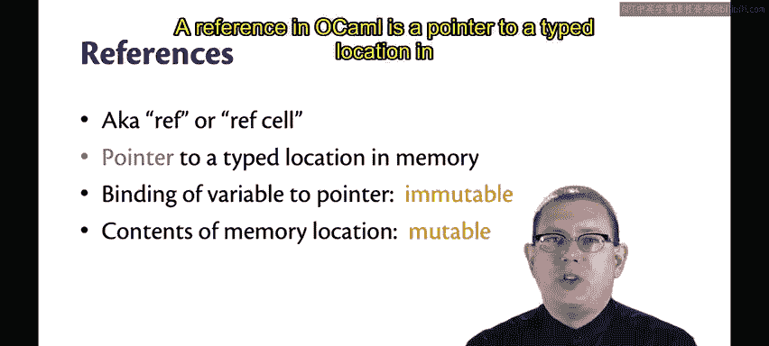

---

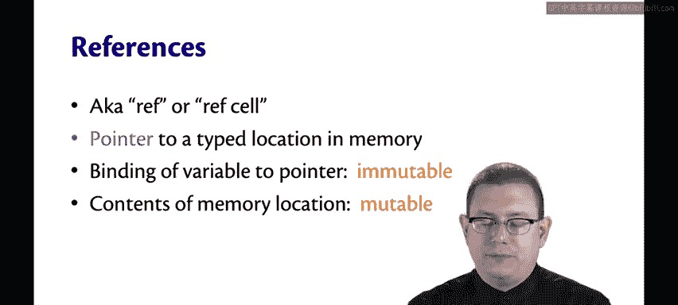

## 什么是引用？

OCaml中的引用指向内存中一个**类型化**的位置。

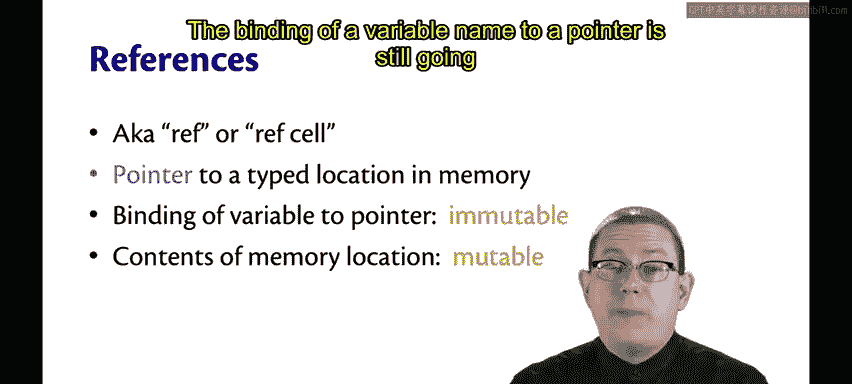

有时它们被简称为 **refs** 或 **ref cell**。

现在，我们开始接触**可变性**。😡 变量名与指针的绑定关系仍然是**不可变**的，但指针所指向的内存位置的内容，通过引用变得**可变**。

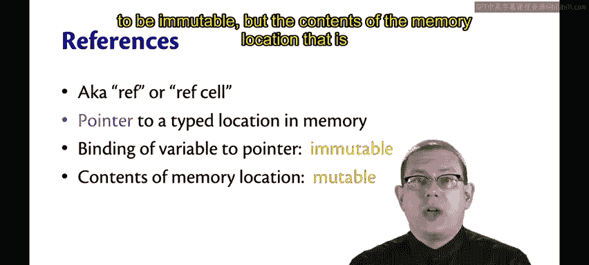

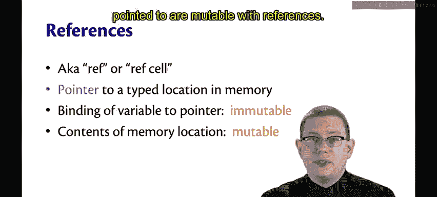

---

## 回顾不可变值

让我们先回忆一下OCaml中不可变值的情况。

例如，我们可以有整数。`3110` 是一个 `int` 类型。它现在是匿名的，没有名字。

我们可以将它绑定到一个名字：
```ocaml
let x = 3110
```
现在 `x` 是一个值为 `3110` 的整数。我们知道不能改变 `x` 的值，尽管我们可以在作用域内创建同名变量来**遮蔽**它。

---

## 创建引用

引用通过标准库函数 `ref` 创建。你给它一个值，它就会创建一个指向内存中类型化位置的指针，其内容被初始化为你传递给 `ref` 的值。

```ocaml
ref 3110
```
现在我们有了一个 `int ref`，即一个指向整数的引用。它将始终指向一个整数，类型不能改变，但该内存位置的内容可以改变。

为了演示，我们需要将这个引用绑定到一个名字。
```ocaml
let y = ref 3110
```
现在我们有了一个值 `y`，它是一个指向整数的引用，其当前内容是 `3110`，但我们可以根据需要改变这些内容。

---

## 访问引用内容

首先，让我们看看 `y` 里面有什么。它是一个 `int ref`，内容是 `3110`。

如果你想取出内容，需要使用**解引用**操作符，写作 `!`，通常读作 “bang”。

```ocaml
!y
```
这会从那个内存位置返回内容本身，而不是位置。注意这里的类型变化：当我们解引用 `y` 时，我们得到的是一个 `int`，而不是 `int ref`。

这一点很重要，因为如果你想对该整数进行算术运算，必须先解引用它。`x + y` 无法通过类型检查，因为 `x` 是 `int`，而 `y` 是 `int ref`。

正确的写法是：
```ocaml
x + !y
```
这允许我们将这两个整数相加。

---

## 修改引用内容

我们可以使用赋值操作符 `:=` 来改变内存位置的内容。

```ocaml
y := 2110
```
注意，赋值操作符返回的是 `unit` 类型。`unit` 类型只有一个值 `()`。本质上，OCaml 是在说：“是的，赋值已完成，内存位置已被修改。”

现在，如果我们查看 `y`，它仍然是一个 `int ref`。你看不出来，但它仍然指向最初的那个内存位置，只是该内存位置的内容已经改变，现在变成了 `2110`。

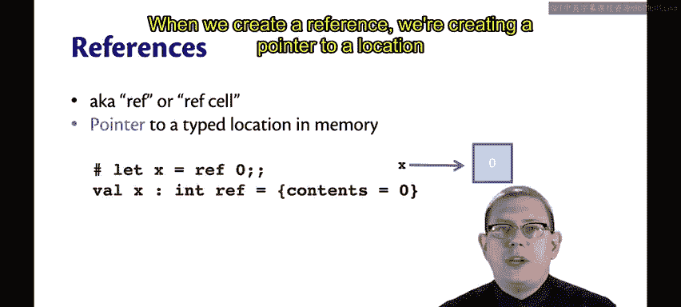

所以，现在如果计算 `x + !y`，我们得到 `5220`，而不是之前的 `6220`。

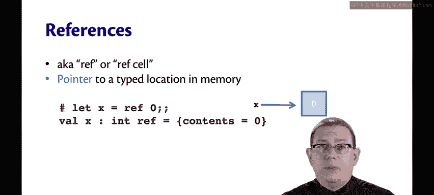

---

## 核心概念回顾

上一节我们介绍了引用的创建和修改，本节我们来总结一下核心机制。

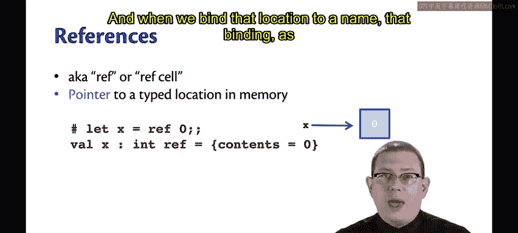

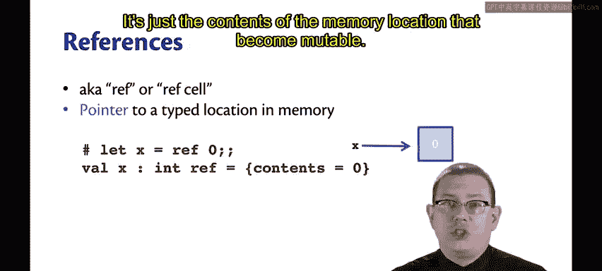

当我们创建一个引用时，我们创建了一个指向内存中某个位置的指针。

该内存位置是**类型化**的。如果你创建了一个 `int ref`，你将永远无法向其中放入一个字符串。

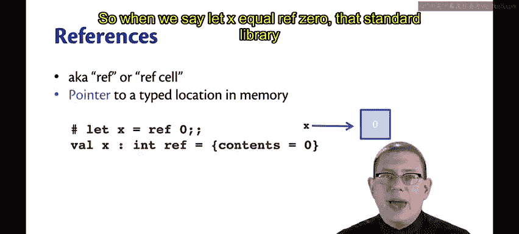

当我们将该位置绑定到一个名字时，这个绑定关系（像往常一样）是**不可变**的，变得可变的只是内存位置的**内容**。

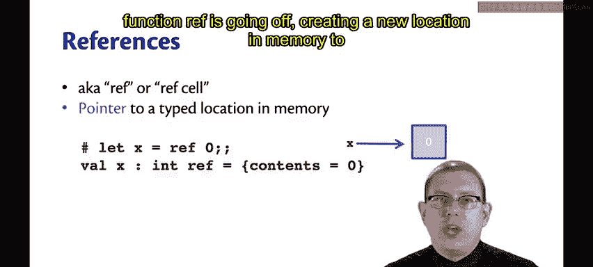

所以，当我们写下 `let x = ref 0` 时，标准库函数 `ref` 会去创建一个新的内存位置来存储整数，并将 `0` 作为其初始内容放入其中。

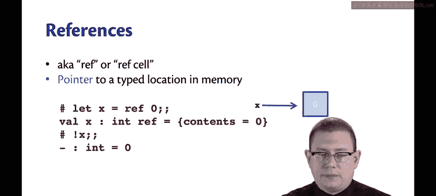

*   如果你解引用 `x`，你会得到内容。
*   如果你给 `x` 赋值，你会得到 `unit` 值，仅表示赋值已经发生。
*   如果你在那之后再次解引用 `x`，内容已经改变，现在是 `1`。

`x` 本身将始终指向内存中的同一个位置（除非我们像往常一样进行遮蔽）。所以，改变的不是指针本身，而是指针所指向的**内容**。

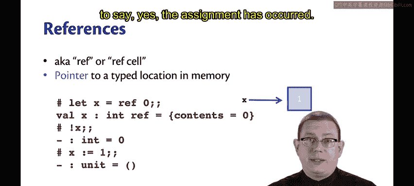

---

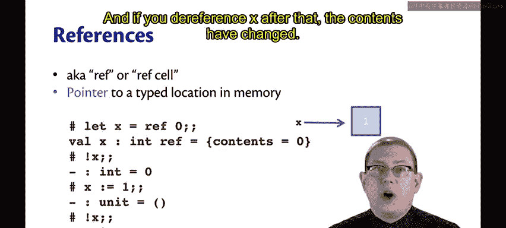

## 总结

本节课中，我们一起学习了OCaml中的**引用**。我们了解到：

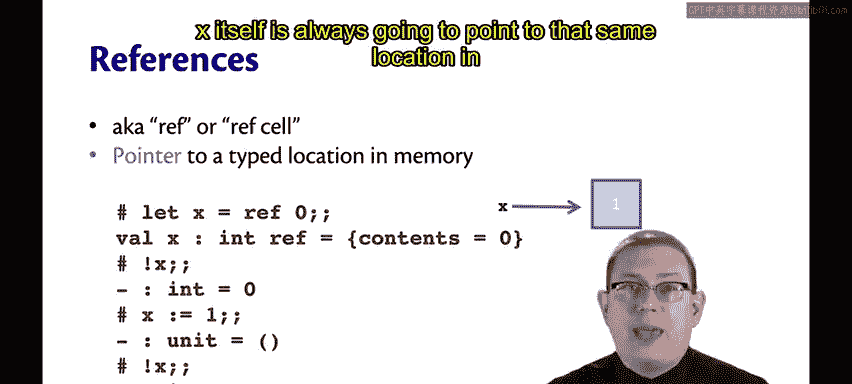

1.  引用（`ref`）是创建可变内存单元的方式。
2.  使用 `!` 操作符可以解引用，获取其当前值。
3.  使用 `:=` 操作符可以赋值，修改引用的内容。
4.  变量名与引用本身的绑定是不可变的，但引用指向的内容是可变的。

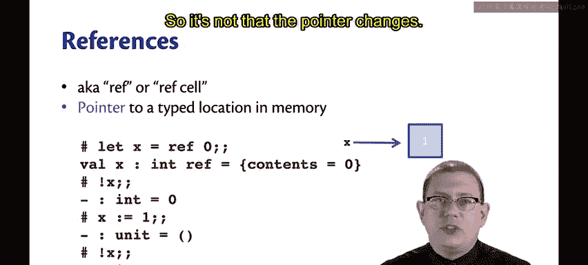


理解引用是掌握OCaml中**命令式编程**和**可变状态**的关键第一步。