# 康奈尔大学《OCaml编程｜CS3110：OCaml Programming： Correct + Efficient + Beautiful》中英字幕 - P109：-109-Semicolon Chap7 Video 3.zh_en - GPT中英字幕课程资源 - BV1Tx4y1s7sP

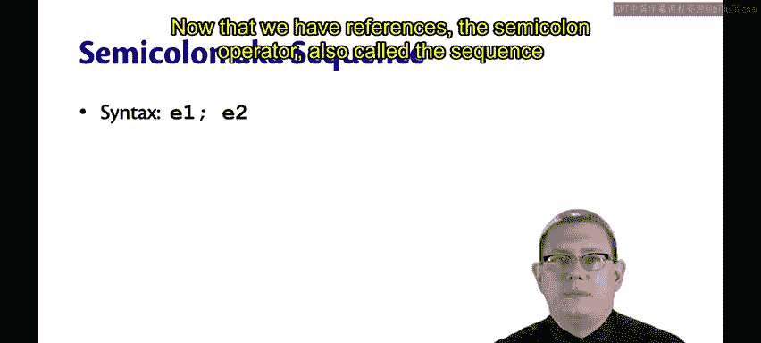

Now that we have references， the semicolon operator， also called the sequence operator。

 is going to become more useful。

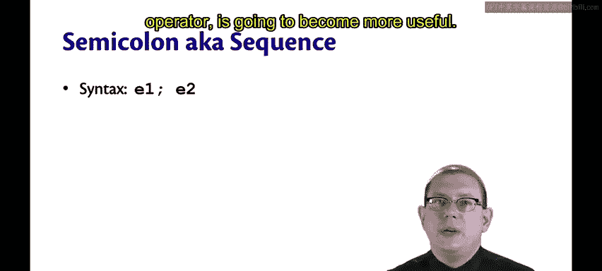

You might already have used it to do printing， in fact。

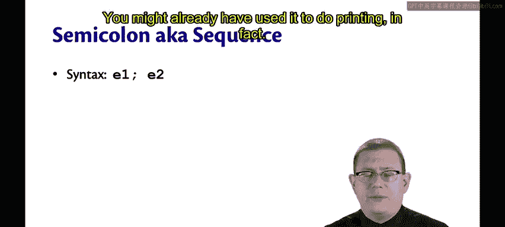

The syntax for it is E1 semicolon E2， and you can keep chaining more on there， semicolon E3。

 semicolon E4， if youd like。

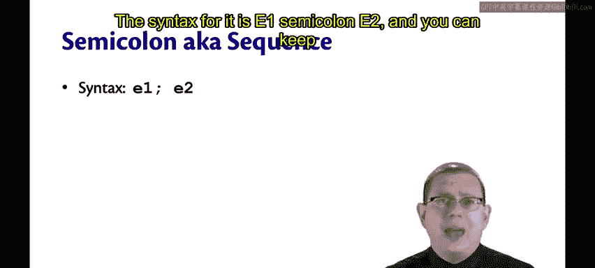

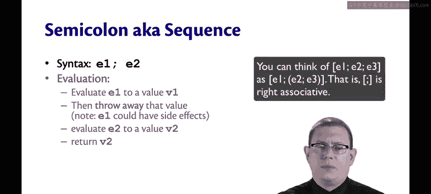

To evaluate such a sequence， first， evaluate E1 to evaluate V1。

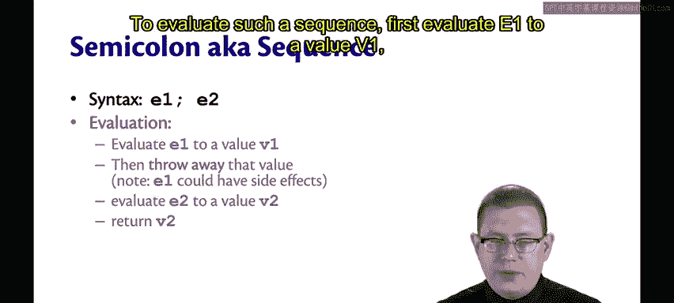

Then throw away that value。We don't care about P1 as a result of this。

 The only reason we're doing a sequence of expressions like this is to evaluate them for their side effects。

 We don't care about the value of E1。

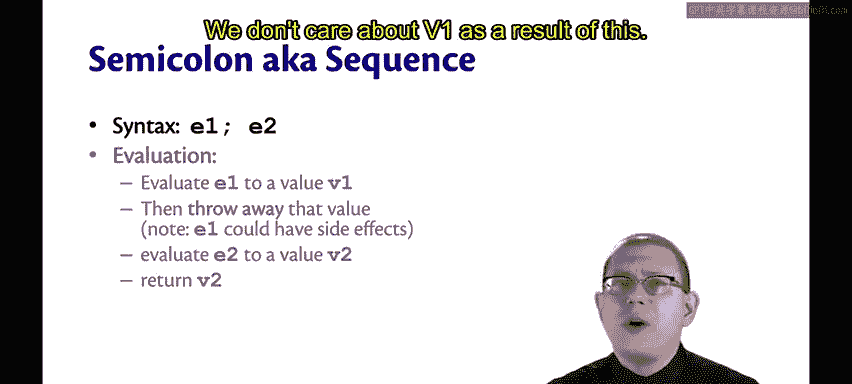

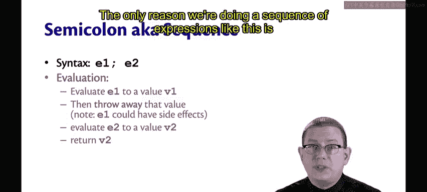

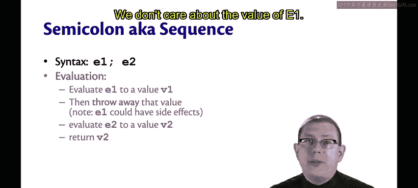

Next， evaluate E2 to evaluate V2 and return V2。

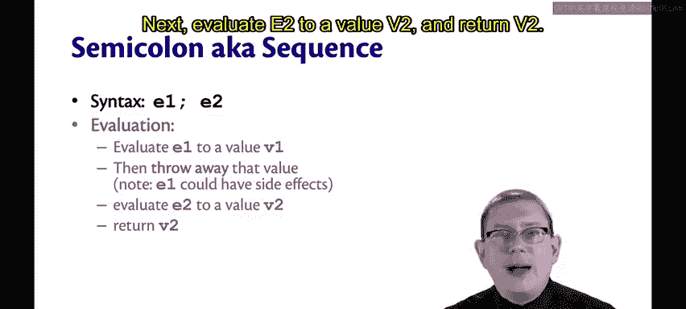

Now， E2 might also have side effects We're interested in those。

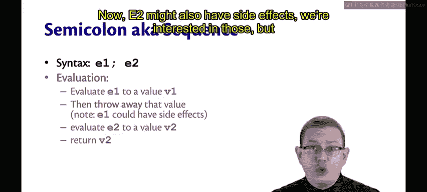

But it's only that final expression in the sequence whose value is ever interesting。

 The entire sequence's value is the value of the last expression。

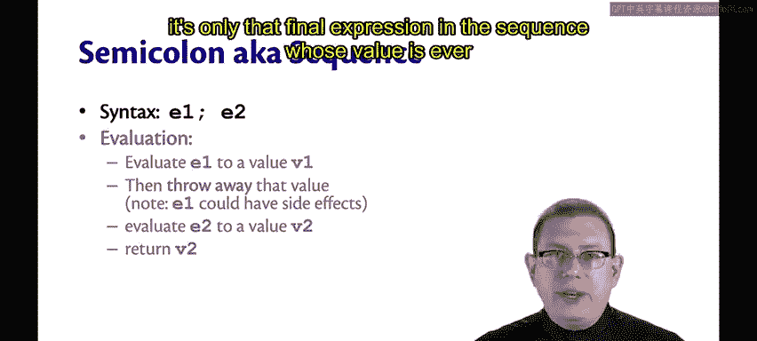

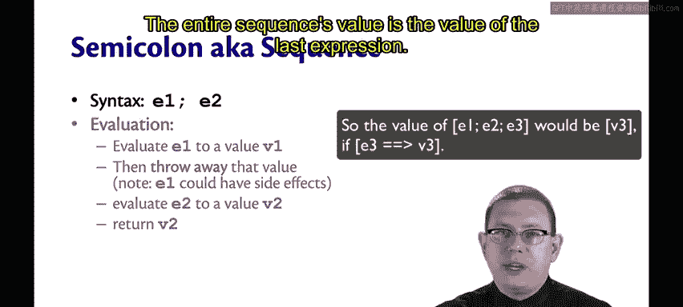

For type checking， if E1 has type unit and E2 has type T， then E1 semicolon E2 has type T。

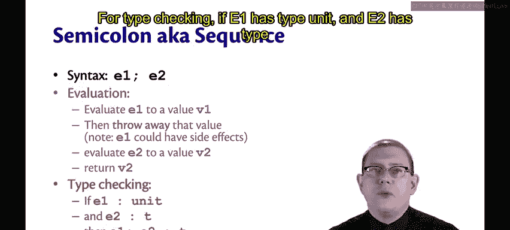

So again， notice why we would be throwing away the value。

 it's just unit T checking requires it to be unit。

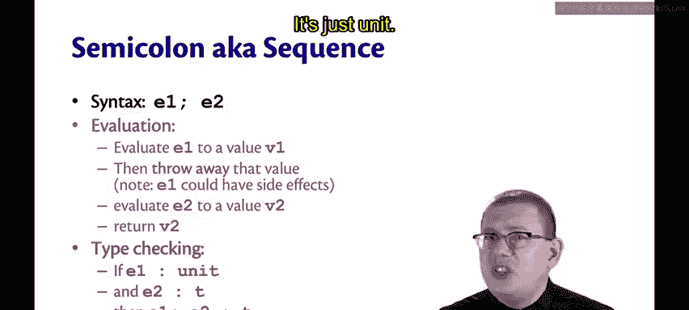

So there's nothing interesting we could even do with that value since there's only one value of type unit。

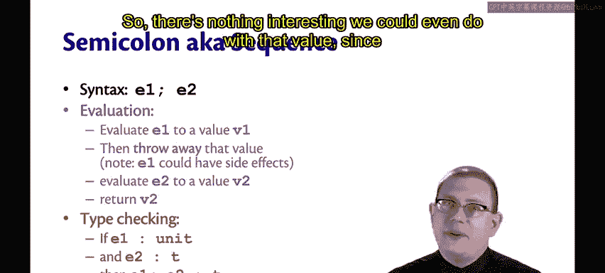

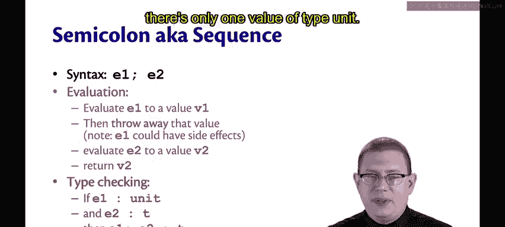

Smiccolon therefore， is almost just syntactic sugar。

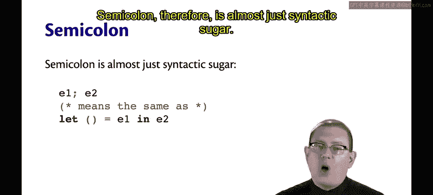

E1 semicolon E2 means almost the same thing as let unit， where unit here is the unit pattern。

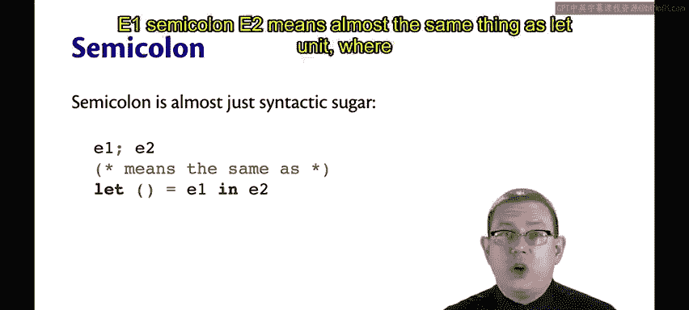

Equal E1 in E2。What would that lead expression do， Well， you know how to evaluate lead expressions。

 you'd evaluate the binding expression E1 to a value。

 Then we would be pattern matching against that to get the unit value out。

 That's not interesting and then continue evaluating the body expression E2。

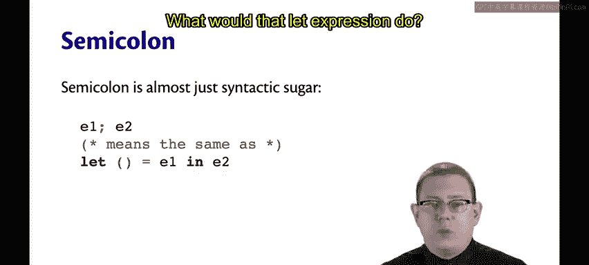

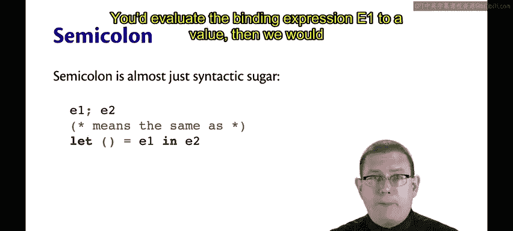

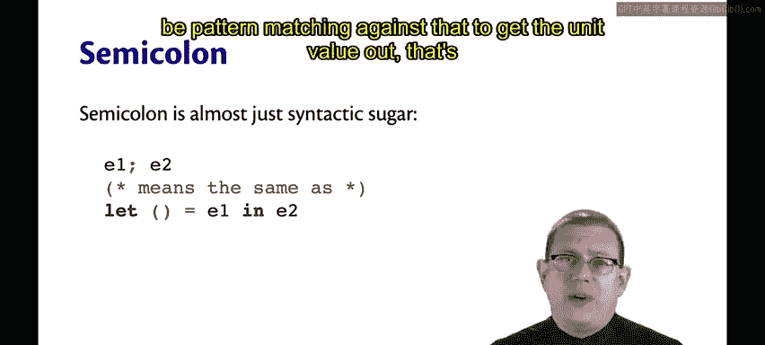

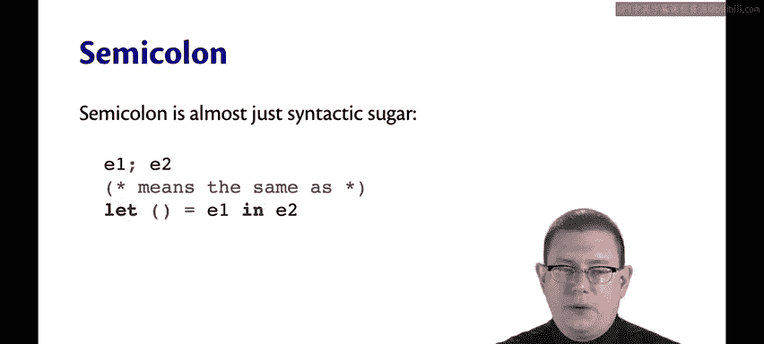

That's really what E1 sum equal and E2 does as well。

The difference between the two is what happens if E1 does or does not have type unit。

For the let syntax， you would get a type error here because E1 must have type unit if you're going to pattern match against the unit pattern。

😡。

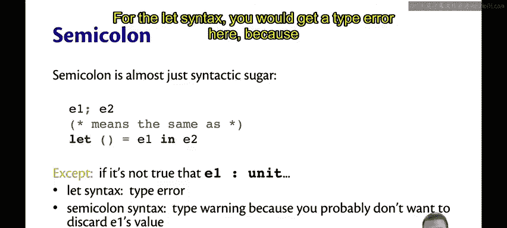

Technically， on the previous slide， I lied a little bit with the semico and syntax。

 you won't get a type error。 you'll get a type warning。

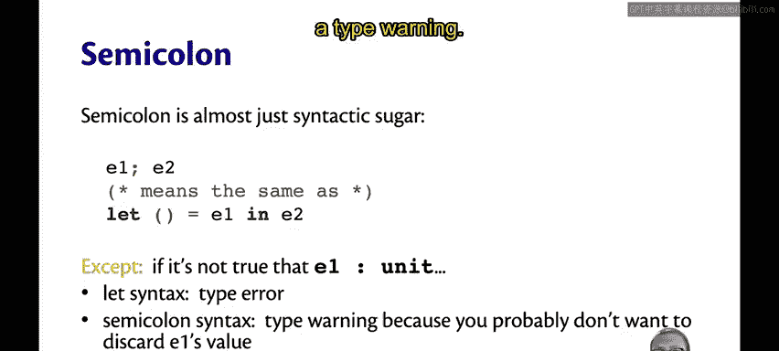

The type checker will warn you that E1 did not have type unit。

 and therefore you're probably making a mistake because you probably don't want to be discarding that value in the sequence。

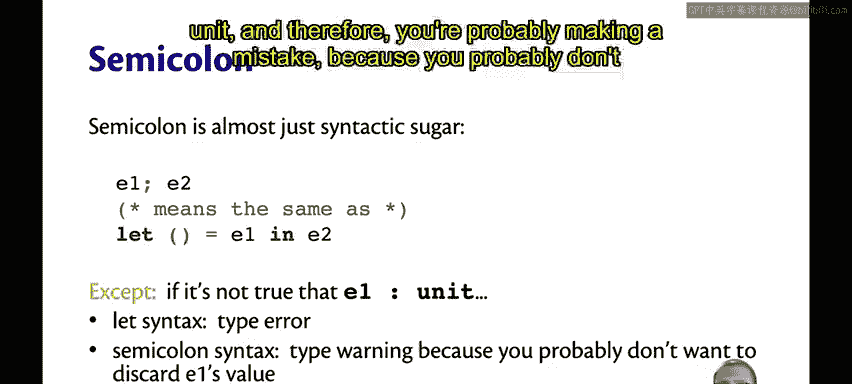

If you do want to discard it， there is a function built into the standard library called IR。

 Ignora just takes in the value of type alpha and returns unit。

 so you can use it to ignore the value produced by an expression if all you were interested in was that expressions side effect。

😡。

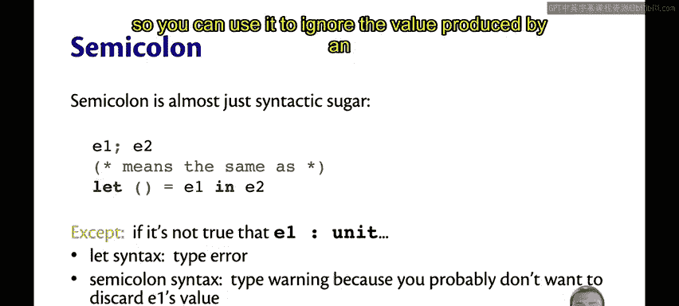

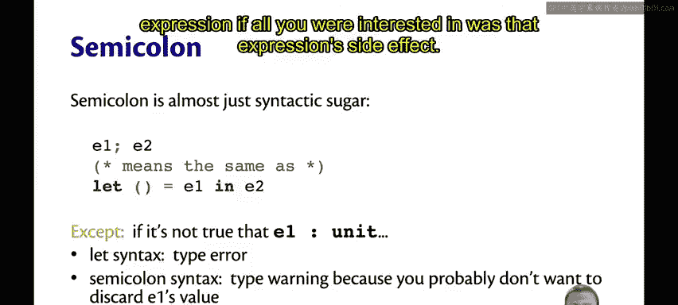

Let's take a look at an example of semicolon。Suppose I wanted to write maybe a little bit of a strange function。

 which adds two integers together and prints the result as well。

So you can see the type of print and add is int arrow int arrow int。

 this function takes into integers and then returns an integer。 it also happens to have side effects。

 it prints the sum of the two integers。You can see that I got a one as output there that was printed。

So the type of print in。😡，Is int arrow unit。 It takes in an int and gives you back a unit。

 That's why I'm able to successfully chain it together as part of that sequence of operations with semicolon。

😊，But if I wanted to chain together， print and add with semicolon， I might get a warning。

You can see the warning comes back， this expression should have type unit。

What Ocamel is complaining about is that the value produced by print and add 01。Which is one。

Is simply being thrown away because it's part of this chain of expressions in the semicolon。

If I really did want to throw that away， I could use the standard library function ignore。And now。

 I get no warning。

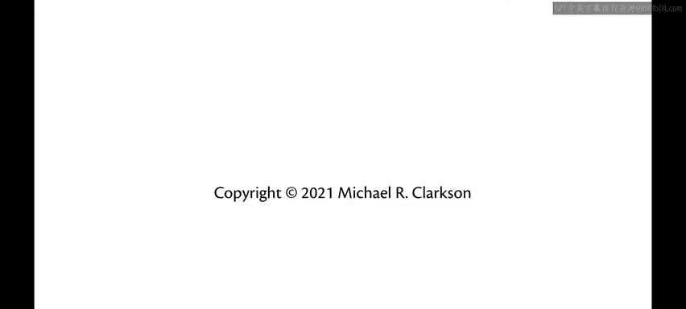