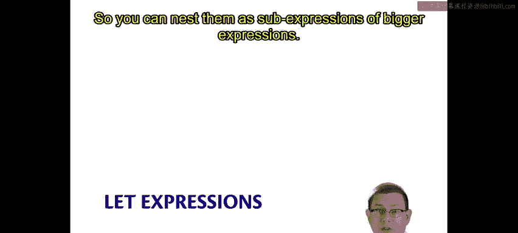
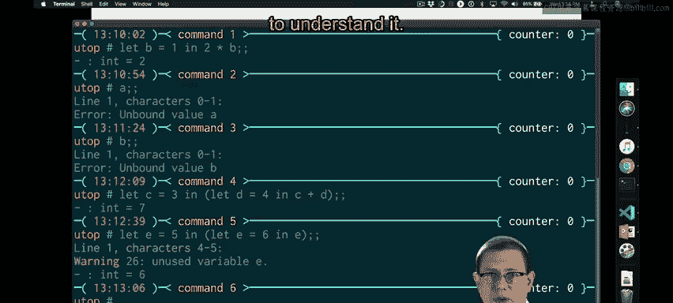

# 康奈尔大学《OCaml编程｜CS3110：OCaml Programming： Correct + Efficient + Beautiful》中英字幕 - P10：-010-Let Expressions Chap2 Video 5.zh_en - GPT中英字幕课程资源 - BV1Tx4y1s7sP

LetE expressions are like let definitions， except that they are syntactically expressions。

 so you can nest them as subexs of bigger expressions。

For example， we could say let a equals0 in a。So this differs from what we've seen before。

 before we didn't have the in and then something else following it as a piece of syntax when we were doing definitions。

 it's that in keyword that is making this a let expression as opposed to a let definition。

So if I say let a equals 0 in a， that evaluates to0。

The way to think about that is Oammbell is binding the value 0 to the name a and then continuing on and saying in the rest of this。

 So what's the rest of it is just a here。And a evaluates to 0。

 because that's the binding that occurred。We could do more complicated kinds of let expressions of course。

 so we could say let B equal1 in two times B， for example。

 what do we think we're going to get there two is what I hope and we do。What happened there？

1 was bound to the name B。And then evaluation continued by evaluating two times B。Well。

 what's two times B？It's2 times1 because B is currently bound to1， and two times 1 is2。

So what you can think of this as is a kind of substitution， even。So if we bind1 to B。

 then whenever we see B later on， we can substitute one for that name B and continue with evaluation that way。

All right， now these lead expressions are not definitions。 and let me prove that to you。

 a is not currently bound to anything。So even though I did that first lead expression up there。

 let a equals 0 and a。That in there is actually trying to say something important。

 that little preposition there。A is equal to zero in that following sub expressionpression。

 but not elsewhere。So this is giving us a notion of scope。

 as you might have encountered in other languages before。A is not bound outside。

 B is not bound outside and so forth。We can nest these arbitrarily。

 you could say lets C equal 3 and let D equal 4 in C plus D。

 So let's stop to think about what we expect to happen here。C is going to be bound to 3。

 and D is going to be bound to4， and then we'll evaluate C plus D。 Well that's going to be 3 plus4。

 so this whole thing should evaluate to7， and that is indeed what happens。

And let's try one other thing。Let E equal5 in。 Let E equals 6 in E。Now。

 what do you think is going to happen there？Actually。

 it's a little hard to predict off the top of your head。

 I imagine there's a bunch of possibilities going through it。Turns out the answer is six。

 and we get a warning as well。It might even look like some sort of mutation of variables is occurring here。

 and I told you that doesn't happen。Well， there is a very logical explanation to what's happening。

 but we're going to need to study the syntaxs and semantics first in order to understand it。

