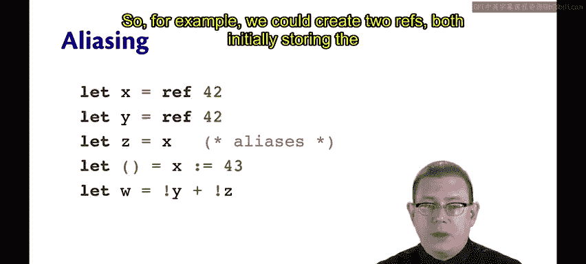
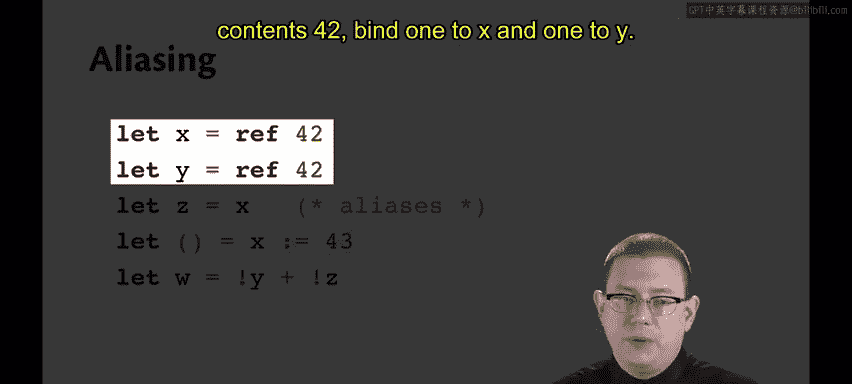
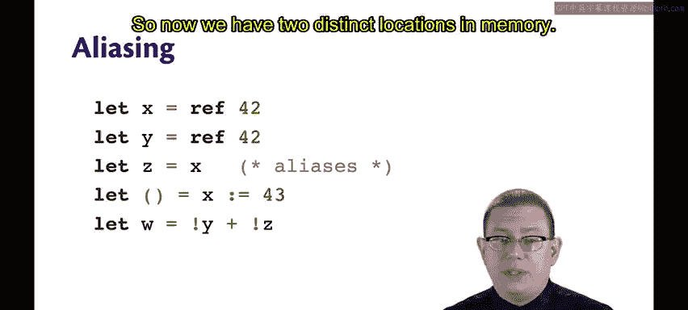
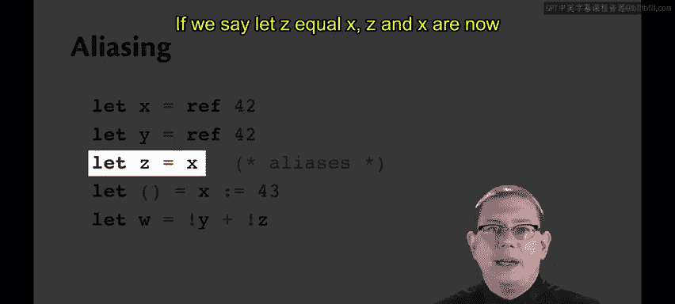
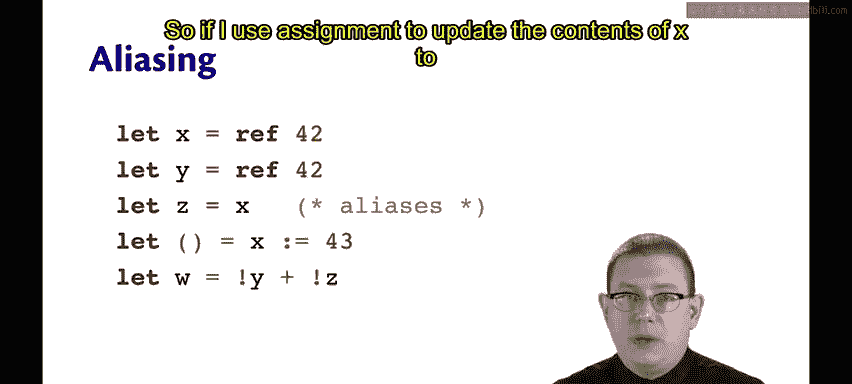
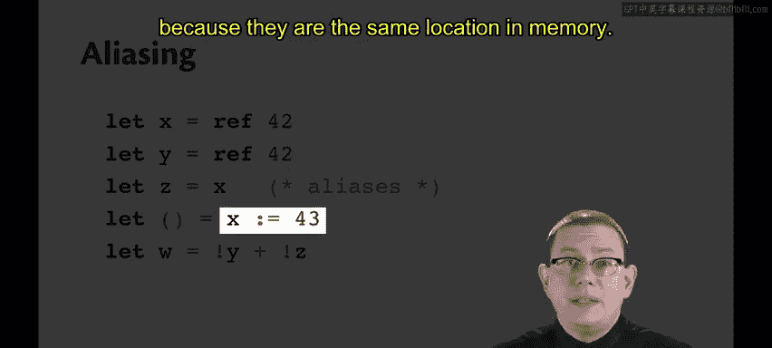
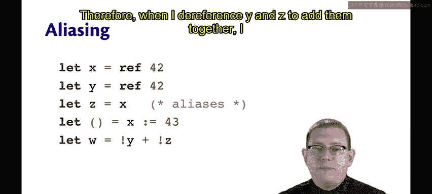
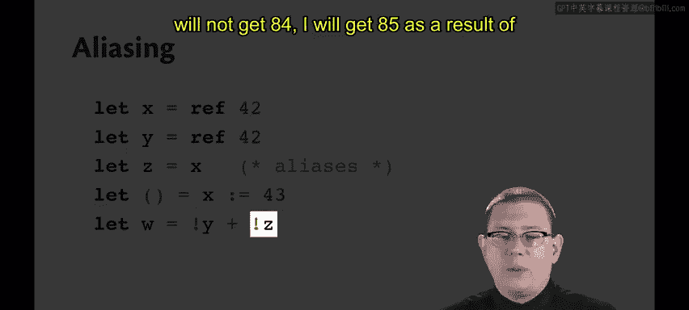
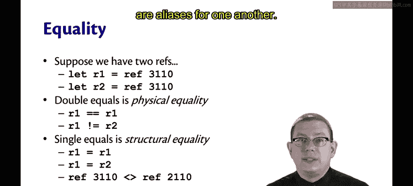

# OCaml编程：7.4：别名与引用相等性 📚

在本节课程中，我们将学习OCaml中引用的一个重要概念：别名。我们将了解什么是别名，以及如何区分两个引用是否指向内存中的同一位置。理解这一点对于编写正确且可预测的程序至关重要。



## 概述



在上一节中，我们学习了如何使用引用（`ref`）来创建可变状态。本节中，我们将探讨当多个引用指向内存中同一位置时会发生什么，这种现象被称为“别名”。我们还将介绍OCaml中两种不同的相等性检查：结构相等性和物理相等性。



## 什么是别名？ 🔗

别名是指两个或更多个引用指向内存中同一位置的情况。





例如，我们可以创建两个引用，初始都存储内容`42`。

```ocaml
let x = ref 42
let y = ref 42
```



`x`和`y`被绑定到两个不同的内存位置。






如果我们执行`let z = x`，那么`z`和`x`现在就是别名。它们都指向内存中的同一位置。


因此，如果我使用赋值操作将`x`的内容更新为`43`：

```ocaml
x := 43
```

这个操作会同时将`z`的内容更新为`43`，因为它们指向内存中的同一位置。


所以，当我解引用`y`和`z`并将它们相加时，我不会得到`84`，而是会得到`85`。

```ocaml
!y + !z (* 结果为 85 *)
```


## 如何检测别名？ 🧐

你可能会问，如何判断两个引用是否是彼此的别名？OCaml的相等运算符可以帮助你解决这个问题。这引出了OCaml中结构相等性和物理相等性的区别。

假设你有两个引用`r1`和`r2`，初始都包含相同的内容。

```ocaml
let r1 = ref 3110
let r2 = ref 3110
```

以下是两种相等性的区别：

*   **`==`（双等号）是物理相等性**。它检查两个引用是否指向内存中“物理上”的同一位置。
    *   `r1 == r1` 结果为 `true`，因为它与自身是同一位置。
    *   `r1 == r2` 结果为 `false`，因为它们不是内存中的同一位置（即使内容相同）。
    *   物理不相等的写法是 `!=`。

*   **`=`（单等号）是结构相等性**。可以将其理解为查看位置的内容或结构，而不是位置本身。
    *   `r1 = r1` 结果为 `true`。
    *   `r1 = r2` 结果也为 `true`，因为它们当前包含相同的内容（`3110`）。
    *   `ref 3110 = ref 2110` 结果为 `false`，因为这两个位置包含不同的内容。
    *   结构不相等的写法是 `<>`。



大多数情况下，你真正需要的是结构相等性（`=`）。只有在你真正关心两个引用是否互为别名时，才使用物理相等性（`==`）。

## 总结


本节课中，我们一起学习了OCaml中引用的别名概念。我们了解到，当多个引用指向同一内存位置时，通过其中一个引用修改内容会影响所有别名。我们还区分了**物理相等性**（`==`，检查是否为同一内存地址）和**结构相等性**（`=`，检查内容是否相同）。理解这些概念对于管理程序中的可变状态和避免意外错误至关重要。在大多数比较场景中，应优先使用结构相等性。