# 康奈尔大学《OCaml编程｜CS3110：OCaml Programming： Correct + Efficient + Beautiful》中英字幕 - P111：-111-Implementing a Counter Chap7 Video 5.zh_en - GPT中英字幕课程资源 - BV1Tx4y1s7sP

Suppose you wanted to create a function that every time you call it returns one more than the previous time you call it。

We couldn't do that with the features we'd see in Ocal so far。

 because every function was a deterministic function so far of its input。

Its output was totally determined by what that input was。

Now that we have references and side effects， we can write functions that are not completely deterministic functions of their input。

Let's create such a function， which is a counter， every time we invoke the function next。

 we'll get one more than the previous time we invoked that function。

I've written the counter function in a slightly funny way。

 I just wanted to make sure that I used anonymous function syntax here so that I could explain each piece of it。

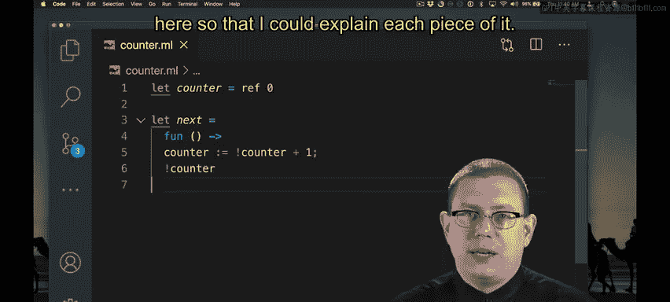

Next is a name that is bound to an anonymous function。That anonymous function takes in an input。

 which must be unit， can't pass an ink to it， can't pass a bo to it。

 The only thing you can pass this function is unit。

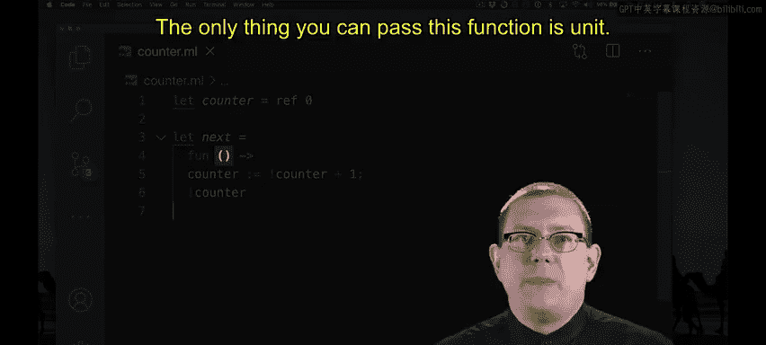

When you pass unit to the function， it evaluates the body。

 which first increments counter by getting the contents of the counter， adding one to it。

 and then storing that back encounter。

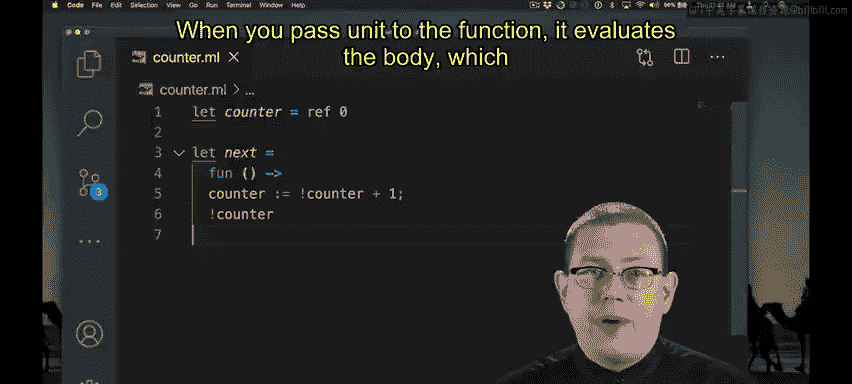

And then returning the contents of the updated counter。

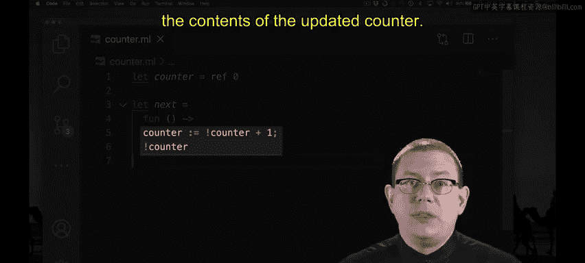

Let's put that to use。So we have a counter variable， its contents are zero。Next is a function。

If I just write next by itself， I'm just referring to that function。 I haven't invoked it yet。

 The only thing I can do is call that function with unit。That returns one。When I call next again。

 I get two， when I call it again， I get3 and so forth。

 So every time I call next I'm counting up and updating the contents of that counter。Most recently。

 its contents are 3。Now that we've seen how counter and next work。

 let's simplify the function just a little bit。First off。

 I didn't have to use the anonymous function syntax I could have used the syntactic sugar。

So now function next takes in one argument， which is of type unit。

There's also a convenience function built into the standard library if all you want to do is increment an int Ref。

 there's a function anchor for that。😡，That's such a common operation that it's provided for you。

You can see that the type of in is ant Ref arrow unit。

 it increments the integer contained in the given reference。FYI should you need it。

 there's also a similar function deckcker to decrement an integer reference。

To better understand references and scope。Let's look at two other places we could have put the let binding for counter。

I could have nested that binding for counter inside of next， like that。

Maybe I wanted to do that because I didn't want to expose that counter reference to the outside world。

 of course I could also use modules and signatures for that purpose。

What happens when I try to run this code？Oops， it looks like my implementation of next is broken。

 every time I call next it's returning the same value。It's no longer counting up for me。

What's going on here？Let's look back at the code。What does next do when it's evaluated？

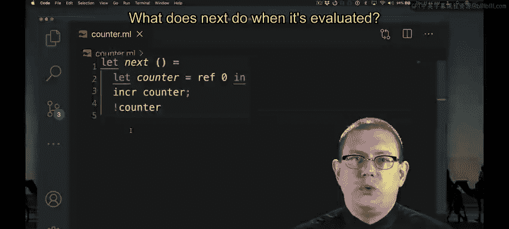

It takes in that unit input。And then it proceeds to evaluate the body。

The first thing in the body of the function is a let binding。

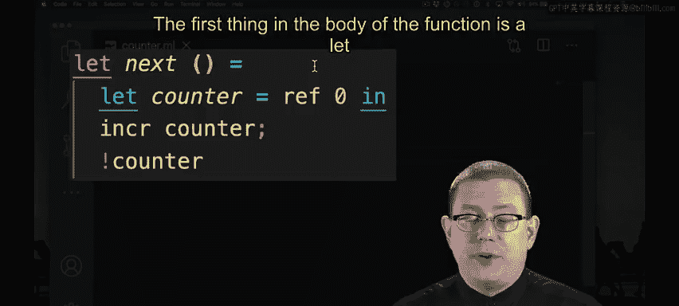

We know how to evaluate those。First， evaluate the binding expression that's Re0 to a value that creates a location in memory and puts zero in that location。

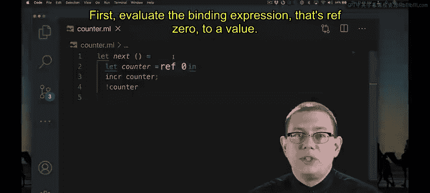

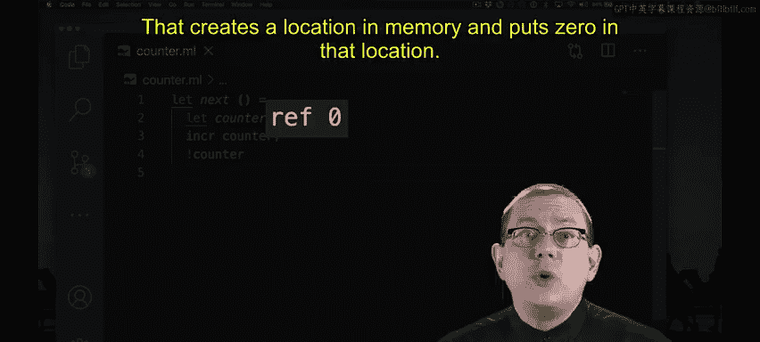

That location in memory is bound to the name counter。The rest of the function increments。

 the contents of that counter and returns it so we get one。

Then what happens the next time that next is called？

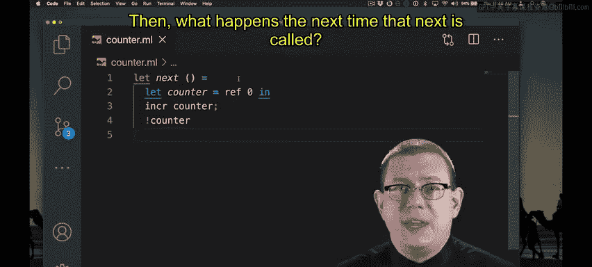

We do all of that over again。Reev0 gets evaluated， which creates a new location in memory and binds that to the name counter。

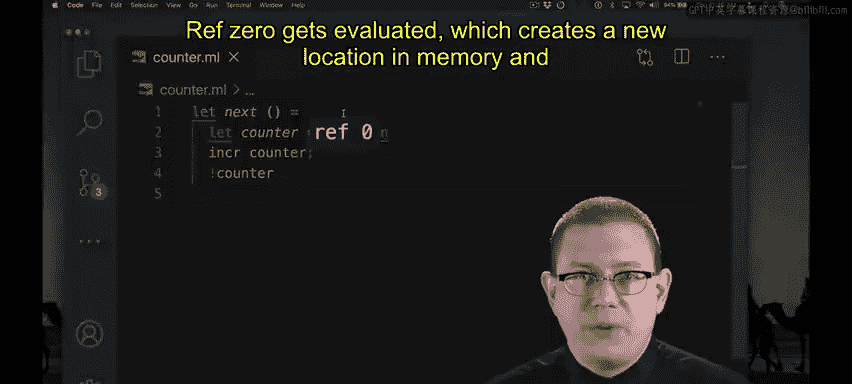

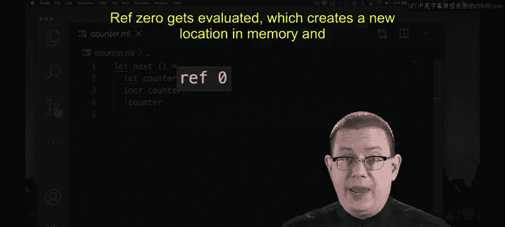

It's a new location。Every time we call this function that Ref0 is being evaluated。

 producing a new location， storing zero in it， and then incrementing that zero to  one。

But since it's a new location every time。We will never increment past one。

We're just creating a lot of places in memory to store the number one basic。Okay。

 here's another place we could have put the let binding for counter。

I've reintroduced that anonymous function syntax。Next is bound to an anonymous function。

That creates a counter。Storees zero in it andcrements that it returns that right away。

 I hope you can see this is the same problem as before。 All I did was get rid of the syntactic sugar。

As you see， every time I evaluate next， I'm still gettingd。

But now let's try something a little clever。We're going to need you to think carefully about the evaluation semantics of L。

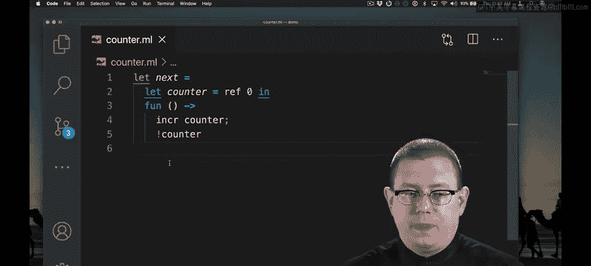

What happens when we bind the entire body from lines two through five to next？

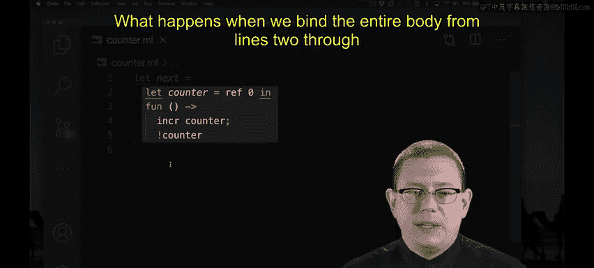

Well， first， we evaluate the binding expression of the let， so that's ref0。

 which means creating a location and memory， initializing its contents to zero。

 and binding those to the name counter。

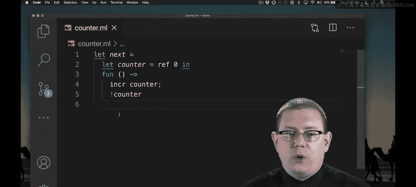

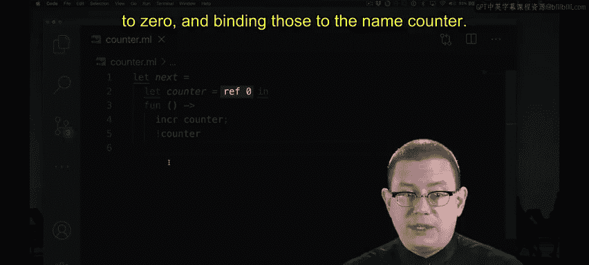

Then we evaluate the body expression。

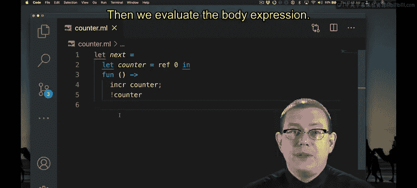

What's the body expression， It's an anonymous function。

 which means no further evaluation is done at this time。 Remember。

 anonymous functions are already values。

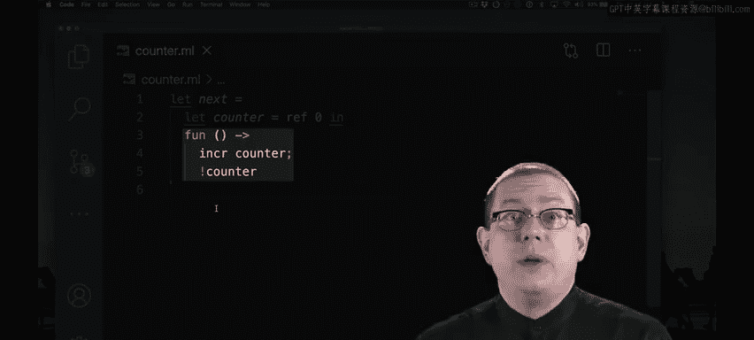

So next is bound to that anonymous function。

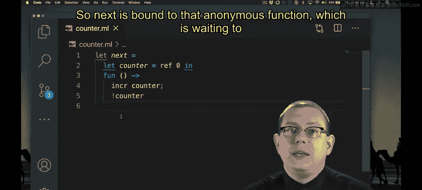

Which is waiting to take an value of type unit and then will evaluate its body。

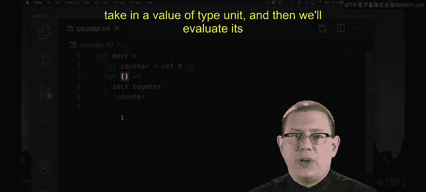

But inside its body， it's as if we've substituted。The location that reff 0 returned for the name counter。

Therefore， it will always be the same location。Only once does that call to Ref 0 get evaluated。

 not every time。So this code actually does create a properly working counter。

You see each time I call next it increments from where it was before。

 So it's just a very subtle difference。 If I put the let binding for counter before the anonymous function。

 it's only going to get evaluated once。 If I put it inside the body of the anonymous function gets evaluated every time the function is called。

That makes the difference between creating only one memory location and increment in it each time versus creating a separate memory location every time。

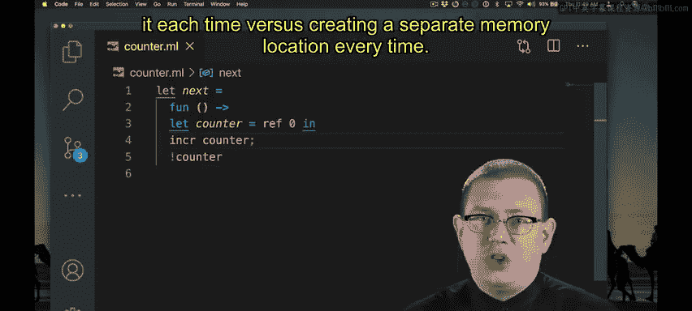