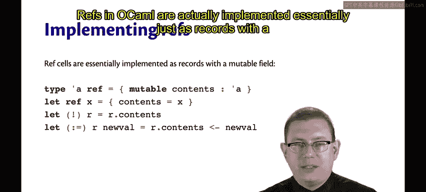
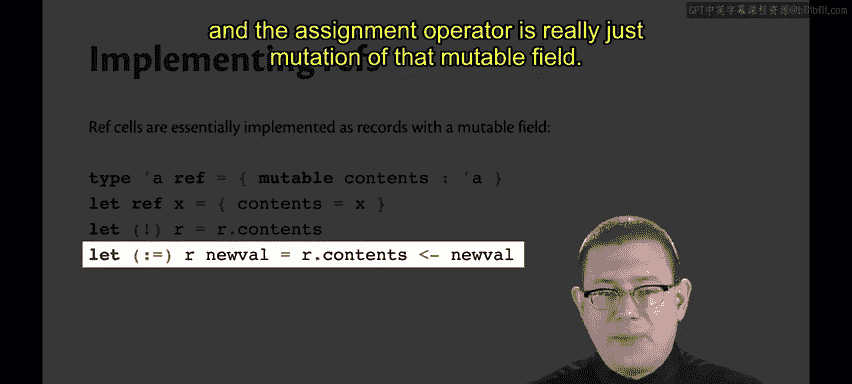
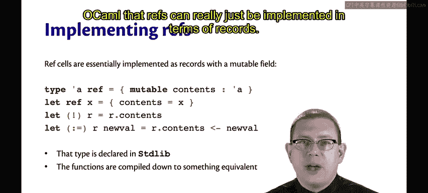

# 康奈尔大学《OCaml编程｜CS3110：OCaml Programming： Correct + Efficient + Beautiful》中英字幕 - P112：-112-Mutable Fields Chap7 Video 6.zh_en - GPT中英字幕课程资源 - BV1Tx4y1s7sP

Fields of records may also be made mutable in Ocamel。Let's create a type for points。

And let's give these points a color。Where the color is mutable。Now I can create a point。

And you'll notice there's nothing in the output of。

Let P equal here that shows me which fields are mutable or not。But the type point。

 when I declared it， I did put in a mutable keyword。

Note that the mutable goes before the field name in that syntax。 It's not part of the type， per se。

So it's not that C has type mutable string or something like that。

 It's that there's a mutable field named C whose type is string。Now。

 I can update that field inside of the point P。🎼So the field C inside of point P has been mutated now to be white instead of red。

I can't do that to the other fields， which were not declared as mut。

The record field X is not beautifulable。Notice that the mutation operator for mutable fields is different than the mutation operator for refs。

For refs， rewrite colon equal。For fields， we write less than dash。

 which is supposed to look like a left facing arrow。

 as in we're taking the contents on the right hand side and putting them into the field on the left。

Reefs in Ocamel are actually implemented essentially just as records with a mutable field。

The type Alpha ref is really just a record with a field named Cons， whose type is alphapha。

 and that field is mutable。This is why all along when we've seen refs。

 I've been able to say the contents of the ref are whatever。

It's not because refs magically have something named contents。

 it's just because it's a record with a field named literally contents。

The RefF function built into the standard library that creates a Ref is really essentially just creating a record value and binding its argument X to the field named contents。

The D referenceence operator is really just the dot operation on that record。

 and the assignment operator is really just mutation of that mutable field。😡。

The type for alpha Ref is declared in the standard library。

 and the functions are compiled down to something equivalent to what I've shown you on this slide。

 even if they aren't literally exactly the same。I think it's a pretty neat piece of the language design of Ocamel that refs can really just be implemented in terms of records。

