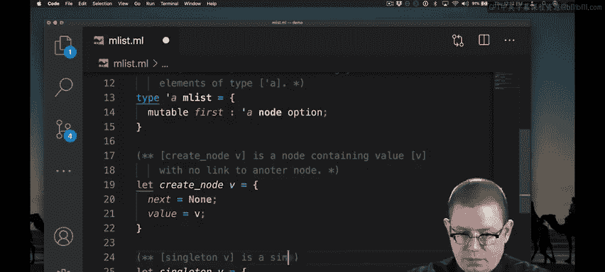

# OCaml编程：7.7：可变单向链表（第一部分）🎯

在本节课中，我们将学习如何在OCaml中实现可变单向链表。我们将从定义链表节点的类型开始，然后定义链表本身的类型，并编写创建链表的函数。

## 定义节点类型

上一节我们介绍了链表的基本概念，本节中我们来看看如何在OCaml中表示链表节点。

在Java中实现链表时，链表通常包含节点。这些节点存储值，并且每个节点都有一个指向链表中下一个节点的指针。

让我们为节点创建一个OCaml表示类型。我们在此处暂停一下。

一个 `'a node` 是一个包含类型为 `'a` 的值的节点。

因此，我创建了一个记录类型，其中包含一个名为 `value` 的字段。该字段存储节点中的值。

我还创建了一个名为 `next` 的字段。该字段将是指向链表中下一个节点的指针。

现在，我希望能够更改链表中的下一个节点是什么，我希望能够改变它。

实现这一点的一种方法是使 `next` 字段可变。现在，当我想更新链表中的下一个节点时，就可以做到。

当然，另一种方法是使用 `ref`。

我也可以将 `next` 设为 `'a node ref` 并改变该引用。

我们现在知道，引用和可变字段本质上是相同的，因为你可以用可变字段来实现引用。因此，我将坚持使用可变字段的实现，以使类型稍微简单一些。

现在，如果我们位于链表的最后一个节点怎么办？之后没有其他节点了。问题是，我们的 `next` 字段将迫使我们放置另一个节点，然后又一个节点，我们将永远无法结束链表。

我们需要类似Java中的 `null` 来实现这一点。如你所知，OCaml有 `option` 类型，它为我们提供了一种规范的方法来表示可能为空的值。

因此，我将使 `next` 字段成为一个 `option` 类型。从右向左读，这是一个包含 `'a` 的可选节点。要么它是 `None`，表示我们位于链表末尾；要么它是 `Some`，表示我们能够跟随到链表中的下一个节点。

我应该用抽象函数来记录其中的一些内容。很好，现在，当有人稍后来阅读我的代码时，他们会理解我使用这个类型的意图。

```ocaml
(** ['a node] 表示可变单向链表中的一个节点。 *)
type 'a node = {
  value : 'a;
  mutable next : 'a node option; (** 指向下一个节点的可选引用。 *)
}
```

## 定义链表类型

在实现链表时，通常还有一个单独的类型来表示链表本身，而不仅仅是一个节点。这个单独的类型有一个指向链表第一个节点的指针，并且可能包含一些额外的信息，比如链表的大小。

让我们为链表创建一个OCaml类型。因此，一个 `'a mlist` 将是一个可变单向链表，它包含类型为 `'a` 的值。我将其创建为记录类型。

该记录有一个名为 `first` 的字段，它是指向链表中第一个节点的指针。当然，如果我想要链表中的第一个节点也是可变的，以便我可以更改此链表的第一个节点（例如通过在链表前添加一个节点），我将需要该字段是可变的。

如果我想要链表可能为空，即其中根本没有节点，我将需要使该 `first` 字段也是可选的。

最后，我应该为此表示类型记录一个抽象函数。

```ocaml
(** ['a mlist] 表示一个可变单向链表。 *)
type 'a mlist = {
  mutable first : 'a node option; (** 指向第一个节点的可选引用。 *)
}
```

## 创建链表的函数

现在我们已经定义了类型，让我们编写一些代码来创建链表。首先，让我们创建单例链表，我们只需传入一个值并创建一个仅包含该值的链表。

因此，我在这里写了两个函数。`singleton` 创建一个 `mlist`，其 `first` 字段被初始化为某个新节点。

而那个新节点，我提取出了一个辅助函数 `node` 来帮助创建。它创建一个不指向任何其他节点且仅包含值 `v` 的节点。

我绝对应该为这些函数中的每一个都编写一些文档注释。

以下是创建节点的辅助函数：

```ocaml
(** [node v] 返回一个值为 [v] 且没有后续节点的新节点。 *)
let node v = { value = v; next = None }
```


以下是创建单例链表的函数：


```ocaml
(** [singleton v] 返回一个仅包含值 [v] 的新链表。 *)
let singleton v = { first = Some (node v) }
```

## 使用示例


让我们尝试使用这些函数来创建一个链表。现在我有了一个新的单向链表，它的第一个节点包含值 `3110`，并且没有任何指向其他节点的链接。



```ocaml
let my_list = singleton 3110
```

## 总结

本节课中我们一起学习了如何在OCaml中实现可变单向链表的基础部分。我们首先定义了表示链表节点的记录类型 `'a node`，它包含一个值字段和一个可变的、指向下一个节点的可选字段。接着，我们定义了表示链表本身的记录类型 `'a mlist`，它包含一个可变的、指向第一个节点的可选字段。最后，我们编写了创建新节点和单例链表的辅助函数，为后续的链表操作打下了基础。在下一节中，我们将继续探索如何向链表中添加元素、遍历链表等操作。