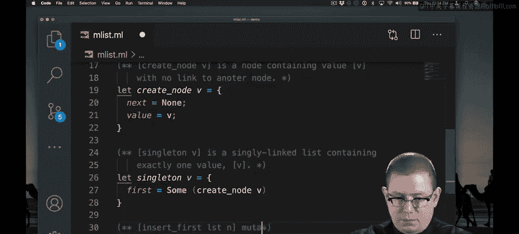
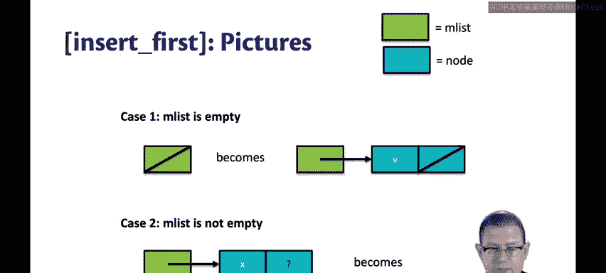
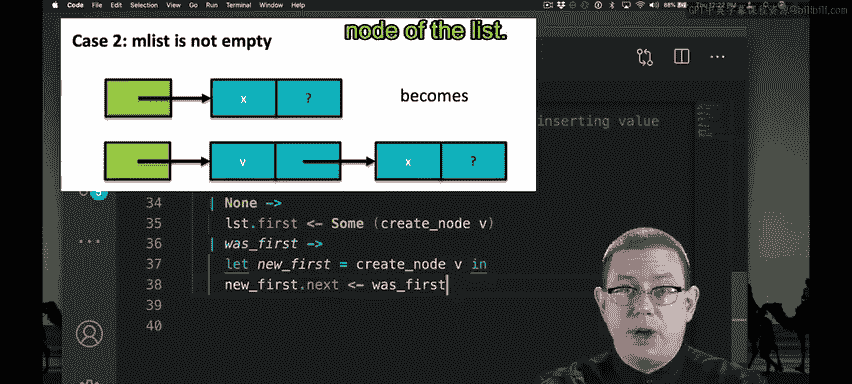

# 康奈尔大学《OCaml编程｜CS3110：OCaml Programming： Correct + Efficient + Beautiful》中英字幕 - P114：-114-Mutable Singly Linked Lists Part 2 Chap7 Video 8.zh_en - GPT中英字幕课程资源 - BV1Tx4y1s7sP

How about writing a function to insert a node at the beginning of a list？

I've written a comment to say what the function should do。And I've created something that compiles。

 but there's no interesting body here yet。How should I implement insert first。Well。

 if you don't remember how to implement it from Java， that's okay。 I probably don't either。

 I find that what's really helpful is if I draw pictures to help me think about implementing data structures that have pointers。

 Let's draw some pictures。What if the list I'm trying to insert into is empty？

Then I'm going to have an im list that doesn't have any first node in it。😡。

I need to change that so that the first field points to a new node。

That new node needs to contain the value V that I'm inserting。And be followed by nothing else。

There's another case， though。Which is what if M list is not empty。In that case。

 we do have a first node。 It contains some value X。

 We don't know what that might point to after that。 It doesn't really matter。

 What we want to change the list to be is a new node for the first node containing V。

And then install a pointer at that node to what used to be the old first node of the list。

 Now that I've drawn the pictures， it's much clearer to me how to implement the code。

Let's just pause here。There were two different pictures based on whether the first node was none or not。

 So I've written a pattern match to handle that。Now I can implement each of the pictures individually。

So to implement the first picture， I need to install a new node as the first node in the list。

 and that node needs to contain value V。Well， I already wrote a helper function above to create new nodes。

 so I'm using that helper function。I'm wrapping it with some and sticking that in as the first note of the list。

This leads to some slightly weird looking syntax where I have a right arrow for the pattern match and a left arrow for the field mutation。

 If that bothers you， just drop it down。Now I can implement the second picture。

 let's remind ourselves what that looked like。I need to create a new node。

 make it the first node of the list， and make its next pointer the old first node。

So let's create the new first node。Let's make its next node， the old first node of a list。

So I changed the pattern match there so that I wouldn't have to create another sum constructor down here。

 if I didn't want to do it that way， I could have written some here and some here。

 but notice the type of was first is different in each of those here it's an alpha node。

Here it's an alpha node option。I can do it either way。

 it's a little cleaner to not have to keep writing the sum in both places。Finally。

 I need to install the new first node as the first node of the list。Finally。

 I need to install the new first node as the first node of the list。

That gives me my implementation of insert first。 Let's give it a try。

Now you can see that I have mutated that list L by preending a new node to it。

 that node contains 2110。 The old node is still there。

 We can follow the chain of pointers to get to it it's 30。Finally。

 what if you wanted to create a convenience function for creating empty lists instead of singleingleton lists。

 let's write such a function。Here's the way you might be tempted to create it。

Just let empty be a record whose first field is bound to none。

Let's try that out and see what happened。So far， so good， we've inserted 2110 and 3110。

 and they're in the proper order in that list。 But what happens if I want to create a second list？

helello。I thought I was creating an empty list， but it's not empty。 It has 21，10 and 31，10 in it。

What went wrong， Well， what went wrong is that our implementation of empty created just one list。

 That's all there will ever be in existence， according to empty， is just that one list。

 Every time I write the name empty， it's bound to that same record value that I'm creating here on liness 41 through 43。

What I really want is a new record value every time I create a new empty list。

To cause that to happen， I need to actually make empty a function。

 then every time I apply that function， I will get a new record value as a result。😡。

What should that function take in Well， there's nothing that needs to take in that's interesting right。

 we're not putting a value into the list or anything like that。

So what's the most uninteresting value in the world unit， We will make empty take in unit。

Now my two lists really are different every time I apply empty to unit。

 I get a different new empty list back， and so when I insert into each of those lists。

 the difference between them is maintained。