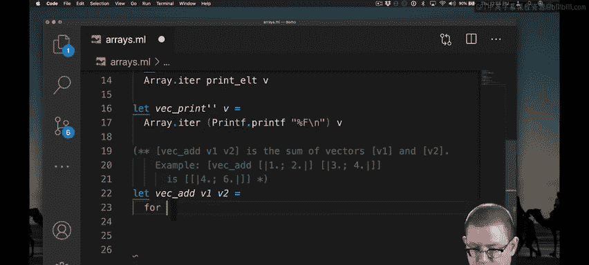
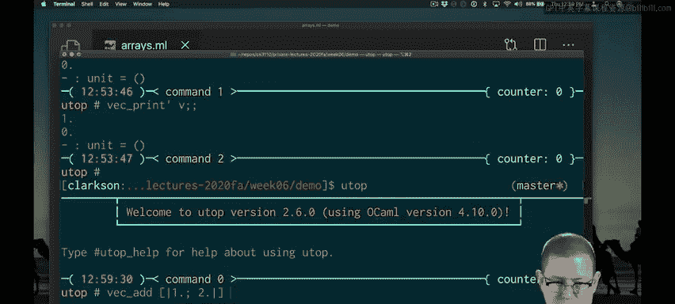

# 康奈尔大学《OCaml编程｜CS3110：OCaml Programming： Correct + Efficient + Beautiful》中英字幕 - P116：-116-Arrays Part 2 Chap7 Video 10.zh_en - GPT中英字幕课程资源 - BV1Tx4y1s7sP

Next， let's try adding together vectors。I've started implementing my vector ad by documenting what it's supposed to do and providing an example usage just to make clear that I'm doing the component wise edition of each of the elements of the vector。

Now to implement that as an imperative programmer， probably the first thing you would think to do is to reach for a loop。

 and we can definitely do that in Ocal。

So I'm starting off here just by coding up the body of the loop。

 there's still some places I'm going to need to fill this in。First off。

 what's the length that I want to use？Well， there's a potential problem if the length of these two vectors that are passed in is mismatched。

So maybe as a precondition， I need to say that they have the same。

Now I'm okay using the length of either one of them。 Of course。

 if I wanted to be a little bit defensive in my programming， I could check out the link。Okay。

 I've made it a little farther now。 If the two vectors don't have the same length。

 I'm going to raise an exception。 Otherwise， I'm okay using either length 1 or length 2 as a bound。

 Of course， I do have to remember to deduct one from it。 Otherwise。

 I'm going to get an index out of bounds exception。

All that's left now is to create a new vector and to store in each component of it。

 the sum of the two vectors that were passed in。Let's pause here。

 I'm using a standard library function array dot make。That returns a fresh array of length N。

 initializing all the values of it to X。So here I have created a fresh array of length L1 and initialized all the values of it to0。

Now I can use that new array to store the component wise sums。And finally。

 I am creating that array V3 now， but I haven't returned it yet。 In fact。

 the return type of V ad at this point is still just unit。

I need to return that vector as the final value。Now， Vec addd has the type float array。

 arrow float array， arrow float array。Let's try it out。

It looks like we get the right answer for that example usage， as we did before， for printing。

We can simplify this code by using ideas from higher order programming。

One way to simplify it is to use another library function called arrayray dot in。

Aray dot and knit gives us a way to initialize every component of a new array。

Aray dot Ed in F returns a fresh array of length N with element number I initialized to the result of F I。

So we're using a function of the index of each new component to decide what should be stored at that component of the array。

Now I'm using array dot in it to create a fresh array of length L1。

And I'm using the element function that I've written here。

 ELT to decide what the component should be at index I。

 and that's just the point why sum of the two vectors that were passed in。So this is better code。

 I don't have to explicitly write the loop that's all hidden for me inside of a ra dot in it。

But there's still some ugliness in it in terms of having to deal with these links。

Higher order programming gives me an even better way to do this。

There is a function built into the standard library called arrayray dot map 2。

You pass it a function F and to array A and B。Map 2 will then apply that function F to all the elements of A and B and build a result。

So we will apply f to a dot0 and B do0 and store that in component0 of the new array。And so forth。

 and so on。Well， what do we want to do for each。Pair of components in the initial two arrays。

 We just want to add them together。So all I need to do is apply the floating point addition function to every pair of elements in the input arrayse。

😡，And that in one line implements the entire vector add function。😡。

All three of my implementations get the same answer。

But I hope you'll agree with me that they're not all the same quality code。

What took me many lines and a loop to do， I can do in just a single line with higher order functions。

So even when we're writing imperative code rather than purely functional code。

 the ideas we have learned out of functional programming so far are highly useful。

