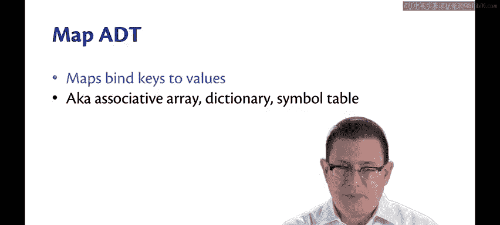
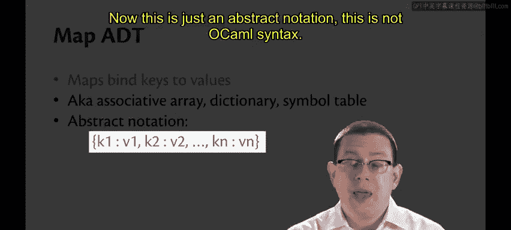
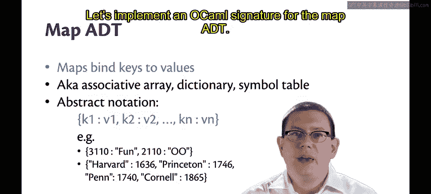
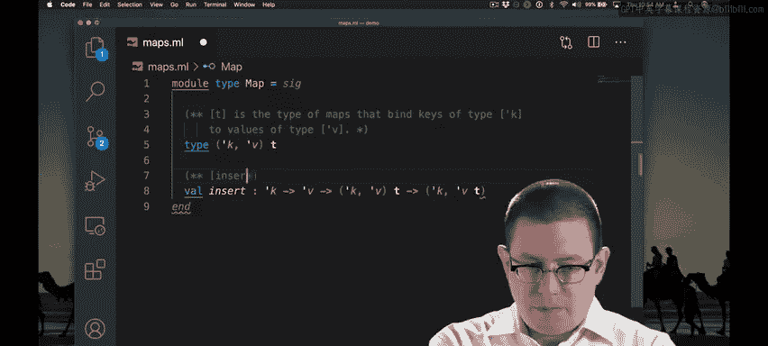

# 康奈尔大学《OCaml编程｜CS3110：OCaml Programming： Correct + Efficient + Beautiful》中英字幕 - P117：-117-Map ADT_ Insert, Find, Remove Chap8 Video 1.zh_en - GPT中英字幕课程资源 - BV1Tx4y1s7sP

The map abstract data type is one of the most important you will ever use。Maps bind keys to values。😡。

You know this from many other languages。But perhaps by different names。

 some call it an associative array， some call it a dictionary。 Some call it a symbol table。 In Java。

 you learned about hash map。 The map is the important part of that there。 In Oammel。

 there's also a hash table implementation that we will be getting to。

 But let's start by just considering the abstract data type itself。

 That is the operations that are interesting on values of this type。

Abstractly， we're going to write a map with this notation， which I've shamelessly stolen from Python。

We'll write curly braces and key colon value for each of the bindings in that map。 So K1。

 colon V1 is a binding from a key K1 to a value V1。

Now this is just an abstract notation， this is not Ocal syntax。

 it's just a way for us to write down abstractly what we mean by a map。😡。

Here's a couple examples of it。 We might have a map that binds the key 3110 to the string fun and the key 2110 to the string00。

 So you know， 3110 is fun 2110 is big googly eyes Now I mean。

 of course functional programming and objectory of programming definitely。

Or you might have a map that binds the key Harvard， which is a string to 1636， Princeton to 1746。

 Penn to 1740 and Corneta 1865， the years in which each was founded。

Let's implement an Oaml signature for the map ADT。

We'll start by writing a module type for map。Let's pause here。

 we're creating the representation type that we want to use for maps。

We need to say something about keys and values and their types at this point。😡，Because in a map。

 all the keys are going to have the same type and all the values are going to have the same type。So。

 our type T。Really needs to be a type constructor that's parameterized on some type variables。

 a type variable for the keys， and a type variable for the values。

The syntax for doing that is a little different than what we've seen so far when we have two type variables we need to put parentheses around。

So T is now a type constructor that's parameterized on type variable tick K and tick V。

I'm not going to bother pronouncing those in Greek。

And those type variables represent the types of the keys and the values respectively。

Let's write some operations and their specifications for maps next。

I've written a specification for the insertt operational on maps。Insert K VM is the same map as M。

So it doesn't change the map at all， except for doing one thing。

It adds an additional binding from K to V。Now the question is。

 what do you do if the map already contained a binding of that key？😡，Here。

 what I've chosen to do is replace the binding。 So if K was already bound in M。

The old binding is replaced by the new binding to V in the new map。

You can see from the type of insert that this is a functional data structure。

 is a persistent data structure， in fact， we're not mutating the map。

 we're taking in an old map and returning a new map with the change Ma。😡。

The find operation is what's going to find the binding of a key in a map。😡，So， find K M is some V。

If K is bound to V in map M。But it's none if there's no binding of that key in that map。😡。

Of course I had other choices there。 I could have raised an exception instead of returning in an option。

 What I've decided here for this particular ADT is that it's going to be the norm that sometimes people want to look up keys that maybe aren't already bound in the map。

 If it's going to be a normal kind of thing to do， returning an option is better than raising an exception。

The remove operation removes a binding from a key to a value。Remove KM is the same map as M。

 but without any binding of K。Of course， the question is， what if K wasn't bound in the map already？

I've decided again not to make that an exceptional situation in which I raise an exception。

 just going to say， okay， that could be a normal situation to occur and in that case if K was not bound in M。

 then the map is just going to remain unchanged for the return value。😡。

Those are the three main operations that are mapped。😡。

