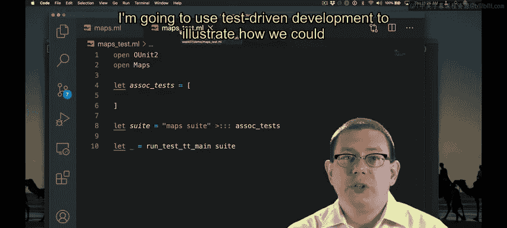
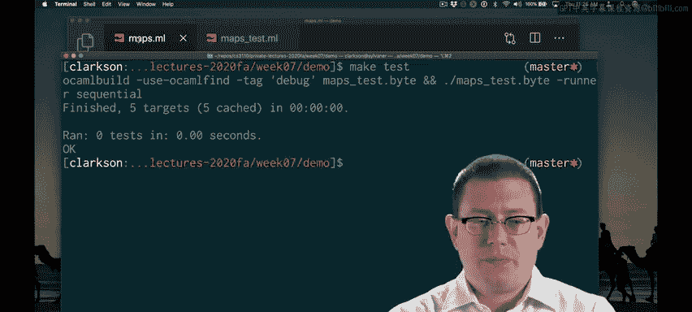

# OCaml编程：8.3：关联列表表示类型

在本节课中，我们将学习如何使用关联列表来实现映射（Map）抽象数据类型（ADT）。我们将从定义表示类型开始，并逐步实现核心操作。

## 概述

我们将基于关联列表构建一个映射ADT。关联列表是一个键值对列表，它提供了一种简单直观的方式来表示映射关系。本节将重点定义其表示类型，并明确其抽象函数和潜在的不变量。

## 选择表示类型



上一节我们介绍了映射ADT的基本概念，本节中我们来看看如何用关联列表来实现它。首先，我们需要定义模块的内部表示类型。

```ocaml
module AssociationListMap : Map = struct
  type ('k, 'v) t = ('k * 'v) list
  ...
end
```

这里，类型构造器 `t` 被定义为一个包含键 `'k` 和值 `'v` 的元组列表。这构成了我们映射的底层数据结构。

## 定义抽象函数



定义了表示类型后，我们需要明确它如何对应到抽象的映射概念。这通过抽象函数来完成。

抽象函数将具体的关联列表映射到抽象的映射。对于一个包含 `(K1, V1), (K2, V2), ..., (Kn, Vn)` 的列表，它表示将键 `K1` 绑定到值 `V1`，键 `K2` 绑定到值 `V2`，依此类推的映射。

关于重复键，我们需要做出设计决策。以下是两种主要选择：

*   允许列表中存在重复键。在这种情况下，抽象映射中键所对应的值由列表中**最左侧**的绑定决定。例如，列表 `[(K, V1); (K, V2)]` 表示将 `K` 映射到 `V1` 的映射，`(K, V2)` 被忽略。
*   定义一个表示不变量，规定列表永远不包含重复键。这将简化某些操作，但会增加插入新元素时的复杂度。

为了实现的简便性，我们选择第一种方案：允许重复键，并以最左侧的绑定为准。同时，空列表 `[]` 自然地表示空映射。

## 实现空映射

根据我们选择的表示类型，空映射的实现变得非常简单。

```ocaml
let empty = []
```

`empty` 值直接定义为空列表，这符合我们的抽象函数定义。

## 搭建测试环境

为了采用测试驱动开发的方式，我们已经准备了一个OUnit测试套件和一个Makefile。这允许我们通过运行 `make test` 来持续验证实现是否正确。在开发过程中，保持测试窗口打开并频繁运行测试是一个好习惯。

## 总结


本节课中我们一起学习了映射ADT基于关联列表的初步实现。我们定义了表示类型 `('k, 'v) t` 为键值对列表，明确了抽象函数的含义，特别是处理重复键的规则（以最左侧为准），并实现了 `empty` 操作。这为后续实现插入、查找和删除等操作奠定了基础。下一节，我们将开始实现这些核心功能。