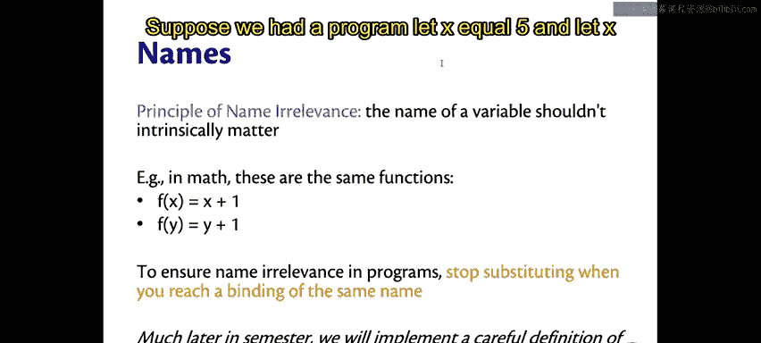
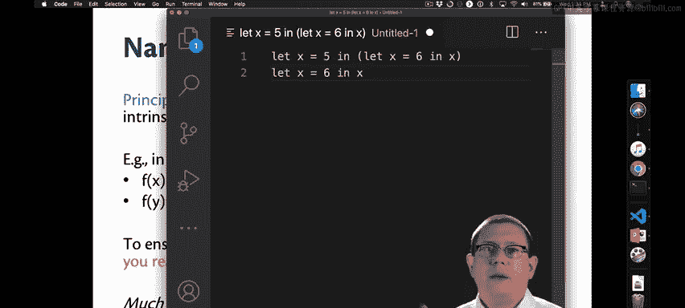
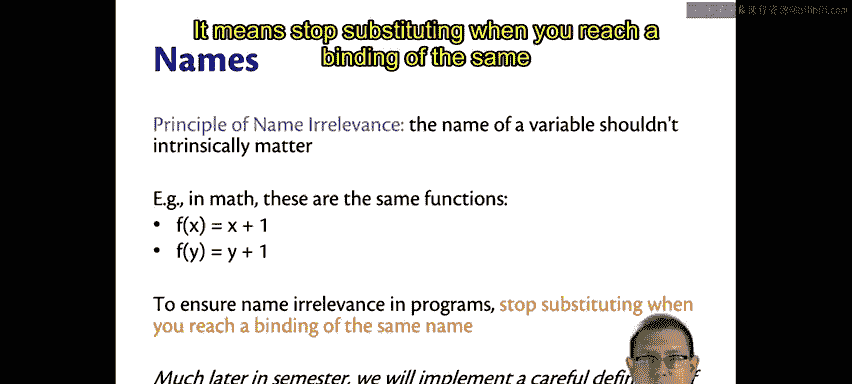
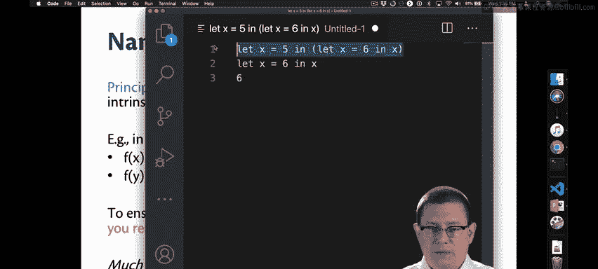
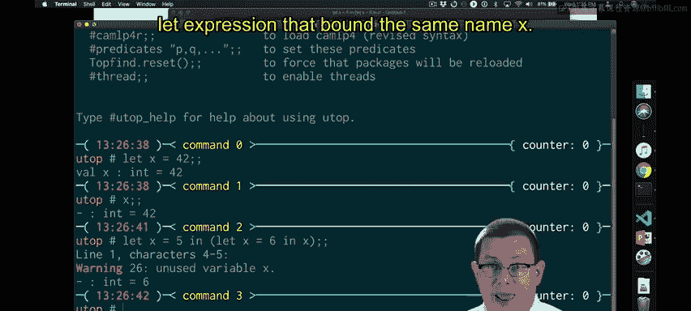
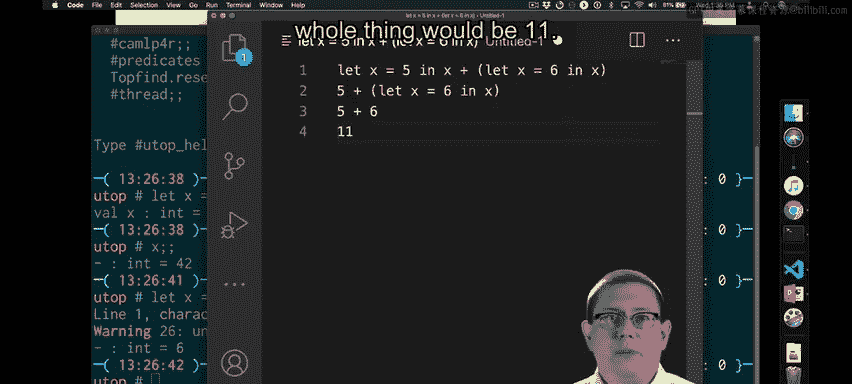
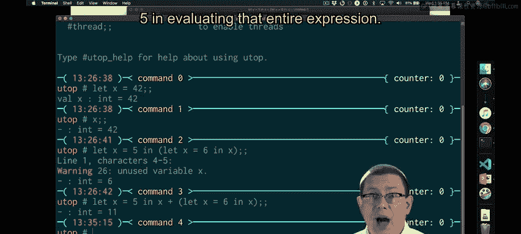

# OCaml编程：2.6：变量表达式与作用域 🧠


在本节课中，我们将要学习OCaml中变量表达式的求值规则，以及一个至关重要的概念——**作用域**。我们将理解变量名如何通过替换获得意义，以及作用域如何界定一个名字在何处是有效的。

---

## 变量求值与替换

上一节我们介绍了`let`表达式的基本结构。本节中我们来看看，当我们单独求值一个变量名时，它意味着什么。

我们之前已经看到，可以单独求值一个名字。例如，我可以输入 `let x = 42`，然后求值 `x`。那么，`x`本身在顶层环境中是如何获得意义的呢？

理解方式是：在顶层环境中，每一个`let`定义都隐式地是一个巨大嵌套`let`表达式的开始。当我输入 `let x = e` 时，其真正含义是：在后续所有将要输入的内容中，`x` 都等于 `e`。

如果你有一连串的`let`定义，例如：
```ocaml
let a = big in
let b = red in
let c = a ^ b in
...
```
这实际上被理解为一系列嵌套的`let`表达式。

基于此，我们现在可以将变量名的求值理解为**替换**。当我输入 `let x = 42` 后，在后续任何地方出现的 `x` 都将被理解为一次替换，就像在`let`表达式中一样，`x` 会被替换为 `42`。因此，本质上，它只是在一个巨大的嵌套`let`表达式内部进行替换。

---

## 作用域的概念

现在，让我们回到**作用域**的概念。作用域是指一个名字**有意义**的地方。😡

在大型嵌套的`let`表达式中，名字在某些地方有意义，在另一些地方则没有。如果我们写 `let x = 42 in ...`，那么在那个主体表达式中，`x` 是有意义的，但在其外部则没有。

考虑一个嵌套的`let`表达式：
```ocaml
let x = 42 in
    let y = 3110 in
        ...
```
`y` 在内层`let`表达式的作用域内是有意义的，但在外层`let`表达式的作用域内则没有意义。

因此，`let`表达式为OCaml程序提供了作用域的界定。

---

## 重叠的作用域

容易让人困惑的是**重叠的作用域**。例如，下面这个程序与我之前提到的一个例子很相似，其中名字 `x` 的作用域发生了重叠：
```ocaml
let x = 5 in
    let x = 6 in
        x + x
```
要弄清楚它的含义有点费脑筋。虽然它确实有明确的定义，但首先我必须说，这**非常令人困惑**。😡 因此，当我们编写供他人理解的程序时，应尽量避免这种难以思考的代码。

不过，既然我们已经有了语义学，特别是`let`表达式的求值规则，我们就可以弄清楚这个程序以及其他类似程序的含义了。它们遵循一个我称之为**名字无关性原则**的原则。

---

## 名字无关性原则

据我所知，我是唯一使用这个术语的人，但我认为它相当贴切。对我来说，**名字无关性原则**是指：一个变量的名字本身**不应该**具有内在的重要性。😡

让我用数学来类比。如果你打开一本数学教科书，看到两个函数：
*   `f(x) = x + 1`
*   `f(y) = y + 1`

我想大多数人都会同意这是同一个函数。它们做同样的事情：给参数加1。因此，参数的名字实际上与函数的真正含义无关。

为了在程序中确保名字无关性，我们在进行替换时必须非常小心。我们需要在遇到**相同名字的绑定**时**停止**替换。在本学期稍后，我会给出一个非常严谨的定义，我们甚至会将其作为程序的一部分来实现。但现在，这个解释足以让我们进行一些示例分析。

---



## 示例分析

以下是几个示例，帮助我们理解重叠作用域下的替换规则。



**示例一：简单重叠**



假设我们有程序：
```ocaml
let x = 5 in
    let x = 6 in
        x
```
它的实际含义是什么？我们已经掌握了足够的知识来推导它。

1.  求值 `5` 得到值 `5`。
2.  将 `5` 替换到 `x` 出现的地方。这意味着对 `let x = 6 in x` 这个表达式进行替换，将 `5` 替换给 `x`。
3.  根据我们刚刚同意的规则：**当遇到相同名字的绑定时，停止替换**。😡
4.  我们确实遇到了一个对相同名字 `x` 的绑定，因此我们停止任何替换，不触及该主体表达式的其余部分。😡

所以，`let x = 5 in let x = 6 in x` 意味着我们现在需要求值 `let x = 6 in x`，我们知道这求值结果为 `6`。这就是整个`let`表达式的结果。



在UTop中，我们会看到一个“未使用变量”的警告。这现在更有意义了。OCaml实际上是在说：第一个将 `x` 绑定到 `5` 的操作，你从未使用它。它被丢弃了，因为替换在遇到绑定相同名字 `x` 的内层`let`表达式时就停止了。

**示例二：使用外层绑定**

这并不是说我们不能使用外层的绑定。例如：
```ocaml
let x = 5 in
    x + (let x = 6 in x)
```
现在，我们有一次替换需要执行：将 `5` 替换给 `x`。但随后停止，不要进一步深入到那个嵌套的`let`表达式中，因为它绑定了一个我们正在替换的相同名字。



这将得到 `5 + 6`，整个表达式的结果是 `11`。

让我们在UTop中验证一下。确实，我们得到了 `11`，并且这次没有收到“未使用变量”的警告，因为我们在求值整个表达式时确实使用了将 `x` 绑定到 `5` 的操作。

---



## 总结

本节课中我们一起学习了：
1.  **变量求值**：变量名通过在其作用域内进行**替换**来获得意义。
2.  **作用域**：由`let`表达式界定，指一个名字**有效**的区域。
3.  **重叠作用域**：当内层作用域重新定义了与外层相同的名字时，内层绑定会“遮蔽”外层绑定。替换规则是：**遇到相同名字的绑定时停止替换**。
4.  **名字无关性原则**：变量的名字本身不影响程序的逻辑含义，这通过上述替换规则来保证。




理解这些概念对于编写清晰、可预测的OCaml代码至关重要。在下一节中，我们将探讨更复杂的数据结构和模式匹配。