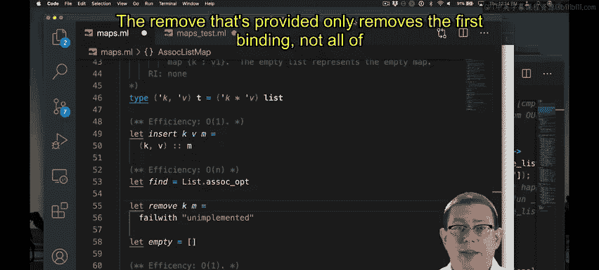

# OCaml编程：8.7：关联列表的插入、查找与删除 🗺️


在本节课中，我们将学习如何使用关联列表来实现映射（Map）抽象数据类型（ADT）的三种核心操作：插入、查找和删除。我们将分析每种操作的效率，并总结关联列表作为映射实现方式的优缺点。

上一节我们介绍了关联列表的基本概念，本节中我们来看看如何基于它实现具体的映射操作。

## 插入操作

插入一个键值对到映射中，只需将这对绑定添加到列表的最前端。

```ocaml
let insert k v map = (k, v) :: map
```

此操作的效率是常数时间（O(1)），因为它只涉及创建一个键值对并将其添加到列表头部。需要注意的是，此实现允许重复键的存在。

## 查找操作

查找操作旨在根据给定的键，在关联列表中找出其对应的值。OCaml标准库中已经提供了相应的函数。

```ocaml
let find k map = List.assoc_opt k map
```



以下是`List.assoc_opt`函数的工作原理：
*   它接收一个键和一个关联列表。
*   它遍历列表，寻找第一个键与给定键匹配的键值对。
*   如果找到，则返回`Some value`；否则返回`None`。

此操作的效率在最坏情况下是线性时间（O(n)），因为它可能需要遍历整个列表才能找到目标键。


## 删除操作

删除操作需要移除列表中所有与给定键匹配的绑定。标准库中的`List.remove_assoc`函数只移除第一个匹配项，因此我们需要自己实现移除所有匹配项的功能。

```ocaml
let remove k map = List.filter (fun (key, _) -> key <> k) map
```

以下是删除操作的实现逻辑：
*   使用`List.filter`函数遍历列表。
*   保留所有键不等于目标键`k`的键值对。
*   过滤掉所有键等于`k`的键值对。


此操作的效率同样是线性时间（O(n)），因为`filter`函数需要检查列表中的每一个元素。

## 效率总结

现在，让我们总结一下使用关联列表实现映射ADT时，三种核心操作的效率。

| 操作 | 时间复杂度 | 说明 |
| :--- | :--- | :--- |
| **插入** | O(1) | 直接将新元素添加到列表头部。 |
| **查找** | O(n) | 在最坏情况下需要遍历整个列表。 |
| **删除** | O(n) | 需要遍历列表以找到并移除所有匹配项。 |

关联列表的优点是插入操作非常快速，且实现简单。然而，其查找和删除操作的效率较低，尤其是在列表很长或目标键位于列表末尾时。这是因为关联列表本质上是一种线性数据结构。


本节课中我们一起学习了如何使用关联列表实现映射的插入、查找和删除操作，并分析了它们的时间复杂度。关联列表提供了简单的实现方式，但牺牲了查找和删除的效率。在后续章节中，我们将探索其他数据结构（如二叉搜索树），以期获得更均衡的操作性能。