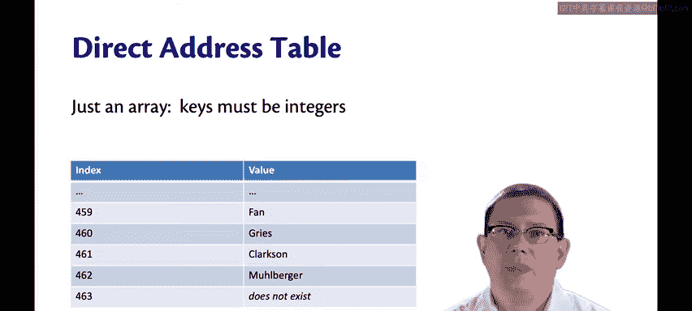
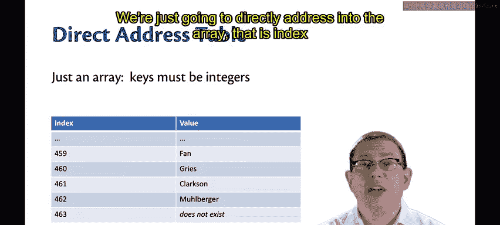
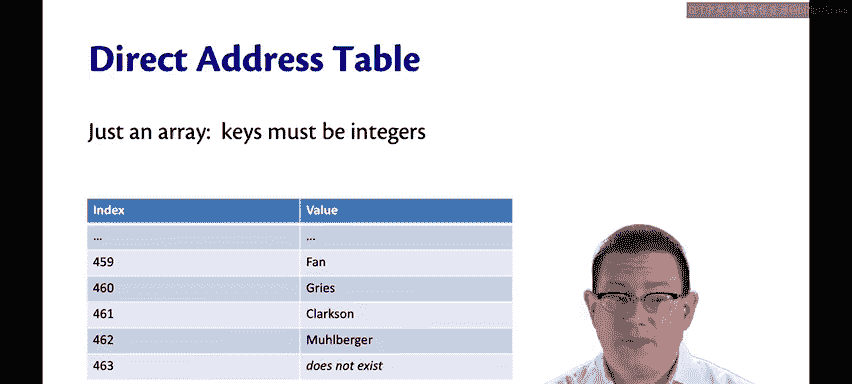
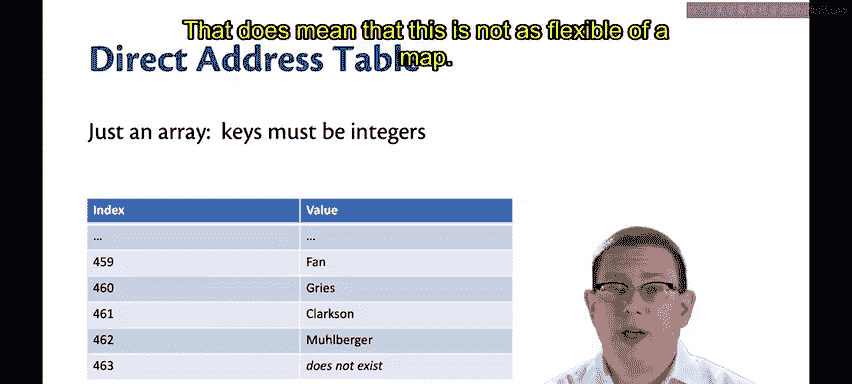
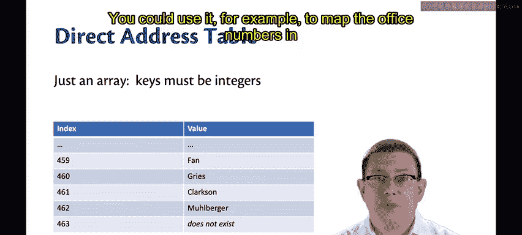
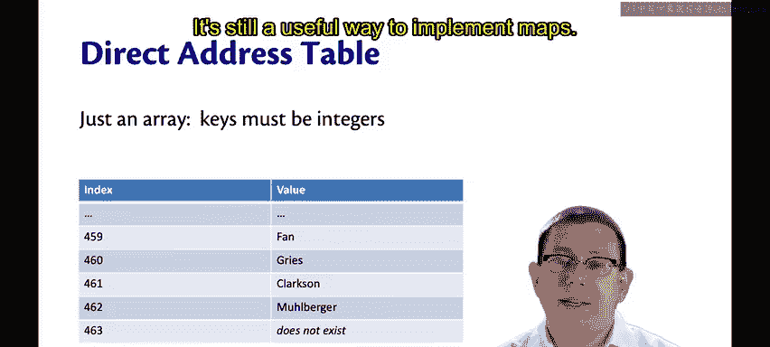

# 康奈尔大学《OCaml编程｜CS3110：OCaml Programming： Correct + Efficient + Beautiful》中英字幕 - P124：-124-Direct Address Map ADT Chap8 Video 8.zh_en - GPT中英字幕课程资源 - BV1Tx4y1s7sP

Our second data structure for implementing the map ADT is the direct address table。

It's almost as simple as the association list implementation。

 It's just this time we're going to use an array instead of a list。Now， because we're using an array。

 there's an important restriction that kicks in。

The keys must be integers。😡，We're just going to directly address into the array that is indexed into the array。

With the key。

That does mean that this is not as flexible of a map。😡。

You could use it， for example， to map the office numbers in gates to the occupants of those offices。

 I'm in Office 461， so at index 461 in the array you could put my name Clarkson。

 but having other kinds of keys like strings or records。

 that's not going to work with this representation type。

That's okay。 It's a still a useful way to implement maps。 So let's take a look at it。

I've started off here by just copying and pasting the interface we had before for maps。

 I'm going to update it for direct address maps， I have to update it because the types of the keys must be integers and some of those specifications are now going to have to change as well。

 so let's take a look at that。😡，This is now going to be a direct address map。

And the representation type T can no longer be parameterized on a key type because keys must be integers。

 so we'll just make it only parameterized on a value。

T is now the type of maps that bind keys of type int。The values of type tick。

Let's update all the rest of this now just to make it compile and then we'll finish fixing up the specifications。

😡，Okay now I've replaced T K with int everywhere， and I've gotten rid of the parameterization of T on TK。

Let's take a look at the specification of insertt next。

Because direct address maps are based on arrays， they are mutable。😡。

When we go to update a map that has an array behind it。

 that means we're actually going to be mutably changing that array。😡。

So that means this is no longer going to be a functional or persistent data structure。

 it's going to be an imperative data structure that is ephemeral。

Every update is going to mutate the array。😡，So it no longer makes sense to pass in an old value of the data structure and get a new data structure back instead we're just going to pass in the value and let the update take place。

So instead of returning a new value of the data structure， we're just going to return unit。

 like all of those mutability updates do， whether it's updating a ref or updating an array location or updating a mutable field。

😡，I should change the specification so that readers of it understand what's going on。Now。

 I've made it clear that I'm mutating the map when I bind the key rather than returning the new。

Find is okay。But remove needs to be updated in its specification to account for the fact that the data structure is now mutable。

All right， that's enough for us to start implementing this data structure。

