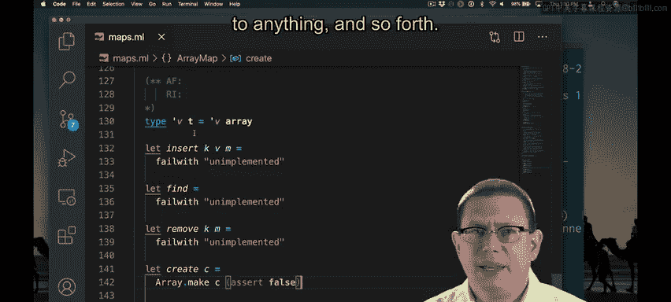

# 康奈尔大学《OCaml编程｜CS3110：OCaml Programming： Correct + Efficient + Beautiful》中英字幕 - P125：-125-Array Map_ Rep Type, and Create Chap8 Video 9.zh_en - GPT中英字幕课程资源 - BV1Tx4y1s7sP

To get us started， I've created just a skeleton here in which I'm failing with the implementation for all the operations。

I know I need to create a representation type here that involves as。

 The obvious thing to do would be to say that this just has to be an array of values of type V。

Of course， that doesn't compile anymore because now I need to implement the empty function。

 I can't just return unit for that。 Actually， empty isn't even a function。 It's just a value here。

 I could put in that this is just the empty array。But already。

 I hope your mind is thinking back to when we implemented Sly length lists and discovered that when we want to create values of a mutable data structure。

The creation function for that actually does need to be a function， not just a value。

 because otherwise we end up with only one value of that data structure ever in existence。

So this really needs to be a function to create a map。😡，And arrays actually are not resizable。

 you might remember。Like once you create an array， it has a fixed size。

 This array is always going to have zero elements in it。

 We need to be able to have maps that have more than0 elements。So these two facts。

It needs to be a function， and we need to know how many elements are going to be in it to create it。

Lead me to change what this operation actually should be in the data structure。

 I need to be able to create a map that has some capacity。To store some number of elements。

Rather than just creating an empty value that I'm going to later add things onto like I could do with lists。

😡，So let's go back to our signature and figure out what to write there for a specification。

 then come back to implementing this function。So I've changed the specification here and changed even the name of it and its type。

Now I'm going to have a function create that creates a map with capacity C。

 that's going to be the size of the underlying array。This has an impact on keys。😡。

Because if an array has capacity C， say it has 10 elements。

 then the only keys that are valid for that array are going to be 0 through9。

So I need to say something in my specification about which keys are going to be valid for the。

Let's introduce a notion of what it means for a key to be inbounds。

I now need some of the rest of my functions in this interface to also say something about when keys must be in bounds as a precondition。

So I'm a little stuck here for of list because I know that there I need to say something about the bounds of the keys in that list that's passed in。

 but there's no map to talk about。Here what I could do， I've got two choices。

 I could scan through that list and figure out what the maximum balance is there and then create a corresponding array。

 Of course， what if the client really wanted something that was going to have more capacity than them？

Maybe the better thing to do is to ask the client of this function to tell me what the capacity of the returned map ought to。

Now that I have updated all of those functions to account for capacities and keys being in bounds。

 let's return to implementing the data structure。Okay， I'm partway through implementing create。

 I need to create an array of capacity C。 I can do that with array dot make。

But I also need to pass into aray dot make。A value to initialize every array element。

I don't know what value to use because I don't actually know what the client is going to instantiate type constructor tea on。

 could be anything。Actually， there's even the worse problem。

I don't actually start off with a map that has anything bound in it。

If I've just created an empty map as it were， then zero ought not to be bound anything。

 one should not be bound to anything and so forth。

So the way to fix both of these problems at the same time is to make this an array of optional values。

Meaning that。If the option is none， then the key is not yet bound in the map。😡。

But if the option is sum， then the key is bound and it's bound to whatever value is contained within that option。

I just made a decision about how to represent values of this data structure。

 so I should document my abstraction function here and any representation imvari that。All right。

 so I've documented an abstraction function that says if I have an array of some v0。

 some v1 and so forth， then that actually represents the map that binds zero to value v0。

 1 to value v1 and so forth。If any element eye of the array is instead none。

 then eye is not bound in the map。Now I have a way of finishing my implementation of create。

Because I can simply pass in none here。To initialize every element of the array to none。

 meaning that it is not yet bound。What's the efficiency of this operation。

 Well an array of size n has to be allocated and all of the elements of it have to be set to none。

 that's going to be a linear time operation in that capacity of the array that is past it。

