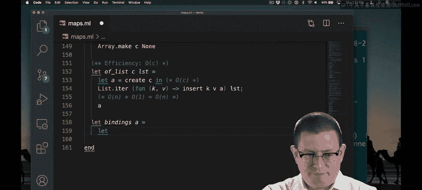

# OCaml编程：8.10：数组映射剩余操作

在本节课中，我们将继续实现基于数组的映射数据结构。我们将完成插入、查找和删除操作，并实现从关联列表创建映射以及从映射获取所有绑定的功能。这些操作都力求在常数时间或线性时间内完成。

## 实现插入、查找和删除

上一节我们介绍了映射的数组表示和核心结构。本节中我们来看看如何实现基础的键值对操作。

插入、查找和删除操作实际上都相当容易实现。为了强调操作对象是数组，我们将参数名定为 `A` 而非 `M`。

以下是这些操作的实现：

```ocaml
(* 插入键值对 *)
let insert (A : 'v t) (k : key) (v : 'v) : unit =
  A.(data).(k) <- Some v

(* 查找键对应的值 *)
let find (A : 'v t) (k : key) : 'v option =
  A.(data).(k)

(* 删除键 *)
let remove (A : 'v t) (k : key) : unit =
  A.(data).(k) <- None
```

**插入**操作直接将数组索引 `k` 处的值修改为 `Some v`。**查找**操作通过索引返回数组中存储的 `option` 值。**删除**操作则将指定数组位置的值设为 `None`，表示该键不再绑定任何值。所有这些操作都是常数时间。

## 从关联列表创建映射

接下来，我们需要实现从关联列表创建映射的函数。以下是实现步骤：

首先，创建一个具有指定容量的数组。然后，遍历输入的关联列表，对于列表中的每一个键值对，调用之前实现的 `insert` 函数将其插入数组中。

```ocaml
let of_list (lst : (key * 'v) list) (c : capacity) : 'v t =
  let A = create c in
  List.iter (fun (k, v) -> insert A k v) lst;
  A
```



该操作的效率分析如下：创建一个容量为 `C` 的数组需要 `O(C)` 时间。遍历列表时，假设列表有 `N` 个元素，每个元素的插入操作是常数时间，因此这部分是 `O(N)`。根据 `of_list` 的规范，列表不能包含重复键，且所有键必须在有效范围内，因此在最坏情况下 `N` 等于 `C`。因此，整个操作的总效率是 `O(C)`。

## 获取映射中的所有绑定

最后，我们来实现获取映射中所有绑定的函数。一个直接的方法是使用循环遍历数组。

以下是实现此功能的一种方式：

```ocaml
let bindings (A : 'v t) : (key * 'v) list =
  let b = ref [] in
  for k = 0 to A.capacity - 1 do
    match A.(data).(k) with
    | None -> ()
    | Some v -> b := (k, v) :: !b
  done;
  !b
```

我们创建一个指向空列表的引用 `b`。在循环中，我们检查数组的每个位置。如果该位置是 `None`，则不进行任何操作。如果是 `Some v`，则将键值对 `(k, v)` 添加到列表 `b` 的开头。循环结束后，返回引用 `b` 中累积的列表。

该操作的效率分析：循环会执行 `容量` 次迭代。在每次迭代中，索引访问、创建新的 `cons` 节点和模式匹配都是常数时间操作。因此，整个循环的时间复杂度是 `O(容量)`。

## 总结


本节课中我们一起学习了如何实现基于数组的映射数据结构的剩余操作。我们实现了常数时间的 `insert`、`find` 和 `remove` 函数。我们还实现了 `of_list` 函数，它能在 `O(容量)` 时间内从关联列表构建映射，以及 `bindings` 函数，它能在 `O(容量)` 时间内提取映射中的所有键值对。这些操作共同构成了一个高效、基础的映射实现。