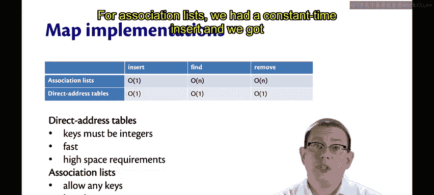
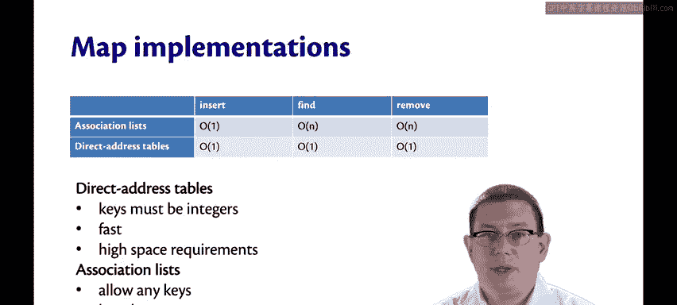
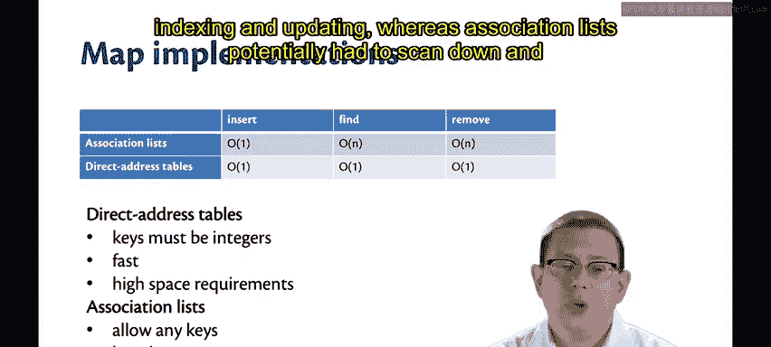
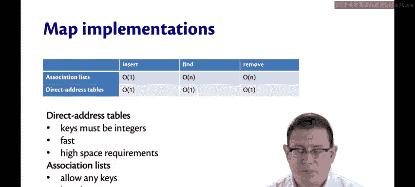
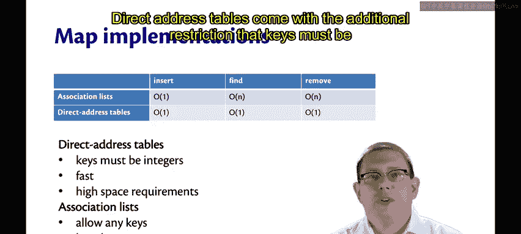
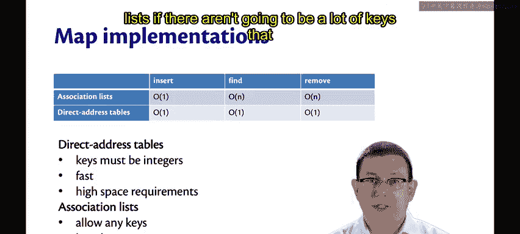
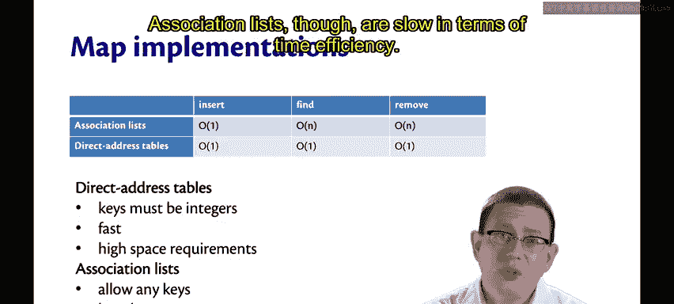
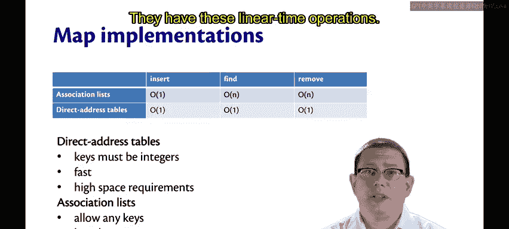
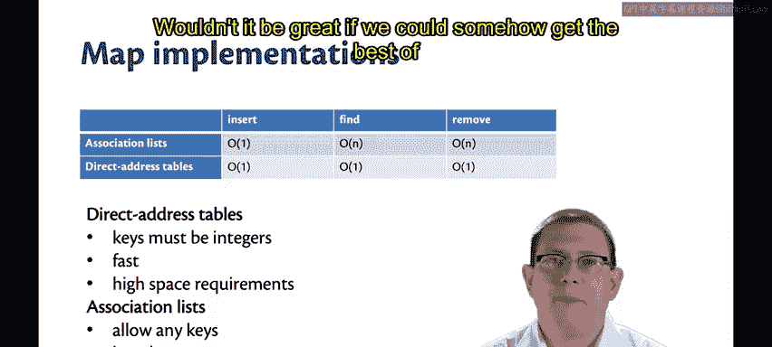

# OCaml编程：8.11：关联列表与数组的对比 🆚

在本节课中，我们将比较目前已经学过的两种映射（Map）实现：关联列表和直接寻址表（数组）。我们将分析它们在时间和空间效率上的差异，并思考如何结合两者的优点。

---

上一节我们介绍了直接寻址表（数组）的实现。本节中，我们来对比关联列表与直接寻址表在性能上的优劣。

首先，让我们回顾一下插入操作的效率。对于关联列表，我们实现了常数时间的插入操作。对于直接寻址表，我们也获得了常数时间的插入操作。

然而，在查找和删除操作上，直接寻址表的效率更高。

直接寻址表提供了常数时间的操作，因为这本质上只是数组的索引和更新。相比之下，关联列表可能需要扫描整个列表，因此这些操作是线性时间的。

当然，这并非完全公平的比较。直接寻址表附带了一个额外的限制：键必须是整数。

正是由于这个限制，你才获得了更高效的实现。😡 这是在时间效率方面。但在空间效率方面，你可能需要付出更多代价。

以下是原因：如果你因为想使用像1000这样的大数字作为键而创建了一个容量非常大的映射，但你实际上并不关心像0、1、2、100、200、300这样的小数字，你仍然需要分配一个巨大的数组来实现这一点。

因此，如果实际绑定的键数量不多，关联列表在空间上可能更节省。

不过，关联列表在时间效率上较慢。

它们具有这些线性时间的操作。

如果我们能设法结合两者的优点，那将非常理想。

---

本节课中我们一起学习了关联列表与直接寻址表（数组）在实现映射时的核心差异。我们了解到，关联列表在空间利用上可能更灵活，但查找和删除操作是线性的；而直接寻址表虽然要求整数键且可能浪费空间，但提供了常数时间的操作。这引出了我们对更优数据结构的需求。