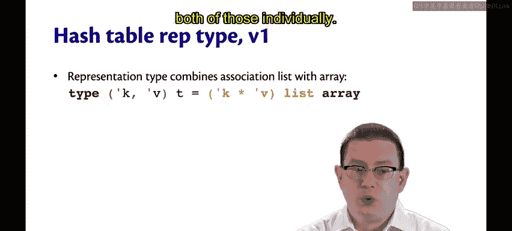
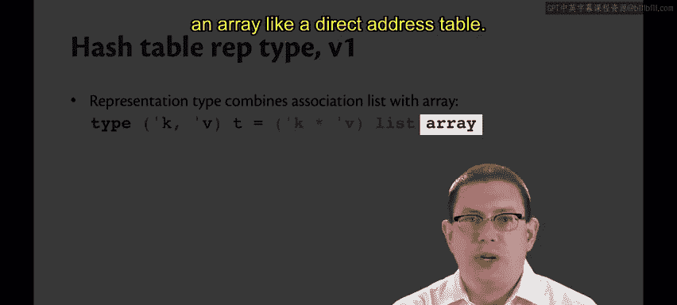
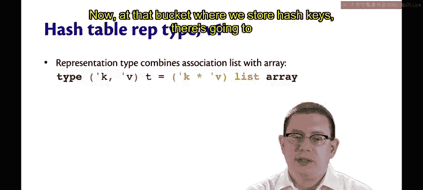
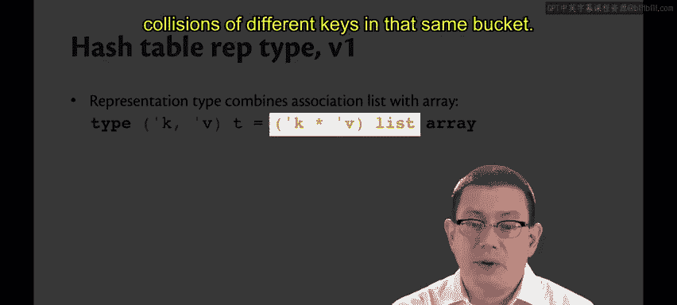
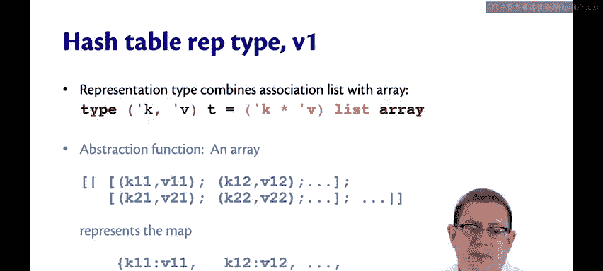
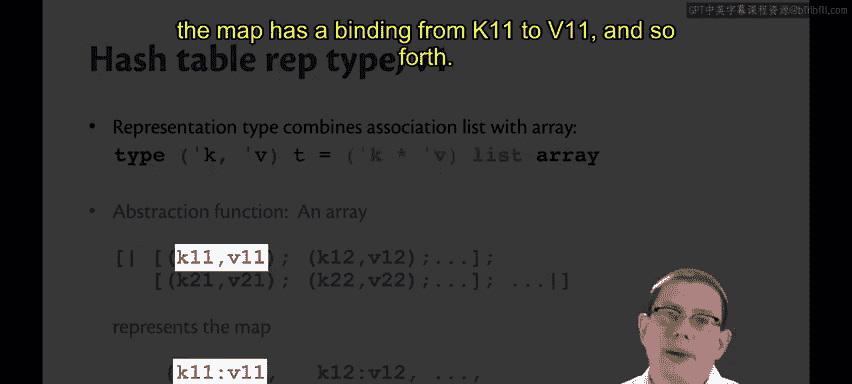

# 康奈尔大学《OCaml编程｜CS3110：OCaml Programming： Correct + Efficient + Beautiful》中英字幕 - P128：-128-Hash Table Rep Type v1 Chap8 Video 12.zh_en - GPT中英字幕课程资源 - BV1Tx4y1s7sP

We want the best of both worlds between direct address tables and association lists。

Direct address tables， because of the array implementation give us constant time operations。

Association lists allow us to have any type of keys。

So the first basic idea of being able to combine these two data structures。😡。

Is to convert keys to entertegers。Let's assume we have such a conversion function that can map from whatever the key type is to an int。

That's what we call the hash function。The idea is you're like taking whatever that key type is and hashing up everything that might be in pieces of that type to produce some kind of integer as an output。

We want to implement insertt。😡，By hashing a key to an int。That is within the bounds for the array。

And then we just store the binding at that index。So this solves the problem of keys having to be integers by assuming that there's a way to convert them。

Now that conversion needs to be fast， we're all about efficiency right now。Ideally。

 we want that conversion to be a constant time operation because if it is。

 then maybe we have a hope of insert and find and remove also being constant time operations。

But the real problem is。What happens if two keys hash to the same index。

We can only store one value at an entry in a direct address table。We'd be in trouble at that point。

Another way of putting this problem in terms of CS 2800 vocabulary is we have a problem with injectivity。

An injective function or a one to one function。Is a function that doesn't have collisions。

 A collision is when an element of the domain and another element of the domain。

 both map to the same element of the co domain。In other words。

 there's no way to uniquely invert the function。The function on the right。

 if we know the output is one， we don't know whether the input was B or D。On the other hand。

 the function on the left， if we know the output is one， then we know it had to have been。

So non injectivity is the problem here。😡，Now you might think the solution is to somehow guarantee that our hash function is injective。

 but in fact， it's exactly the opposite we're going to be okay with non injective hash functions。

So the integer output of a hash is called a bucket。 It's a bucket because there's a large collection。

 basically of binding that are going to be stored at that location in the array instead of just a single binding。

So in that bucket， we're going to get multiple keys colliding potentially， and that's okay。

 we'll just keep all those collisions there。😡，There's two strategies in general for dealing with collisions in a bucket。

One of them is called probing。That means finding an empty bucket somewhere else in the table。

 typical strategies for this include scanning straightforward through the table or maybe skipping over some elements。

 maybe at some quadratic interval。😡，This is traditionally more common for hardware implementations because in hardware you can't just store like you know a whole bunch of data structures at the bucket。

 there's just not room for it like that so you have to go forward through what empty space you have。

😡，Another possibility is called chaining， that means storing multiple key value pairs in a list at a bucket。

😡，It might not even be a list， maybe you put it in some sort of tree data structure or something fancier even。

But the basic idea is to keep chaining off from that bucket and storing more and more binding。😡。

That's something that's hard to do in hardware， but easy to do in software。😡。

Ocal's hash table module does this， actually it's called hashable。

 I don't know if they were just like out of vowels when they got to the end of that word or what。

But that's what we're going to do here as well， I'm going to show you how to implement。By the way。

 probing and chaining have crazy other names like closed hashing and open addressing or open hashing and closed addressing。

I don't use those terms。 I don't expect you to know them either probing and chaining are fine。

So let's start off with our representation type for hash tables by combining the two types that we had already。

😡，For direct address tables。And for association lists。

And now you know why I've showed you both of those in detail before。

 it's because in order to understand hash tables， you need to understand both of those individually。

So the representation type at its utmost level is going to be an array， like a direct address table。

😡。

So for each hashed key， we're storing some binding。Now， at that bucket where we store hash keys。

 there's going to be an association list。

In that association list， there are going to be multiple key value bindings。

 potentially where it might be empty。And the keys aren't necessarily all the same。

Because there could be collisions of different keys in that same bucket。

So here's the abstraction function I have in mind for this representation type。If I have an array。

And if that array at each index in it。Has an association list of key value bindings。

Then that represents the map。That just takes all of those bindings and puts them individually into the map。

So if the array has a binding from K11 to V11， then the map has a binding from K11 to V11 and so forth。

It's as if we just ignore all those different levels of array andiceeas and association list entries and just collapse it all down into one set of binding。

We need some representation invari for this type。First off。

 I'm going to enforce the invariant that no key appears more than once in an array。In other words。

 I'm not going to ever allow a duplicate binding of the same key。😡，Not in the same bucket。

 not even in other buckets。 right， So every key can appear at most once。

The second representation in variantal in force is that all keys have to be in the right bucket。

So if key K is in bucket B， then it must be the case that the hash of K is B。

